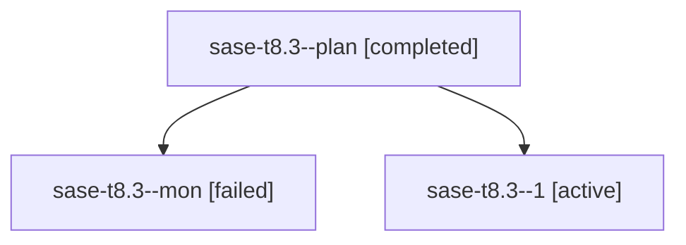

# Family: sase-t8.3

[Agent Hoods](../README.md) / [bbugyi200](../users/bbugyi200/README.md) / [athena](../users/bbugyi200/machines/athena/README.md) / [sase-t8](../users/bbugyi200/machines/athena/hoods/sase-t8/README.md) / sase-t8.3

Owner: `bbugyi200.athena` · Hood: `sase-t8` · Members: 3 · Bead: [sase-t8.3](https://github.com/sase-org/sase--beads/blob/main/pages/sase-t8/sase-t8.3.md)

## Lineage

The diagram is an optional enhancement; the ordered table below contains the same lineage in accessible text.

| Role | Agent | State | Model / provider | Timing | Commits | Prompt | Chat |
|---|---|---|---|---|---:|---|---|
| plan | sase-t8.3--plan | completed | sonnet / claude | 2026-08-25T00:28:37.657190+00:00 → 2026-08-25T00:58:02.288405+00:00 | 0 | [Prompt](../agents/bbugyi200.athena.sase-t8.3--plan/prompt.md) | [Chat](../agents/bbugyi200.athena.sase-t8.3--plan/chat.md) |
| mon | sase-t8.3--mon | failed | sonnet / claude | 2026-08-25T00:57:30.006485+00:00 | 0 | — | [Chat](../agents/bbugyi200.athena.sase-t8.3--mon/chat.md) |
| 1 | sase-t8.3--1 | active | sonnet / claude | 2026-08-25T01:13:50.239610+00:00 | [1](../agents/bbugyi200.athena.sase-t8.3--1/README.md#commits) | [Prompt](../agents/bbugyi200.athena.sase-t8.3--1/prompt.md) | — |

## Commits

| Role | Repo | Commit | Subject | Committed |
|---|---|---|---|---|
| 1 | sase | [`69dc50a`](https://github.com/sase-org/sase/commit/69dc50a31af35724d9784b775f557fad3ea0a57f) | feat(ace): expose shell forks throughout ACE | 2026-08-24 21:16:35 EDT |

## Neighbors

| Agent | Relation | State |
|---|---|---|
| [sase-t8.1](bbugyi200.athena.sase-t8.1.md) (family · 3) | sase-t8 hood | dismissed 1, failed 2 |
| [sase-t8.2](../agents/bbugyi200.athena.sase-t8.2/README.md) | sase-t8 hood | completed |
| [sase-t8.land](../agents/bbugyi200.athena.sase-t8.land/README.md) | sase-t8 hood | waiting |
