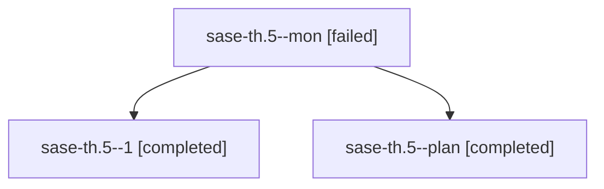

# Family: sase-th.5

[Agent Hoods](../README.md) / [bbugyi200](../users/bbugyi200/README.md) / [athena](../users/bbugyi200/machines/athena/README.md) / [sase-th](../users/bbugyi200/machines/athena/hoods/sase-th/README.md) / sase-th.5

Owner: `bbugyi200.athena` · Hood: `sase-th` · Members: 3 · Bead: [sase-th.5](https://github.com/sase-org/sase--beads/blob/main/pages/sase-th/sase-th.5.md)

## Lineage

The diagram is an optional enhancement; the ordered table below contains the same lineage in accessible text.

| Role | Agent | State | Model / provider | Timing | Commits | Prompt | Chat |
|---|---|---|---|---|---:|---|---|
| mon | sase-th.5--mon | failed | sonnet / claude | 2026-08-25T11:42:45.096062+00:00 | 0 | — | [Chat](../agents/bbugyi200.athena.sase-th.5--mon/chat.md) |
| 1 | sase-th.5--1 | completed | sonnet / claude | 2026-08-25T11:47:34.526686+00:00 → 2026-08-25T11:54:44.614722+00:00 | 0 | [Prompt](../agents/bbugyi200.athena.sase-th.5--1/prompt.md) | [Chat](../agents/bbugyi200.athena.sase-th.5--1/chat.md) |
| plan | sase-th.5--plan | completed | sonnet / claude | 2026-08-25T11:34:02.480906+00:00 → 2026-08-25T11:42:53.439211+00:00 | 0 | [Prompt](../agents/bbugyi200.athena.sase-th.5--plan/prompt.md) | [Chat](../agents/bbugyi200.athena.sase-th.5--plan/chat.md) |

## Neighbors

| Agent | Relation | State |
|---|---|---|
| [sase-th.1](../agents/bbugyi200.athena.sase-th.1/README.md) | sase-th hood | completed |
| [sase-th.2](../agents/bbugyi200.athena.sase-th.2/README.md) | sase-th hood | active |
| [sase-th.3](../agents/bbugyi200.athena.sase-th.3/README.md) | sase-th hood | completed |
| [sase-th.4](../agents/bbugyi200.athena.sase-th.4/README.md) | sase-th hood | active |
| [sase-th.6](../agents/bbugyi200.athena.sase-th.6/README.md) | sase-th hood | active |
| [sase-th.7](../agents/bbugyi200.athena.sase-th.7/README.md) | sase-th hood | waiting |
| [sase-th.land](../agents/bbugyi200.athena.sase-th.land/README.md) | sase-th hood | waiting |
