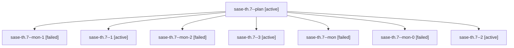

# Family: sase-th.7

[Agent Hoods](../README.md) / [bbugyi200](../users/bbugyi200/README.md) / [athena](../users/bbugyi200/machines/athena/README.md) / [sase-th](../users/bbugyi200/machines/athena/hoods/sase-th/README.md) / sase-th.7

Owner: `bbugyi200.athena` · Hood: `sase-th` · Members: 8 · Bead: [sase-th.7](https://github.com/sase-org/sase--beads/blob/main/pages/sase-th/sase-th.7.md)

## Lineage

The diagram is an optional enhancement; the ordered table below contains the same lineage in accessible text.

| Role | Agent | State | Model / provider | Timing | Commits | Prompt | Chat |
|---|---|---|---|---|---:|---|---|
| plan | sase-th.7--plan | active | sonnet / claude | 2026-08-25T12:56:39.398057+00:00 | 0 | [Prompt](../agents/bbugyi200.athena.sase-th.7--plan/prompt.md) | [Chat](../agents/bbugyi200.athena.sase-th.7--plan/chat.md) |
| mon-1 | sase-th.7--mon-1 | failed | sonnet / claude | 2026-08-25T14:00:04.843244+00:00 | 0 | — | [Chat](../agents/bbugyi200.athena.sase-th.7--mon-1/chat.md) |
| 1 | sase-th.7--1 | active | sonnet / claude | 2026-08-25T13:37:28.204927+00:00 | 0 | [Prompt](../agents/bbugyi200.athena.sase-th.7--1/prompt.md) | [Chat](../agents/bbugyi200.athena.sase-th.7--1/chat.md) |
| mon-2 | sase-th.7--mon-2 | failed | sonnet / claude | 2026-08-25T15:34:59.839275+00:00 | 0 | — | [Chat](../agents/bbugyi200.athena.sase-th.7--mon-2/chat.md) |
| 3 | sase-th.7--3 | active | sonnet / claude | 2026-08-25T15:31:16.311978+00:00 | 0 | [Prompt](../agents/bbugyi200.athena.sase-th.7--3/prompt.md) | [Chat](../agents/bbugyi200.athena.sase-th.7--3/chat.md) |
| mon | sase-th.7--mon | failed | sonnet / claude | 2026-08-25T13:07:31.085850+00:00 | 0 | — | [Chat](../agents/bbugyi200.athena.sase-th.7--mon/chat.md) |
| mon-0 | sase-th.7--mon-0 | failed | sonnet / claude | 2026-08-25T13:39:57.887413+00:00 | 0 | — | [Chat](../agents/bbugyi200.athena.sase-th.7--mon-0/chat.md) |
| 2 | sase-th.7--2 | active | sonnet / claude | 2026-08-25T13:49:52.222711+00:00 | 0 | [Prompt](../agents/bbugyi200.athena.sase-th.7--2/prompt.md) | [Chat](../agents/bbugyi200.athena.sase-th.7--2/chat.md) |

## Neighbors

| Agent | Relation | State |
|---|---|---|
| [sase-th.1](../agents/bbugyi200.athena.sase-th.1/README.md) | sase-th hood | active |
| [sase-th.2](../agents/bbugyi200.athena.sase-th.2/README.md) | sase-th hood | active |
| [sase-th.3](../agents/bbugyi200.athena.sase-th.3/README.md) | sase-th hood | active |
| [sase-th.4](../agents/bbugyi200.athena.sase-th.4/README.md) | sase-th hood | active |
| [sase-th.5](bbugyi200.athena.sase-th.5.md) (family · 3) | sase-th hood | active 2, failed 1 |
| [sase-th.6](../agents/bbugyi200.athena.sase-th.6/README.md) | sase-th hood | active |
| [sase-th.7--4--0](../agents/bbugyi200.athena.sase-th.7--4--0/README.md) | sase-th hood | active |
| [sase-th.7--4--1](../agents/bbugyi200.athena.sase-th.7--4--1/README.md) | sase-th hood | completed |
| [sase-th.land](../agents/bbugyi200.athena.sase-th.land/README.md) | sase-th hood | waiting |
