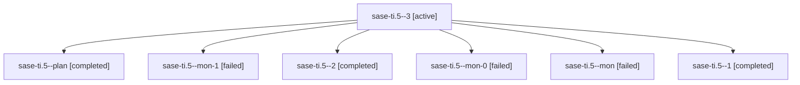

# Family: sase-ti.5

[Agent Hoods](../README.md) / [bbugyi200](../users/bbugyi200/README.md) / [athena](../users/bbugyi200/machines/athena/README.md) / [sase-ti](../users/bbugyi200/machines/athena/hoods/sase-ti/README.md) / sase-ti.5

Owner: `bbugyi200.athena` · Hood: `sase-ti` · Members: 7 · Bead: [sase-ti.5](https://github.com/sase-org/sase--beads/blob/main/pages/sase-ti/sase-ti.5.md)

## Lineage

The diagram is an optional enhancement; the ordered table below contains the same lineage in accessible text.

| Role | Agent | State | Model / provider | Timing | Commits | Prompt | Chat |
|---|---|---|---|---|---:|---|---|
| 3 | sase-ti.5--3 | active | sonnet / claude | 2026-08-25T12:13:34.443562+00:00 | 0 | [Prompt](../agents/bbugyi200.athena.sase-ti.5--3/prompt.md) | — |
| plan | sase-ti.5--plan | completed | sonnet / claude | 2026-08-25T11:40:23.120729+00:00 → 2026-08-25T12:04:06.754096+00:00 | 0 | [Prompt](../agents/bbugyi200.athena.sase-ti.5--plan/prompt.md) | [Chat](../agents/bbugyi200.athena.sase-ti.5--plan/chat.md) |
| mon-1 | sase-ti.5--mon-1 | failed | sonnet / claude | 2026-08-25T12:10:52.779097+00:00 | 0 | — | [Chat](../agents/bbugyi200.athena.sase-ti.5--mon-1/chat.md) |
| 2 | sase-ti.5--2 | completed | sonnet / claude | 2026-08-25T12:09:33.663549+00:00 → 2026-08-25T12:11:03.057042+00:00 | 0 | [Prompt](../agents/bbugyi200.athena.sase-ti.5--2/prompt.md) | [Chat](../agents/bbugyi200.athena.sase-ti.5--2/chat.md) |
| mon-0 | sase-ti.5--mon-0 | failed | sonnet / claude | 2026-08-25T12:08:43.887800+00:00 | 0 | — | [Chat](../agents/bbugyi200.athena.sase-ti.5--mon-0/chat.md) |
| mon | sase-ti.5--mon | failed | sonnet / claude | 2026-08-25T12:03:55.374284+00:00 | 0 | — | [Chat](../agents/bbugyi200.athena.sase-ti.5--mon/chat.md) |
| 1 | sase-ti.5--1 | completed | sonnet / claude | 2026-08-25T12:07:29.349121+00:00 → 2026-08-25T12:08:53.213196+00:00 | 0 | [Prompt](../agents/bbugyi200.athena.sase-ti.5--1/prompt.md) | [Chat](../agents/bbugyi200.athena.sase-ti.5--1/chat.md) |

## Neighbors

| Agent | Relation | State |
|---|---|---|
| [sase-ti.1](../agents/bbugyi200.athena.sase-ti.1/README.md) | sase-ti hood | completed |
| [sase-ti.2](../agents/bbugyi200.athena.sase-ti.2/README.md) | sase-ti hood | active |
| [sase-ti.3](../agents/bbugyi200.athena.sase-ti.3/README.md) | sase-ti hood | completed |
| [sase-ti.4](../agents/bbugyi200.athena.sase-ti.4/README.md) | sase-ti hood | completed |
| [sase-ti.6](../agents/bbugyi200.athena.sase-ti.6/README.md) | sase-ti hood | waiting |
| [sase-ti.land](../agents/bbugyi200.athena.sase-ti.land/README.md) | sase-ti hood | waiting |
