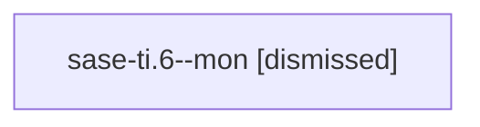

# Family: sase-ti.6

[Agent Hoods](../README.md) / [bbugyi200](../users/bbugyi200/README.md) / [athena](../users/bbugyi200/machines/athena/README.md) / [sase-ti](../users/bbugyi200/machines/athena/hoods/sase-ti/README.md) / sase-ti.6

Owner: `bbugyi200.athena` · Hood: `sase-ti` · Members: 1 · Bead: [sase-ti.6](https://github.com/sase-org/sase--beads/blob/main/pages/sase-ti/sase-ti.6.md)

## Lineage

The diagram is an optional enhancement; the ordered table below contains the same lineage in accessible text.

| Role | Agent | State | Model / provider | Timing | Commits | Prompt | Chat |
|---|---|---|---|---|---:|---|---|
| mon | sase-ti.6--mon | dismissed | — | 2026-08-25T09:58:17 | 0 | — | — |

## Neighbors

| Agent | Relation | State |
|---|---|---|
| [sase-ti.1](../agents/bbugyi200.athena.sase-ti.1/README.md) | sase-ti hood | active |
| [sase-ti.2](../agents/bbugyi200.athena.sase-ti.2/README.md) | sase-ti hood | active |
| [sase-ti.3](../agents/bbugyi200.athena.sase-ti.3/README.md) | sase-ti hood | active |
| [sase-ti.4](../agents/bbugyi200.athena.sase-ti.4/README.md) | sase-ti hood | active |
| [sase-ti.5](bbugyi200.athena.sase-ti.5.md) (family · 7) | sase-ti hood | active 4, failed 3 |
| [sase-ti.land](../agents/bbugyi200.athena.sase-ti.land/README.md) | sase-ti hood | active |
