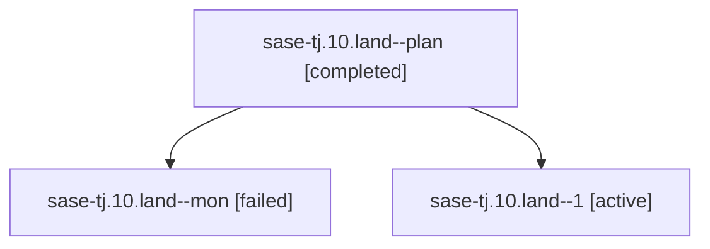

# Family: sase-tj.10.land

[Agent Hoods](../README.md) / [bbugyi200](../users/bbugyi200/README.md) / [athena](../users/bbugyi200/machines/athena/README.md) / [sase-tj](../users/bbugyi200/machines/athena/hoods/sase-tj/README.md) / sase-tj.10.land

Owner: `bbugyi200.athena` · Hood: `sase-tj` · Members: 3 · Bead: [sase-tj.10](https://github.com/sase-org/sase--beads/blob/main/pages/sase-tj/sase-tj.10.md)

## Lineage

The diagram is an optional enhancement; the ordered table below contains the same lineage in accessible text.

| Role | Agent | State | Model / provider | Timing | Commits | Prompt | Chat |
|---|---|---|---|---|---:|---|---|
| plan | sase-tj.10.land--plan | completed | opus / claude | 2026-08-26T10:40:10.867084+00:00 → 2026-08-26T11:31:22.484794+00:00 | 0 | [Prompt](../agents/bbugyi200.athena.sase-tj.10.land--plan/prompt.md) | [Chat](../agents/bbugyi200.athena.sase-tj.10.land--plan/chat.md) |
| mon | sase-tj.10.land--mon | failed | opus / claude | 2026-08-26T11:31:08.821690+00:00 | 0 | — | [Chat](../agents/bbugyi200.athena.sase-tj.10.land--mon/chat.md) |
| 1 | sase-tj.10.land--1 | active | opus / claude | 2026-08-26T11:52:27.706739+00:00 | [1](../agents/bbugyi200.athena.sase-tj.10.land--1/README.md#commits) | [Prompt](../agents/bbugyi200.athena.sase-tj.10.land--1/prompt.md) | — |

## Commits

| Role | Repo | Commit | Subject | Committed |
|---|---|---|---|---|
| 1 | sase | [`a5989a8`](https://github.com/sase-org/sase/commit/a5989a8738023567daf8b215a2b2a1c4865453bc) | test(artifacts-agents): repair the Agent pane visual fixture and rebaseline one golden | 2026-08-26 08:21:15 EDT |

## Neighbors

| Agent | Relation | State |
|---|---|---|
| [sase-tj.10.1](../agents/bbugyi200.athena.sase-tj.10.1/README.md) | sase-tj.10 hood | completed |
| [sase-tj.10.2](../agents/bbugyi200.athena.sase-tj.10.2/README.md) | sase-tj.10 hood | completed |
| [sase-tj.10.3](../agents/bbugyi200.athena.sase-tj.10.3/README.md) | sase-tj.10 hood | dismissed |
| [sase-tj.1](../agents/bbugyi200.athena.sase-tj.1/README.md) | sase-tj hood | dismissed |
| [sase-tj.2](../agents/bbugyi200.athena.sase-tj.2/README.md) | sase-tj hood | dismissed |
| [sase-tj.3](../agents/bbugyi200.athena.sase-tj.3/README.md) | sase-tj hood | dismissed |
| [sase-tj.4](../agents/bbugyi200.athena.sase-tj.4/README.md) | sase-tj hood | dismissed |
| [sase-tj.5](bbugyi200.athena.sase-tj.5.md) (family · 3) | sase-tj hood | dismissed 2, failed 1 |
| [sase-tj.6](../agents/bbugyi200.athena.sase-tj.6/README.md) | sase-tj hood | dismissed |
| [sase-tj.7](bbugyi200.athena.sase-tj.7.md) (family · 3) | sase-tj hood | dismissed 1, failed 2 |
| [sase-tj.8](bbugyi200.athena.sase-tj.8.md) (family · 4) | sase-tj hood | active 1, completed 1, dismissed 1, failed 1 |
| [sase-tj.8](../agents/bbugyi200.athena.sase-tj.8/README.md) | sase-tj hood | dismissed |
| [sase-tj.9](../agents/bbugyi200.athena.sase-tj.9/README.md) | sase-tj hood | dismissed |
| [sase-tj.land](bbugyi200.athena.sase-tj.land.md) (family · 2) | sase-tj hood | dismissed 1, failed 1 |
| [sase-tj.land.w0](../agents/bbugyi200.athena.sase-tj.land.w0/README.md) | sase-tj hood | dismissed |
| [sase-tj.land.w1](../agents/bbugyi200.athena.sase-tj.land.w1/README.md) | sase-tj hood | dismissed |
| [sase-tj.land.w3](bbugyi200.athena.sase-tj.land.w3.md) (family · 2) | sase-tj hood | dismissed 1, failed 1 |
