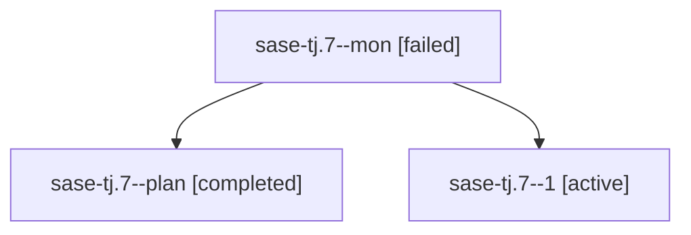

# Family: sase-tj.7

[Agent Hoods](../README.md) / [bbugyi200](../users/bbugyi200/README.md) / [athena](../users/bbugyi200/machines/athena/README.md) / [sase-tj](../users/bbugyi200/machines/athena/hoods/sase-tj/README.md) / sase-tj.7

Owner: `bbugyi200.athena` · Hood: `sase-tj` · Members: 3 · Bead: [sase-tj.7](https://github.com/sase-org/sase--beads/blob/main/pages/sase-tj/sase-tj.7.md)

## Lineage

The diagram is an optional enhancement; the ordered table below contains the same lineage in accessible text.

| Role | Agent | State | Model / provider | Timing | Commits | Prompt | Chat |
|---|---|---|---|---|---:|---|---|
| mon | sase-tj.7--mon | failed | gpt-5.5 / codex | 2026-08-25T15:41:08.711954+00:00 | 0 | — | [Chat](../agents/bbugyi200.athena.sase-tj.7--mon/chat.md) |
| plan | sase-tj.7--plan | completed | gpt-5.5 / codex | 2026-08-25T14:54:37.033753+00:00 → 2026-08-25T15:41:34.220247+00:00 | 0 | [Prompt](../agents/bbugyi200.athena.sase-tj.7--plan/prompt.md) | [Chat](../agents/bbugyi200.athena.sase-tj.7--plan/chat.md) |
| 1 | sase-tj.7--1 | active | gpt-5.5 / codex | 2026-08-25T15:54:13.294577+00:00 | 0 | [Prompt](../agents/bbugyi200.athena.sase-tj.7--1/prompt.md) | — |

## Neighbors

| Agent | Relation | State |
|---|---|---|
| [sase-tj.1](../agents/bbugyi200.athena.sase-tj.1/README.md) | sase-tj hood | completed |
| [sase-tj.2](../agents/bbugyi200.athena.sase-tj.2/README.md) | sase-tj hood | dismissed |
| [sase-tj.3](../agents/bbugyi200.athena.sase-tj.3/README.md) | sase-tj hood | completed |
| [sase-tj.4](../agents/bbugyi200.athena.sase-tj.4/README.md) | sase-tj hood | dismissed |
| [sase-tj.5](bbugyi200.athena.sase-tj.5.md) (family · 2) | sase-tj hood | active 1, completed 1 |
| [sase-tj.6](../agents/bbugyi200.athena.sase-tj.6/README.md) | sase-tj hood | completed |
| [sase-tj.8](bbugyi200.athena.sase-tj.8.md) (family · 4) | sase-tj hood | active 1, completed 1, dismissed 1, failed 1 |
| [sase-tj.8](../agents/bbugyi200.athena.sase-tj.8/README.md) | sase-tj hood | completed |
| [sase-tj.9](../agents/bbugyi200.athena.sase-tj.9/README.md) | sase-tj hood | waiting |
| [sase-tj.land](../agents/bbugyi200.athena.sase-tj.land/README.md) | sase-tj hood | waiting |
| [sase-tj.land.w0](../agents/bbugyi200.athena.sase-tj.land.w0/README.md) | sase-tj hood | dismissed |
| [sase-tj.land.w1](../agents/bbugyi200.athena.sase-tj.land.w1/README.md) | sase-tj hood | dismissed |
| [sase-tj.land.w2](../agents/bbugyi200.athena.sase-tj.land.w2/README.md) | sase-tj hood | waiting |
