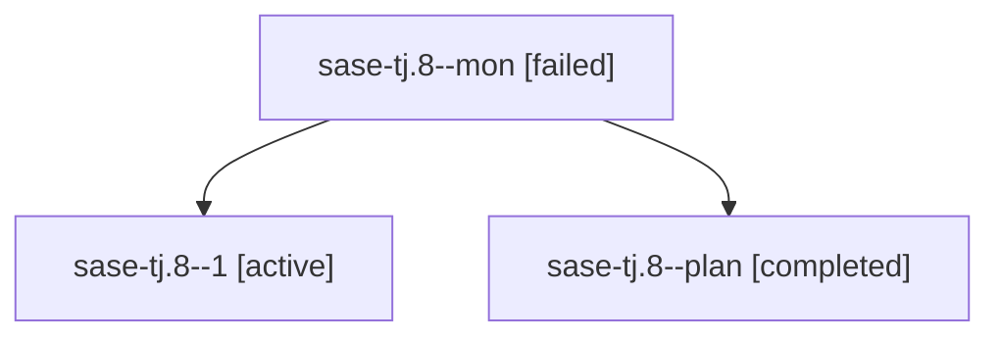

# Family: sase-tj.8

[Agent Hoods](../README.md) / [bbugyi200](../users/bbugyi200/README.md) / [athena](../users/bbugyi200/machines/athena/README.md) / [sase-tj](../users/bbugyi200/machines/athena/hoods/sase-tj/README.md) / sase-tj.8

Owner: `bbugyi200.athena` · Hood: `sase-tj` · Members: 3 · Bead: [sase-tj.8](https://github.com/sase-org/sase--beads/blob/main/pages/sase-tj/sase-tj.8.md)

## Lineage

The diagram is an optional enhancement; the ordered table below contains the same lineage in accessible text.

| Role | Agent | State | Model / provider | Timing | Commits | Prompt | Chat |
|---|---|---|---|---|---:|---|---|
| mon | sase-tj.8--mon | failed | sonnet / claude | 2026-08-25T14:14:16.681745+00:00 | 0 | — | [Chat](../agents/bbugyi200.athena.sase-tj.8--mon/chat.md) |
| 1 | sase-tj.8--1 | active | sonnet / claude | 2026-08-25T14:16:05.600213+00:00 | 0 | [Prompt](../agents/bbugyi200.athena.sase-tj.8--1/prompt.md) | — |
| plan | sase-tj.8--plan | completed | sonnet / claude | 2026-08-25T13:56:20.843975+00:00 → 2026-08-25T14:14:51.178176+00:00 | 0 | [Prompt](../agents/bbugyi200.athena.sase-tj.8--plan/prompt.md) | [Chat](../agents/bbugyi200.athena.sase-tj.8--plan/chat.md) |

## Neighbors

| Agent | Relation | State |
|---|---|---|
| [sase-tj.1](../agents/bbugyi200.athena.sase-tj.1/README.md) | sase-tj hood | completed |
| [sase-tj.2](../agents/bbugyi200.athena.sase-tj.2/README.md) | sase-tj hood | dismissed |
| [sase-tj.3](../agents/bbugyi200.athena.sase-tj.3/README.md) | sase-tj hood | completed |
| [sase-tj.4](../agents/bbugyi200.athena.sase-tj.4/README.md) | sase-tj hood | active |
| [sase-tj.5](../agents/bbugyi200.athena.sase-tj.5/README.md) | sase-tj hood | waiting |
| [sase-tj.6](../agents/bbugyi200.athena.sase-tj.6/README.md) | sase-tj hood | waiting |
| [sase-tj.7](../agents/bbugyi200.athena.sase-tj.7/README.md) | sase-tj hood | waiting |
| [sase-tj.9](../agents/bbugyi200.athena.sase-tj.9/README.md) | sase-tj hood | waiting |
| [sase-tj.land](../agents/bbugyi200.athena.sase-tj.land/README.md) | sase-tj hood | waiting |
| [sase-tj.land.w0](../agents/bbugyi200.athena.sase-tj.land.w0/README.md) | sase-tj hood | waiting |
