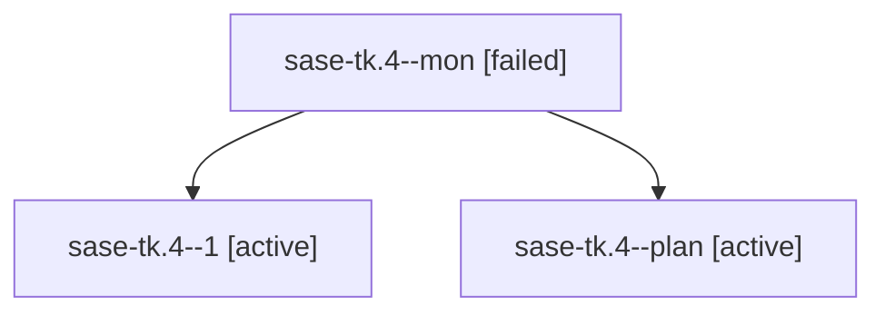

# Family: sase-tk.4

[Agent Hoods](../README.md) / [bbugyi200](../users/bbugyi200/README.md) / [athena](../users/bbugyi200/machines/athena/README.md) / [sase-tk](../users/bbugyi200/machines/athena/hoods/sase-tk/README.md) / sase-tk.4

Owner: `bbugyi200.athena` · Hood: `sase-tk` · Members: 3 · Bead: [sase-tk.4](https://github.com/sase-org/sase--beads/blob/main/pages/sase-tk/sase-tk.4.md)

## Lineage

The diagram is an optional enhancement; the ordered table below contains the same lineage in accessible text.

| Role | Agent | State | Model / provider | Timing | Commits | Prompt | Chat |
|---|---|---|---|---|---:|---|---|
| mon | sase-tk.4--mon | failed | gpt-5.5 / codex | 2026-08-25T15:21:14.879067+00:00 | 0 | — | [Chat](../agents/bbugyi200.athena.sase-tk.4--mon/chat.md) |
| 1 | sase-tk.4--1 | active | gpt-5.5 / codex | 2026-08-25T16:33:22.366814+00:00 | [1](../agents/bbugyi200.athena.sase-tk.4--1/README.md#commits) | [Prompt](../agents/bbugyi200.athena.sase-tk.4--1/prompt.md) | — |
| plan | sase-tk.4--plan | active | gpt-5.5 / codex | 2026-08-25T14:54:21.334181+00:00 | 0 | [Prompt](../agents/bbugyi200.athena.sase-tk.4--plan/prompt.md) | [Chat](../agents/bbugyi200.athena.sase-tk.4--plan/chat.md) |

## Commits

| Role | Repo | Commit | Subject | Committed |
|---|---|---|---|---|
| 1 | sase | [`cc66e7b`](https://github.com/sase-org/sase/commit/cc66e7bf321680feae3a781a51a1994eb2ef96fa) | feat(ace-tui): show clan/family/lane total runtime rows | 2026-08-25 12:20:22 EDT |

## Neighbors

| Agent | Relation | State |
|---|---|---|
| [sase-tk.1](../agents/bbugyi200.athena.sase-tk.1/README.md) | sase-tk hood | active |
| [sase-tk.2](../agents/bbugyi200.athena.sase-tk.2/README.md) | sase-tk hood | active |
| [sase-tk.3](../agents/bbugyi200.athena.sase-tk.3/README.md) | sase-tk hood | active |
| [sase-tk.land](bbugyi200.athena.sase-tk.land.md) (family · 2) | sase-tk hood | active 1, completed 1 |
