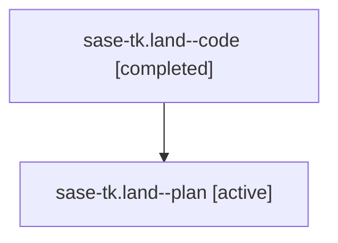

# Family: sase-tk.land

[Agent Hoods](../README.md) / [bbugyi200](../users/bbugyi200/README.md) / [athena](../users/bbugyi200/machines/athena/README.md) / [sase-tk](../users/bbugyi200/machines/athena/hoods/sase-tk/README.md) / sase-tk.land

Owner: `bbugyi200.athena` · Hood: `sase-tk` · Members: 2 · Bead: [sase-tk](https://github.com/sase-org/sase--beads/blob/main/pages/sase-tk/README.md)

## Lineage

The diagram is an optional enhancement; the ordered table below contains the same lineage in accessible text.

| Role | Agent | State | Model / provider | Timing | Commits | Prompt | Chat |
|---|---|---|---|---|---:|---|---|
| code | sase-tk.land--code | completed | gpt-5.5 / codex | 2026-08-25T17:05:30.032232+00:00 → 2026-08-25T17:16:14.334077+00:00 | [1](../agents/bbugyi200.athena.sase-tk.land--code/README.md#commits) | — | [Chat](../agents/bbugyi200.athena.sase-tk.land--code/chat.md) |
| plan | sase-tk.land--plan | active | gpt-5.6-sol / codex | 2026-08-25T16:40:24.361858+00:00 | 0 | [Prompt](../agents/bbugyi200.athena.sase-tk.land--plan/prompt.md) | [Chat](../agents/bbugyi200.athena.sase-tk.land--plan/chat.md) |

## Commits

| Role | Repo | Commit | Subject | Committed |
|---|---|---|---|---|
| code | sase | [`0bdca93`](https://github.com/sase-org/sase/commit/0bdca9380de38a8fe7857531537839944bd9f415) | fix(agent): release condition lease on marker failure | 2026-08-25 13:15:10 EDT |

## Neighbors

| Agent | Relation | State |
|---|---|---|
| [sase-tk.1](../agents/bbugyi200.athena.sase-tk.1/README.md) | sase-tk hood | active |
| [sase-tk.2](../agents/bbugyi200.athena.sase-tk.2/README.md) | sase-tk hood | active |
| [sase-tk.3](../agents/bbugyi200.athena.sase-tk.3/README.md) | sase-tk hood | active |
| [sase-tk.4](bbugyi200.athena.sase-tk.4.md) (family · 3) | sase-tk hood | active 2, failed 1 |
