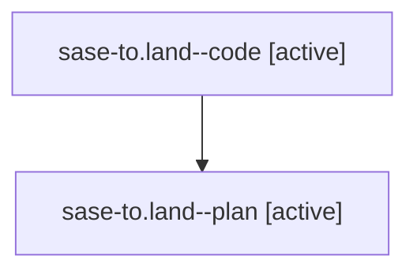

# Family: sase-to.land

[Agent Hoods](../README.md) / [bbugyi200](../users/bbugyi200/README.md) / [athena](../users/bbugyi200/machines/athena/README.md) / [sase-to](../users/bbugyi200/machines/athena/hoods/sase-to/README.md) / sase-to.land

Owner: `bbugyi200.athena` · Hood: `sase-to` · Members: 2 · Bead: [sase-to](https://github.com/sase-org/sase--beads/blob/main/pages/sase-to/README.md)

## Lineage

The diagram is an optional enhancement; the ordered table below contains the same lineage in accessible text.

| Role | Agent | State | Model / provider | Timing | Commits | Prompt | Chat |
|---|---|---|---|---|---:|---|---|
| code | sase-to.land--code | active | gpt-5.5 / codex | 2026-08-25T18:48:23.105877+00:00 | [1](../agents/bbugyi200.athena.sase-to.land--code/README.md#commits) | — | — |
| plan | sase-to.land--plan | active | gpt-5.6-sol / codex | 2026-08-25T18:38:46.774198+00:00 | 0 | [Prompt](../agents/bbugyi200.athena.sase-to.land--plan/prompt.md) | [Chat](../agents/bbugyi200.athena.sase-to.land--plan/chat.md) |

## Commits

| Role | Repo | Commit | Subject | Committed |
|---|---|---|---|---|
| code | sase | [`269329d`](https://github.com/sase-org/sase/commit/269329d34f0b32cfef8089f168c3e07c9b70dfa1) | fix(plugins): batch required-plugin gate installs | 2026-08-25 15:30:36 EDT |

## Neighbors

| Agent | Relation | State |
|---|---|---|
| [sase-to.1](../agents/bbugyi200.athena.sase-to.1/README.md) | sase-to hood | completed |
| [sase-to.2](../agents/bbugyi200.athena.sase-to.2/README.md) | sase-to hood | completed |
| [sase-to.3](../agents/bbugyi200.athena.sase-to.3/README.md) | sase-to hood | completed |
| [sase-to.4](../agents/bbugyi200.athena.sase-to.4/README.md) | sase-to hood | completed |
