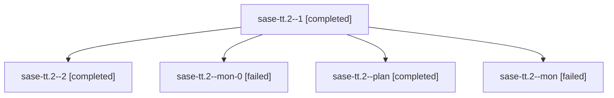

# Family: sase-tt.2

[Agent Hoods](../README.md) / [bbugyi200](../users/bbugyi200/README.md) / [athena](../users/bbugyi200/machines/athena/README.md) / [sase-tt](../users/bbugyi200/machines/athena/hoods/sase-tt/README.md) / sase-tt.2

Owner: `bbugyi200.athena` · Hood: `sase-tt` · Members: 5 · Bead: [sase-tt.2](https://github.com/sase-org/sase--beads/blob/main/pages/sase-tt/sase-tt.2.md)

## Lineage

The diagram is an optional enhancement; the ordered table below contains the same lineage in accessible text.

| Role | Agent | State | Model / provider | Timing | Commits | Prompt | Chat |
|---|---|---|---|---|---:|---|---|
| 1 | sase-tt.2--1 | completed | sonnet / claude | 2026-08-25T20:14:48.907642+00:00 → 2026-08-25T20:18:56.693826+00:00 | 0 | [Prompt](../agents/bbugyi200.athena.sase-tt.2--1/prompt.md) | [Chat](../agents/bbugyi200.athena.sase-tt.2--1/chat.md) |
| 2 | sase-tt.2--2 | completed | gpt-5.5 / codex | 2026-08-25T20:22:47.313456+00:00 → 2026-08-25T20:26:13.886545+00:00 | [1](../agents/bbugyi200.athena.sase-tt.2--2/README.md#commits) | [Prompt](../agents/bbugyi200.athena.sase-tt.2--2/prompt.md) | [Chat](../agents/bbugyi200.athena.sase-tt.2--2/chat.md) |
| mon-0 | sase-tt.2--mon-0 | failed | sonnet / claude | 2026-08-25T20:18:42.905172+00:00 | 0 | — | [Chat](../agents/bbugyi200.athena.sase-tt.2--mon-0/chat.md) |
| plan | sase-tt.2--plan | completed | sonnet / claude | 2026-08-25T19:51:05.119905+00:00 → 2026-08-25T20:04:22.503768+00:00 | 0 | [Prompt](../agents/bbugyi200.athena.sase-tt.2--plan/prompt.md) | [Chat](../agents/bbugyi200.athena.sase-tt.2--plan/chat.md) |
| mon | sase-tt.2--mon | failed | sonnet / claude | 2026-08-25T20:04:10.206421+00:00 | 0 | — | [Chat](../agents/bbugyi200.athena.sase-tt.2--mon/chat.md) |

## Commits

| Role | Repo | Commit | Subject | Committed |
|---|---|---|---|---|
| 2 | sase | [`fe66394`](https://github.com/sase-org/sase/commit/fe663948fa8d495d3eda69d67a7dc7f0ae757f75) | perf(agent-names): memoize registry staleness checks | 2026-08-25 16:25:21 EDT |

## Neighbors

| Agent | Relation | State |
|---|---|---|
| [sase-tt.1](../agents/bbugyi200.athena.sase-tt.1/README.md) | sase-tt hood | completed |
| [sase-tt.3](../agents/bbugyi200.athena.sase-tt.3/README.md) | sase-tt hood | completed |
| [sase-tt.4](../agents/bbugyi200.athena.sase-tt.4/README.md) | sase-tt hood | completed |
| [sase-tt.5](../agents/bbugyi200.athena.sase-tt.5/README.md) | sase-tt hood | completed |
| [sase-tt.6](../agents/bbugyi200.athena.sase-tt.6/README.md) | sase-tt hood | completed |
| [sase-tt.7](../agents/bbugyi200.athena.sase-tt.7/README.md) | sase-tt hood | completed |
| [sase-tt.8](../agents/bbugyi200.athena.sase-tt.8/README.md) | sase-tt hood | completed |
| [sase-tt.land](../agents/bbugyi200.athena.sase-tt.land/README.md) | sase-tt hood | active |
