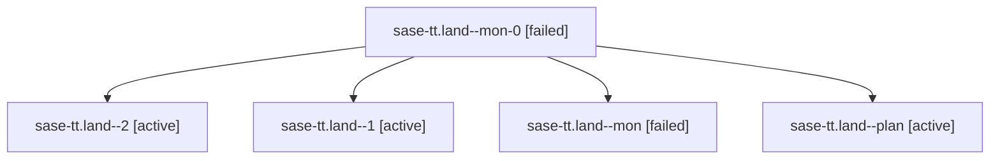

# Family: sase-tt.land

[Agent Hoods](../README.md) / [bbugyi200](../users/bbugyi200/README.md) / [athena](../users/bbugyi200/machines/athena/README.md) / [sase-tt](../users/bbugyi200/machines/athena/hoods/sase-tt/README.md) / sase-tt.land

Owner: `bbugyi200.athena` · Hood: `sase-tt` · Members: 5 · Bead: [sase-tt](https://github.com/sase-org/sase--beads/blob/main/pages/sase-tt/README.md)

## Lineage

The diagram is an optional enhancement; the ordered table below contains the same lineage in accessible text.

| Role | Agent | State | Model / provider | Timing | Commits | Prompt | Chat |
|---|---|---|---|---|---:|---|---|
| mon-0 | sase-tt.land--mon-0 | failed | opus / claude | 2026-08-25T22:38:52.376261+00:00 | 0 | — | [Chat](../agents/bbugyi200.athena.sase-tt.land--mon-0/chat.md) |
| 2 | sase-tt.land--2 | active | opus / claude | 2026-08-25T23:42:34.403017+00:00 | 0 | [Prompt](../agents/bbugyi200.athena.sase-tt.land--2/prompt.md) | — |
| 1 | sase-tt.land--1 | active | opus / claude | 2026-08-25T22:36:45.711876+00:00 | 0 | [Prompt](../agents/bbugyi200.athena.sase-tt.land--1/prompt.md) | [Chat](../agents/bbugyi200.athena.sase-tt.land--1/chat.md) |
| mon | sase-tt.land--mon | failed | opus / claude | 2026-08-25T22:13:12.806510+00:00 | 0 | — | [Chat](../agents/bbugyi200.athena.sase-tt.land--mon/chat.md) |
| plan | sase-tt.land--plan | active | opus / claude | 2026-08-25T21:33:01.743196+00:00 | 0 | [Prompt](../agents/bbugyi200.athena.sase-tt.land--plan/prompt.md) | [Chat](../agents/bbugyi200.athena.sase-tt.land--plan/chat.md) |

## Commits

| Role | Repo | Commit | Subject | Committed |
|---|---|---|---|---|
| — | sase | [`5a1b886`](https://github.com/sase-org/sase/commit/5a1b8868335d8a183e4f6a0fe760efcb8fab9767) | fix(agent-names): pay the full staleness proof on reservation reads | 2026-08-25 19:59:16 EDT |

## Neighbors

| Agent | Relation | State |
|---|---|---|
| [sase-tt.1](../agents/bbugyi200.athena.sase-tt.1/README.md) | sase-tt hood | active |
| [sase-tt.2](bbugyi200.athena.sase-tt.2.md) (family · 5) | sase-tt hood | active 3, failed 2 |
| [sase-tt.3](../agents/bbugyi200.athena.sase-tt.3/README.md) | sase-tt hood | active |
| [sase-tt.4](../agents/bbugyi200.athena.sase-tt.4/README.md) | sase-tt hood | active |
| [sase-tt.5](../agents/bbugyi200.athena.sase-tt.5/README.md) | sase-tt hood | active |
| [sase-tt.6](../agents/bbugyi200.athena.sase-tt.6/README.md) | sase-tt hood | active |
| [sase-tt.7](../agents/bbugyi200.athena.sase-tt.7/README.md) | sase-tt hood | active |
| [sase-tt.8](../agents/bbugyi200.athena.sase-tt.8/README.md) | sase-tt hood | active |
