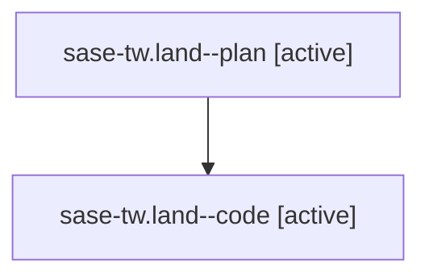

# Family: sase-tw.land

[Agent Hoods](../README.md) / [bbugyi200](../users/bbugyi200/README.md) / [athena](../users/bbugyi200/machines/athena/README.md) / [sase-tw](../users/bbugyi200/machines/athena/hoods/sase-tw/README.md) / sase-tw.land

Owner: `bbugyi200.athena` · Hood: `sase-tw` · Members: 2 · Bead: [sase-tw](https://github.com/sase-org/sase--beads/blob/main/pages/sase-tw/README.md)

## Lineage

The diagram is an optional enhancement; the ordered table below contains the same lineage in accessible text.

| Role | Agent | State | Model / provider | Timing | Commits | Prompt | Chat |
|---|---|---|---|---|---:|---|---|
| plan | sase-tw.land--plan | active | opus / claude | 2026-08-26T01:12:17.205065+00:00 | 0 | [Prompt](../agents/bbugyi200.athena.sase-tw.land--plan/prompt.md) | [Chat](../agents/bbugyi200.athena.sase-tw.land--plan/chat.md) |
| code | sase-tw.land--code | active | gpt-5.5 / codex | 2026-08-26T01:49:39.022125+00:00 | 0 | — | — |

## Neighbors

| Agent | Relation | State |
|---|---|---|
| [sase-tw.1](../agents/bbugyi200.athena.sase-tw.1/README.md) | sase-tw hood | completed |
| [sase-tw.10](../agents/bbugyi200.athena.sase-tw.10/README.md) | sase-tw hood | completed |
| [sase-tw.11](../agents/bbugyi200.athena.sase-tw.11/README.md) | sase-tw hood | completed |
| [sase-tw.12](../agents/bbugyi200.athena.sase-tw.12/README.md) | sase-tw hood | completed |
| [sase-tw.13](../agents/bbugyi200.athena.sase-tw.13/README.md) | sase-tw hood | completed |
| [sase-tw.14](../agents/bbugyi200.athena.sase-tw.14/README.md) | sase-tw hood | completed |
| [sase-tw.2](../agents/bbugyi200.athena.sase-tw.2/README.md) | sase-tw hood | completed |
| [sase-tw.3](../agents/bbugyi200.athena.sase-tw.3/README.md) | sase-tw hood | completed |
| [sase-tw.4](../agents/bbugyi200.athena.sase-tw.4/README.md) | sase-tw hood | dismissed |
| [sase-tw.5](../agents/bbugyi200.athena.sase-tw.5/README.md) | sase-tw hood | completed |
| [sase-tw.6](../agents/bbugyi200.athena.sase-tw.6/README.md) | sase-tw hood | completed |
| [sase-tw.7](../agents/bbugyi200.athena.sase-tw.7/README.md) | sase-tw hood | completed |
| [sase-tw.8](../agents/bbugyi200.athena.sase-tw.8/README.md) | sase-tw hood | completed |
| [sase-tw.9](../agents/bbugyi200.athena.sase-tw.9/README.md) | sase-tw hood | completed |
