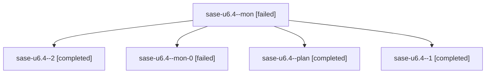

# Family: sase-u6.4

[Agent Hoods](../README.md) / [bbugyi200](../users/bbugyi200/README.md) / [athena](../users/bbugyi200/machines/athena/README.md) / [sase-u6](../users/bbugyi200/machines/athena/hoods/sase-u6/README.md) / sase-u6.4

Owner: `bbugyi200.athena` · Hood: `sase-u6` · Members: 5 · Bead: [sase-u6.4](https://github.com/sase-org/sase--beads/blob/main/pages/sase-u6/sase-u6.4.md)

## Lineage

The diagram is an optional enhancement; the ordered table below contains the same lineage in accessible text.

| Role | Agent | State | Model / provider | Timing | Commits | Prompt | Chat |
|---|---|---|---|---|---:|---|---|
| mon | sase-u6.4--mon | failed | gpt-5.5 / codex | 2026-08-26T16:08:24.197881+00:00 | 0 | — | [Chat](../agents/bbugyi200.athena.sase-u6.4--mon/chat.md) |
| 2 | sase-u6.4--2 | completed | sonnet / claude | 2026-08-26T16:51:30.505280+00:00 → 2026-08-26T16:56:26.572895+00:00 | [1](../agents/bbugyi200.athena.sase-u6.4--2/README.md#commits) | [Prompt](../agents/bbugyi200.athena.sase-u6.4--2/prompt.md) | [Chat](../agents/bbugyi200.athena.sase-u6.4--2/chat.md) |
| mon-0 | sase-u6.4--mon-0 | failed | gpt-5.5 / codex | 2026-08-26T16:33:24.347545+00:00 | 0 | — | [Chat](../agents/bbugyi200.athena.sase-u6.4--mon-0/chat.md) |
| plan | sase-u6.4--plan | completed | gpt-5.5 / codex | 2026-08-26T15:44:56.506674+00:00 → 2026-08-26T16:08:54.231112+00:00 | 0 | [Prompt](../agents/bbugyi200.athena.sase-u6.4--plan/prompt.md) | [Chat](../agents/bbugyi200.athena.sase-u6.4--plan/chat.md) |
| 1 | sase-u6.4--1 | completed | gpt-5.5 / codex | 2026-08-26T16:26:07.701959+00:00 → 2026-08-26T16:33:58.248013+00:00 | 0 | [Prompt](../agents/bbugyi200.athena.sase-u6.4--1/prompt.md) | [Chat](../agents/bbugyi200.athena.sase-u6.4--1/chat.md) |

## Commits

| Role | Repo | Commit | Subject | Committed |
|---|---|---|---|---|
| 2 | sase | [`2cbe2f1`](https://github.com/sase-org/sase/commit/2cbe2f17d0d4e0b5fd7d1eec0cdf970303472268) | test(artifacts): add pane-description PNG goldens and rebaseline visuals | 2026-08-26 12:55:14 EDT |

## Neighbors

| Agent | Relation | State |
|---|---|---|
| [sase-u6.1](../agents/bbugyi200.athena.sase-u6.1/README.md) | sase-u6 hood | completed |
| [sase-u6.2](../agents/bbugyi200.athena.sase-u6.2/README.md) | sase-u6 hood | completed |
| [sase-u6.3](../agents/bbugyi200.athena.sase-u6.3/README.md) | sase-u6 hood | completed |
| [sase-u6.land](../agents/bbugyi200.athena.sase-u6.land/README.md) | sase-u6 hood | active |
