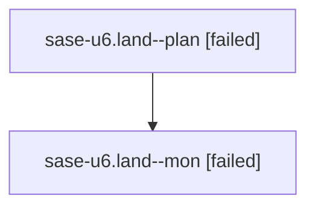

# Family: sase-u6.land

[Agent Hoods](../README.md) / [bbugyi200](../users/bbugyi200/README.md) / [athena](../users/bbugyi200/machines/athena/README.md) / [sase-u6](../users/bbugyi200/machines/athena/hoods/sase-u6/README.md) / sase-u6.land

Owner: `bbugyi200.athena` · Hood: `sase-u6` · Members: 2 · Bead: [sase-u6](https://github.com/sase-org/sase--beads/blob/main/pages/sase-u6/README.md)

## Lineage

The diagram is an optional enhancement; the ordered table below contains the same lineage in accessible text.

| Role | Agent | State | Model / provider | Timing | Commits | Prompt | Chat |
|---|---|---|---|---|---:|---|---|
| plan | sase-u6.land--plan | failed | gpt-5.6-sol / codex | 2026-08-26T16:56:15.742853+00:00 → 2026-08-26T17:08:49.634175+00:00 | 0 | [Prompt](../agents/bbugyi200.athena.sase-u6.land--plan/prompt.md) | [Chat](../agents/bbugyi200.athena.sase-u6.land--plan/chat.md) |
| mon | sase-u6.land--mon | failed | gpt-5.6-sol / codex | 2026-08-26T17:08:43.911850+00:00 | 0 | — | [Chat](../agents/bbugyi200.athena.sase-u6.land--mon/chat.md) |

## Neighbors

| Agent | Relation | State |
|---|---|---|
| [sase-u6.1](../agents/bbugyi200.athena.sase-u6.1/README.md) | sase-u6 hood | completed |
| [sase-u6.2](../agents/bbugyi200.athena.sase-u6.2/README.md) | sase-u6 hood | completed |
| [sase-u6.3](../agents/bbugyi200.athena.sase-u6.3/README.md) | sase-u6 hood | completed |
| [sase-u6.4](bbugyi200.athena.sase-u6.4.md) (family · 5) | sase-u6 hood | completed 3, failed 2 |
| [sase-u6.5.1](../agents/bbugyi200.athena.sase-u6.5.1/README.md) | sase-u6 hood | active |
| [sase-u6.5.2](../agents/bbugyi200.athena.sase-u6.5.2/README.md) | sase-u6 hood | waiting |
| [sase-u6.5.land](../agents/bbugyi200.athena.sase-u6.5.land/README.md) | sase-u6 hood | waiting |
