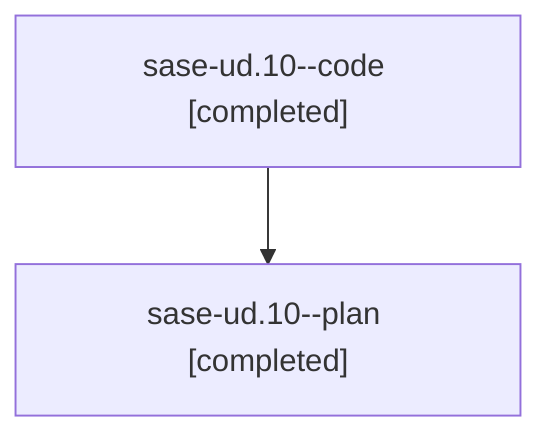

# Family: sase-ud.10

[Agent Hoods](../README.md) / [bbugyi200](../users/bbugyi200/README.md) / [athena](../users/bbugyi200/machines/athena/README.md) / [sase-ud](../users/bbugyi200/machines/athena/hoods/sase-ud/README.md) / sase-ud.10

Owner: `bbugyi200.athena` · Hood: `sase-ud` · Members: 2 · Bead: [sase-ud.10](https://github.com/sase-org/sase--beads/blob/main/pages/sase-ud/sase-ud.10.md)

## Lineage

The diagram is an optional enhancement; the ordered table below contains the same lineage in accessible text.

| Role | Agent | State | Model / provider | Timing | Commits | Prompt | Chat |
|---|---|---|---|---|---:|---|---|
| code | sase-ud.10--code | completed | sonnet / claude | 2026-08-27T03:03:12.654275+00:00 → 2026-08-27T04:15:57.984099+00:00 | [1](../agents/bbugyi200.athena.sase-ud.10--code/README.md#commits) | — | [Chat](../agents/bbugyi200.athena.sase-ud.10--code/chat.md) |
| plan | sase-ud.10--plan | completed | opus / claude | 2026-08-27T02:48:28.442125+00:00 → 2026-08-27T04:15:57.984099+00:00 | 0 | [Prompt](../agents/bbugyi200.athena.sase-ud.10--plan/prompt.md) | [Chat](../agents/bbugyi200.athena.sase-ud.10--plan/chat.md) |

## Commits

| Role | Repo | Commit | Subject | Committed |
|---|---|---|---|---|
| code | sase | [`05ce87f`](https://github.com/sase-org/sase/commit/05ce87fbf3d0942372ccc3b74cec299f8374af39) | feat(gate-shell): migrate /sase\_questions to a gate shell behind gate\_shell\_handoff | 2026-08-27 00:13:19 EDT |

## Neighbors

| Agent | Relation | State |
|---|---|---|
| [sase-ud.1](../agents/bbugyi200.athena.sase-ud.1/README.md) | sase-ud hood | completed |
| [sase-ud.11](bbugyi200.athena.sase-ud.11.md) (family · 2) | sase-ud hood | active 2 |
| [sase-ud.12](../agents/bbugyi200.athena.sase-ud.12/README.md) | sase-ud hood | waiting |
| [sase-ud.13](../agents/bbugyi200.athena.sase-ud.13/README.md) | sase-ud hood | waiting |
| [sase-ud.14](../agents/bbugyi200.athena.sase-ud.14/README.md) | sase-ud hood | waiting |
| [sase-ud.2](bbugyi200.athena.sase-ud.2.md) (family · 6) | sase-ud hood | completed 4, failed 2 |
| [sase-ud.3](bbugyi200.athena.sase-ud.3.md) (family · 2) | sase-ud hood | completed 2 |
| [sase-ud.4](../agents/bbugyi200.athena.sase-ud.4/README.md) | sase-ud hood | completed |
| [sase-ud.5](../agents/bbugyi200.athena.sase-ud.5/README.md) | sase-ud hood | completed |
| [sase-ud.6](bbugyi200.athena.sase-ud.6.md) (family · 2) | sase-ud hood | completed 2 |
| [sase-ud.7](bbugyi200.athena.sase-ud.7.md) (family · 4) | sase-ud hood | completed 3, failed 1 |
| [sase-ud.8](../agents/bbugyi200.athena.sase-ud.8/README.md) | sase-ud hood | completed |
| [sase-ud.9](../agents/bbugyi200.athena.sase-ud.9/README.md) | sase-ud hood | completed |
| [sase-ud.land](../agents/bbugyi200.athena.sase-ud.land/README.md) | sase-ud hood | waiting |
