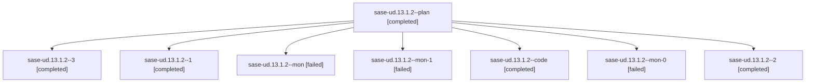

# Family: sase-ud.13.1.2

[Agent Hoods](../README.md) / [bbugyi200](../users/bbugyi200/README.md) / [athena](../users/bbugyi200/machines/athena/README.md) / [sase-ud](../users/bbugyi200/machines/athena/hoods/sase-ud/README.md) / sase-ud.13.1.2

Owner: `bbugyi200.athena` · Hood: `sase-ud` · Members: 8 · Bead: [sase-ud.13.1.2](https://github.com/sase-org/sase--beads/blob/main/pages/sase-ud/sase-ud.13.1.2.md)

## Lineage

The diagram is an optional enhancement; the ordered table below contains the same lineage in accessible text.

| Role | Agent | State | Model / provider | Timing | Commits | Prompt | Chat |
|---|---|---|---|---|---:|---|---|
| plan | sase-ud.13.1.2--plan | completed | gpt-5.6-sol / codex | 2026-08-27T12:50:52.707649+00:00 → 2026-08-27T14:10:12.351108+00:00 | 0 | [Prompt](../agents/bbugyi200.athena.sase-ud.13.1.2--plan/prompt.md) | [Chat](../agents/bbugyi200.athena.sase-ud.13.1.2--plan/chat.md) |
| 3 | sase-ud.13.1.2--3 | completed | sonnet / claude | 2026-08-27T15:12:25.893577+00:00 → 2026-08-27T15:17:09.051135+00:00 | 0 | [Prompt](../agents/bbugyi200.athena.sase-ud.13.1.2--3/prompt.md) | [Chat](../agents/bbugyi200.athena.sase-ud.13.1.2--3/chat.md) |
| 1 | sase-ud.13.1.2--1 | completed | sonnet / claude | 2026-08-27T14:34:18.339487+00:00 → 2026-08-27T14:48:16.916523+00:00 | 0 | [Prompt](../agents/bbugyi200.athena.sase-ud.13.1.2--1/prompt.md) | [Chat](../agents/bbugyi200.athena.sase-ud.13.1.2--1/chat.md) |
| mon | sase-ud.13.1.2--mon | failed | sonnet / claude | 2026-08-27T14:09:53.511335+00:00 | 0 | — | [Chat](../agents/bbugyi200.athena.sase-ud.13.1.2--mon/chat.md) |
| mon-1 | sase-ud.13.1.2--mon-1 | failed | sonnet / claude | 2026-08-27T15:02:40.310574+00:00 | 0 | — | [Chat](../agents/bbugyi200.athena.sase-ud.13.1.2--mon-1/chat.md) |
| code | sase-ud.13.1.2--code | completed | sonnet / claude | 2026-08-27T12:54:45.708986+00:00 → 2026-08-27T14:10:12.351108+00:00 | 0 | — | [Chat](../agents/bbugyi200.athena.sase-ud.13.1.2--code/chat.md) |
| mon-0 | sase-ud.13.1.2--mon-0 | failed | sonnet / claude | 2026-08-27T14:47:58.558349+00:00 | 0 | — | [Chat](../agents/bbugyi200.athena.sase-ud.13.1.2--mon-0/chat.md) |
| 2 | sase-ud.13.1.2--2 | completed | sonnet / claude | 2026-08-27T15:00:25.856078+00:00 → 2026-08-27T15:03:00.624481+00:00 | 0 | [Prompt](../agents/bbugyi200.athena.sase-ud.13.1.2--2/prompt.md) | [Chat](../agents/bbugyi200.athena.sase-ud.13.1.2--2/chat.md) |

## Commits

| Role | Repo | Commit | Subject | Committed |
|---|---|---|---|---|
| — | sase | [`a646bda`](https://github.com/sase-org/sase/commit/a646bdaf6b75838326f8c9d16f42fb935393e5c1) | refactor(plan-gate): remove the gate\_shell\_handoff flag and blocking Off branch | 2026-08-27 11:14:29 EDT |

## Neighbors

| Agent | Relation | State |
|---|---|---|
| [sase-ud.13](bbugyi200.athena.sase-ud.13.md) (family · 2) | ancestor | failed 2 |
| [sase-ud.13.1.1](../agents/bbugyi200.athena.sase-ud.13.1.1/README.md) | sase-ud.13.1 hood | completed |
| [sase-ud.13.1.3](bbugyi200.athena.sase-ud.13.1.3.md) (family · 2) | sase-ud.13.1 hood | failed 2 |
| [sase-ud.13.1.3.1.1](bbugyi200.athena.sase-ud.13.1.3.1.1.md) (family · 5) | sase-ud.13.1 hood | completed 3, failed 2 |
| [sase-ud.13.1.3.1.2](../agents/bbugyi200.athena.sase-ud.13.1.3.1.2/README.md) | sase-ud.13.1 hood | completed |
| [sase-ud.13.1.3.1.3](../agents/bbugyi200.athena.sase-ud.13.1.3.1.3/README.md) | sase-ud.13.1 hood | completed |
| [sase-ud.13.1.3.1.4](../agents/bbugyi200.athena.sase-ud.13.1.3.1.4/README.md) | sase-ud.13.1 hood | active |
| [sase-ud.13.1.3.1.land](../agents/bbugyi200.athena.sase-ud.13.1.3.1.land/README.md) | sase-ud.13.1 hood | waiting |
| [sase-ud.13.1.4](../agents/bbugyi200.athena.sase-ud.13.1.4/README.md) | sase-ud.13.1 hood | waiting |
| [sase-ud.13.1.5](../agents/bbugyi200.athena.sase-ud.13.1.5/README.md) | sase-ud.13.1 hood | completed |
| [sase-ud.13.1.land](../agents/bbugyi200.athena.sase-ud.13.1.land/README.md) | sase-ud.13.1 hood | waiting |
| [sase-ud.1](../agents/bbugyi200.athena.sase-ud.1/README.md) | sase-ud hood | completed |
| [sase-ud.10](bbugyi200.athena.sase-ud.10.md) (family · 2) | sase-ud hood | completed 2 |
| [sase-ud.11](bbugyi200.athena.sase-ud.11.md) (family · 2) | sase-ud hood | completed 2 |
| [sase-ud.12](bbugyi200.athena.sase-ud.12.md) (family · 2) | sase-ud hood | completed 2 |
| [sase-ud.14](../agents/bbugyi200.athena.sase-ud.14/README.md) | sase-ud hood | waiting |
| [sase-ud.2](bbugyi200.athena.sase-ud.2.md) (family · 6) | sase-ud hood | completed 4, failed 2 |
| [sase-ud.3](bbugyi200.athena.sase-ud.3.md) (family · 2) | sase-ud hood | completed 2 |
| [sase-ud.4](../agents/bbugyi200.athena.sase-ud.4/README.md) | sase-ud hood | completed |
| [sase-ud.5](../agents/bbugyi200.athena.sase-ud.5/README.md) | sase-ud hood | completed |
| [sase-ud.6](bbugyi200.athena.sase-ud.6.md) (family · 2) | sase-ud hood | completed 2 |
| [sase-ud.7](bbugyi200.athena.sase-ud.7.md) (family · 4) | sase-ud hood | completed 3, failed 1 |
| [sase-ud.8](../agents/bbugyi200.athena.sase-ud.8/README.md) | sase-ud hood | completed |
| [sase-ud.9](../agents/bbugyi200.athena.sase-ud.9/README.md) | sase-ud hood | completed |
| [sase-ud.land](../agents/bbugyi200.athena.sase-ud.land/README.md) | sase-ud hood | waiting |
