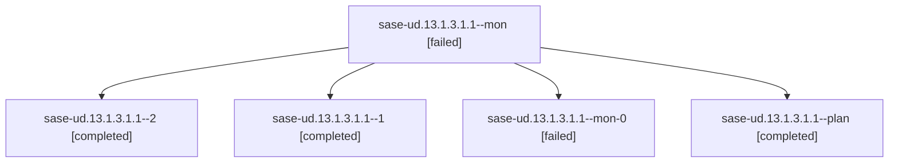

# Family: sase-ud.13.1.3.1.1

[Agent Hoods](../README.md) / [bbugyi200](../users/bbugyi200/README.md) / [athena](../users/bbugyi200/machines/athena/README.md) / [sase-ud](../users/bbugyi200/machines/athena/hoods/sase-ud/README.md) / sase-ud.13.1.3.1.1

Owner: `bbugyi200.athena` · Hood: `sase-ud` · Members: 5 · Bead: [sase-ud.13.1.3.1.1](https://github.com/sase-org/sase--beads/blob/main/pages/sase-ud/sase-ud.13.1.3.1.1.md)

## Lineage

The diagram is an optional enhancement; the ordered table below contains the same lineage in accessible text.

| Role | Agent | State | Model / provider | Timing | Commits | Prompt | Chat |
|---|---|---|---|---|---:|---|---|
| mon | sase-ud.13.1.3.1.1--mon | failed | sonnet / claude | 2026-08-27T16:07:38.779111+00:00 | 0 | — | [Chat](../agents/bbugyi200.athena.sase-ud.13.1.3.1.1--mon/chat.md) |
| 2 | sase-ud.13.1.3.1.1--2 | completed | sonnet / claude | 2026-08-27T16:24:41.463074+00:00 → 2026-08-27T16:34:27.946562+00:00 | [1](../agents/bbugyi200.athena.sase-ud.13.1.3.1.1--2/README.md#commits) | [Prompt](../agents/bbugyi200.athena.sase-ud.13.1.3.1.1--2/prompt.md) | [Chat](../agents/bbugyi200.athena.sase-ud.13.1.3.1.1--2/chat.md) |
| 1 | sase-ud.13.1.3.1.1--1 | completed | sonnet / claude | 2026-08-27T16:13:13.758153+00:00 → 2026-08-27T16:14:18.782008+00:00 | 0 | [Prompt](../agents/bbugyi200.athena.sase-ud.13.1.3.1.1--1/prompt.md) | [Chat](../agents/bbugyi200.athena.sase-ud.13.1.3.1.1--1/chat.md) |
| mon-0 | sase-ud.13.1.3.1.1--mon-0 | failed | sonnet / claude | 2026-08-27T16:14:10.114301+00:00 | 0 | — | [Chat](../agents/bbugyi200.athena.sase-ud.13.1.3.1.1--mon-0/chat.md) |
| plan | sase-ud.13.1.3.1.1--plan | completed | sonnet / claude | 2026-08-27T15:54:23.820332+00:00 → 2026-08-27T16:07:48.731910+00:00 | 0 | [Prompt](../agents/bbugyi200.athena.sase-ud.13.1.3.1.1--plan/prompt.md) | [Chat](../agents/bbugyi200.athena.sase-ud.13.1.3.1.1--plan/chat.md) |

## Commits

| Role | Repo | Commit | Subject | Committed |
|---|---|---|---|---|
| 2 | sase | [`2f8bc9a`](https://github.com/sase-org/sase/commit/2f8bc9abb4e90d23f5e1dd1c171da61d5639b1b8) | test(status-strip): pin gate-shell family projection contract for \_apply\_status\_overrides | 2026-08-27 12:27:38 EDT |

## Neighbors

| Agent | Relation | State |
|---|---|---|
| [sase-ud.13.1.3](bbugyi200.athena.sase-ud.13.1.3.md) (family · 2) | ancestor | failed 2 |
| [sase-ud.13](bbugyi200.athena.sase-ud.13.md) (family · 2) | ancestor | failed 2 |
| [sase-ud.13.1.3.1.2](../agents/bbugyi200.athena.sase-ud.13.1.3.1.2/README.md) | sase-ud.13.1.3.1 hood | completed |
| [sase-ud.13.1.3.1.3](../agents/bbugyi200.athena.sase-ud.13.1.3.1.3/README.md) | sase-ud.13.1.3.1 hood | completed |
| [sase-ud.13.1.3.1.4](bbugyi200.athena.sase-ud.13.1.3.1.4.md) (family · 21) | sase-ud.13.1.3.1 hood | active 1, completed 9, failed 11 |
| [sase-ud.13.1.3.1.4](../agents/bbugyi200.athena.sase-ud.13.1.3.1.4/README.md) | sase-ud.13.1.3.1 hood | active |
| [sase-ud.13.1.3.1.5.1](../agents/bbugyi200.athena.sase-ud.13.1.3.1.5.1/README.md) | sase-ud.13.1.3.1 hood | active |
| [sase-ud.13.1.3.1.5.land](../agents/bbugyi200.athena.sase-ud.13.1.3.1.5.land/README.md) | sase-ud.13.1.3.1 hood | waiting |
| [sase-ud.13.1.3.1.land](bbugyi200.athena.sase-ud.13.1.3.1.land.md) (family · 3) | sase-ud.13.1.3.1 hood | failed 3 |
| [sase-ud.13.1.3.1.land](../agents/bbugyi200.athena.sase-ud.13.1.3.1.land/README.md) | sase-ud.13.1.3.1 hood | waiting |
| [sase-ud.13.1.1](../agents/bbugyi200.athena.sase-ud.13.1.1/README.md) | sase-ud.13.1 hood | completed |
| [sase-ud.13.1.2](bbugyi200.athena.sase-ud.13.1.2.md) (family · 8) | sase-ud.13.1 hood | completed 5, failed 3 |
| [sase-ud.13.1.4](../agents/bbugyi200.athena.sase-ud.13.1.4/README.md) | sase-ud.13.1 hood | waiting |
| [sase-ud.13.1.5](../agents/bbugyi200.athena.sase-ud.13.1.5/README.md) | sase-ud.13.1 hood | completed |
| [sase-ud.13.1.land](../agents/bbugyi200.athena.sase-ud.13.1.land/README.md) | sase-ud.13.1 hood | waiting |
| [sase-ud.1](../agents/bbugyi200.athena.sase-ud.1/README.md) | sase-ud hood | completed |
| [sase-ud.10](bbugyi200.athena.sase-ud.10.md) (family · 2) | sase-ud hood | completed 2 |
| [sase-ud.11](bbugyi200.athena.sase-ud.11.md) (family · 2) | sase-ud hood | completed 2 |
| [sase-ud.12](bbugyi200.athena.sase-ud.12.md) (family · 2) | sase-ud hood | completed 2 |
| [sase-ud.14](../agents/bbugyi200.athena.sase-ud.14/README.md) | sase-ud hood | waiting |
| [sase-ud.2](bbugyi200.athena.sase-ud.2.md) (family · 6) | sase-ud hood | completed 4, failed 2 |
| [sase-ud.3](bbugyi200.athena.sase-ud.3.md) (family · 2) | sase-ud hood | completed 2 |
| [sase-ud.4](../agents/bbugyi200.athena.sase-ud.4/README.md) | sase-ud hood | completed |
| [sase-ud.5](../agents/bbugyi200.athena.sase-ud.5/README.md) | sase-ud hood | completed |
| [sase-ud.6](bbugyi200.athena.sase-ud.6.md) (family · 2) | sase-ud hood | completed 2 |
| [sase-ud.7](bbugyi200.athena.sase-ud.7.md) (family · 4) | sase-ud hood | completed 3, failed 1 |
| [sase-ud.8](../agents/bbugyi200.athena.sase-ud.8/README.md) | sase-ud hood | completed |
| [sase-ud.9](../agents/bbugyi200.athena.sase-ud.9/README.md) | sase-ud hood | completed |
| [sase-ud.land](../agents/bbugyi200.athena.sase-ud.land/README.md) | sase-ud hood | waiting |
