# Family: sase-ud.13.1.3.1.4

[Agent Hoods](../README.md) / [bbugyi200](../users/bbugyi200/README.md) / [athena](../users/bbugyi200/machines/athena/README.md) / [sase-ud](../users/bbugyi200/machines/athena/hoods/sase-ud/README.md) / sase-ud.13.1.3.1.4

Owner: `bbugyi200.athena` · Hood: `sase-ud` · Members: 21 · Bead: [sase-ud.13.1.3.1.4](https://github.com/sase-org/sase--beads/blob/main/pages/sase-ud/sase-ud.13.1.3.1.4.md)

## Lineage

```mermaid
flowchart TD
  n0["sase-ud.13.1.3.1.4--mon-2 [failed]"]
  n1["sase-ud.13.1.3.1.4--1 [active]"]
  n0 --> n1
  n2["sase-ud.13.1.3.1.4--mon [failed]"]
  n0 --> n2
  n3["sase-ud.13.1.3.1.4--9 [completed]"]
  n0 --> n3
  n4["sase-ud.13.1.3.1.4--a [failed]"]
  n0 --> n4
  n5["sase-ud.13.1.3.1.4--5 [completed]"]
  n0 --> n5
  n6["sase-ud.13.1.3.1.4--mon-6 [failed]"]
  n0 --> n6
  n7["sase-ud.13.1.3.1.4--3 [completed]"]
  n0 --> n7
  n8["sase-ud.13.1.3.1.4--plan [completed]"]
  n0 --> n8
  n9["sase-ud.13.1.3.1.4--6 [completed]"]
  n0 --> n9
  n10["sase-ud.13.1.3.1.4--mon-4 [failed]"]
  n0 --> n10
  n11["sase-ud.13.1.3.1.4--mon-0 [failed]"]
  n0 --> n11
  n12["sase-ud.13.1.3.1.4--4 [completed]"]
  n0 --> n12
  n13["sase-ud.13.1.3.1.4--mon-7 [failed]"]
  n0 --> n13
  n14["sase-ud.13.1.3.1.4--8 [completed]"]
  n0 --> n14
  n15["sase-ud.13.1.3.1.4--mon-3 [failed]"]
  n0 --> n15
  n16["sase-ud.13.1.3.1.4--7 [completed]"]
  n0 --> n16
  n17["sase-ud.13.1.3.1.4--mon-1 [failed]"]
  n0 --> n17
  n18["sase-ud.13.1.3.1.4--2 [completed]"]
  n0 --> n18
  n19["sase-ud.13.1.3.1.4--mon-8 [failed]"]
  n0 --> n19
  n20["sase-ud.13.1.3.1.4--mon-5 [failed]"]
  n0 --> n20
```

The diagram is an optional enhancement; the ordered table below contains the same lineage in accessible text.

| Role | Agent | State | Model / provider | Timing | Commits | Prompt | Chat |
|---|---|---|---|---|---:|---|---|
| mon-2 | sase-ud.13.1.3.1.4--mon-2 | failed | gpt-5.5 / codex | 2026-08-27T23:49:54.474795+00:00 | 0 | — | [Chat](../agents/bbugyi200.athena.sase-ud.13.1.3.1.4--mon-2/chat.md) |
| 1 | sase-ud.13.1.3.1.4--1 | active | gpt-5.5 / codex | 2026-08-27T22:24:33.029406+00:00 | 0 | [Prompt](../agents/bbugyi200.athena.sase-ud.13.1.3.1.4--1/prompt.md) | [Chat](../agents/bbugyi200.athena.sase-ud.13.1.3.1.4--1/chat.md) |
| mon | sase-ud.13.1.3.1.4--mon | failed | gpt-5.5 / codex | 2026-08-27T21:59:56.141239+00:00 | 0 | — | [Chat](../agents/bbugyi200.athena.sase-ud.13.1.3.1.4--mon/chat.md) |
| 9 | sase-ud.13.1.3.1.4--9 | completed | gpt-5.5 / codex | 2026-08-28T04:15:20.625021+00:00 → 2026-08-28T05:33:33.785274+00:00 | 0 | [Prompt](../agents/bbugyi200.athena.sase-ud.13.1.3.1.4--9/prompt.md) | [Chat](../agents/bbugyi200.athena.sase-ud.13.1.3.1.4--9/chat.md) |
| a | sase-ud.13.1.3.1.4--a | failed | gpt-5.5 / codex | 2026-08-28T05:56:52.029658+00:00 → 2026-08-28T06:38:37.039563+00:00 | 0 | [Prompt](../agents/bbugyi200.athena.sase-ud.13.1.3.1.4--a/prompt.md) | — |
| 5 | sase-ud.13.1.3.1.4--5 | completed | gpt-5.5 / codex | 2026-08-28T01:46:00.444157+00:00 → 2026-08-28T01:55:03.358909+00:00 | 0 | [Prompt](../agents/bbugyi200.athena.sase-ud.13.1.3.1.4--5/prompt.md) | [Chat](../agents/bbugyi200.athena.sase-ud.13.1.3.1.4--5/chat.md) |
| mon-6 | sase-ud.13.1.3.1.4--mon-6 | failed | gpt-5.5 / codex | 2026-08-28T03:30:29.620566+00:00 | 0 | — | [Chat](../agents/bbugyi200.athena.sase-ud.13.1.3.1.4--mon-6/chat.md) |
| 3 | sase-ud.13.1.3.1.4--3 | completed | gpt-5.5 / codex | 2026-08-27T23:16:57.454239+00:00 → 2026-08-27T23:50:26.205446+00:00 | 0 | [Prompt](../agents/bbugyi200.athena.sase-ud.13.1.3.1.4--3/prompt.md) | [Chat](../agents/bbugyi200.athena.sase-ud.13.1.3.1.4--3/chat.md) |
| plan | sase-ud.13.1.3.1.4--plan | completed | gpt-5.5 / codex | 2026-08-27T21:23:53.922562+00:00 → 2026-08-27T22:00:03.663336+00:00 | 0 | [Prompt](../agents/bbugyi200.athena.sase-ud.13.1.3.1.4--plan/prompt.md) | [Chat](../agents/bbugyi200.athena.sase-ud.13.1.3.1.4--plan/chat.md) |
| 6 | sase-ud.13.1.3.1.4--6 | completed | gpt-5.5 / codex | 2026-08-28T02:32:11.130175+00:00 → 2026-08-28T02:37:47.228266+00:00 | 0 | [Prompt](../agents/bbugyi200.athena.sase-ud.13.1.3.1.4--6/prompt.md) | [Chat](../agents/bbugyi200.athena.sase-ud.13.1.3.1.4--6/chat.md) |
| mon-4 | sase-ud.13.1.3.1.4--mon-4 | failed | gpt-5.5 / codex | 2026-08-28T01:54:42.968854+00:00 | 0 | — | [Chat](../agents/bbugyi200.athena.sase-ud.13.1.3.1.4--mon-4/chat.md) |
| mon-0 | sase-ud.13.1.3.1.4--mon-0 | failed | gpt-5.5 / codex | 2026-08-27T22:45:16.607867+00:00 | 0 | — | [Chat](../agents/bbugyi200.athena.sase-ud.13.1.3.1.4--mon-0/chat.md) |
| 4 | sase-ud.13.1.3.1.4--4 | completed | gpt-5.5 / codex | 2026-08-28T01:00:38.194525+00:00 → 2026-08-28T01:08:52.490559+00:00 | 0 | [Prompt](../agents/bbugyi200.athena.sase-ud.13.1.3.1.4--4/prompt.md) | [Chat](../agents/bbugyi200.athena.sase-ud.13.1.3.1.4--4/chat.md) |
| mon-7 | sase-ud.13.1.3.1.4--mon-7 | failed | gpt-5.5 / codex | 2026-08-28T03:52:36.783052+00:00 | 0 | — | [Chat](../agents/bbugyi200.athena.sase-ud.13.1.3.1.4--mon-7/chat.md) |
| 8 | sase-ud.13.1.3.1.4--8 | completed | gpt-5.5 / codex | 2026-08-28T03:36:10.336035+00:00 → 2026-08-28T03:52:52.820774+00:00 | 0 | [Prompt](../agents/bbugyi200.athena.sase-ud.13.1.3.1.4--8/prompt.md) | [Chat](../agents/bbugyi200.athena.sase-ud.13.1.3.1.4--8/chat.md) |
| mon-3 | sase-ud.13.1.3.1.4--mon-3 | failed | gpt-5.5 / codex | 2026-08-28T01:08:32.854163+00:00 | 0 | — | [Chat](../agents/bbugyi200.athena.sase-ud.13.1.3.1.4--mon-3/chat.md) |
| 7 | sase-ud.13.1.3.1.4--7 | completed | gpt-5.5 / codex | 2026-08-28T03:14:47.703752+00:00 → 2026-08-28T03:30:46.416902+00:00 | 0 | [Prompt](../agents/bbugyi200.athena.sase-ud.13.1.3.1.4--7/prompt.md) | [Chat](../agents/bbugyi200.athena.sase-ud.13.1.3.1.4--7/chat.md) |
| mon-1 | sase-ud.13.1.3.1.4--mon-1 | failed | gpt-5.5 / codex | 2026-08-27T22:54:15.930042+00:00 | 0 | — | [Chat](../agents/bbugyi200.athena.sase-ud.13.1.3.1.4--mon-1/chat.md) |
| 2 | sase-ud.13.1.3.1.4--2 | completed | gpt-5.5 / codex | 2026-08-27T22:49:29.207605+00:00 → 2026-08-27T22:54:39.993435+00:00 | 0 | [Prompt](../agents/bbugyi200.athena.sase-ud.13.1.3.1.4--2/prompt.md) | [Chat](../agents/bbugyi200.athena.sase-ud.13.1.3.1.4--2/chat.md) |
| mon-8 | sase-ud.13.1.3.1.4--mon-8 | failed | gpt-5.5 / codex | 2026-08-28T05:33:10.062497+00:00 | 0 | — | [Chat](../agents/bbugyi200.athena.sase-ud.13.1.3.1.4--mon-8/chat.md) |
| mon-5 | sase-ud.13.1.3.1.4--mon-5 | failed | gpt-5.5 / codex | 2026-08-28T02:37:28.974665+00:00 | 0 | — | [Chat](../agents/bbugyi200.athena.sase-ud.13.1.3.1.4--mon-5/chat.md) |

## Commits

| Role | Repo | Commit | Subject | Committed |
|---|---|---|---|---|
| — | sase | [`8efce6d`](https://github.com/sase-org/sase/commit/8efce6de9d31fa63384767d58606a83f9274ec9e) | fix(ace): retire timestamp reconstruction statuses | 2026-08-28 02:34:37 EDT |

## Neighbors

| Agent | Relation | State |
|---|---|---|
| [sase-ud.13.1.3](bbugyi200.athena.sase-ud.13.1.3.md) (family · 2) | ancestor | failed 2 |
| [sase-ud.13](bbugyi200.athena.sase-ud.13.md) (family · 2) | ancestor | failed 2 |
| [sase-ud.13.1.3.1.1](bbugyi200.athena.sase-ud.13.1.3.1.1.md) (family · 5) | sase-ud.13.1.3.1 hood | completed 3, failed 2 |
| [sase-ud.13.1.3.1.2](../agents/bbugyi200.athena.sase-ud.13.1.3.1.2/README.md) | sase-ud.13.1.3.1 hood | completed |
| [sase-ud.13.1.3.1.3](../agents/bbugyi200.athena.sase-ud.13.1.3.1.3/README.md) | sase-ud.13.1.3.1 hood | completed |
| [sase-ud.13.1.3.1.5.1](../agents/bbugyi200.athena.sase-ud.13.1.3.1.5.1/README.md) | sase-ud.13.1.3.1 hood | active |
| [sase-ud.13.1.3.1.5.land](../agents/bbugyi200.athena.sase-ud.13.1.3.1.5.land/README.md) | sase-ud.13.1.3.1 hood | waiting |
| [sase-ud.13.1.3.1.land](bbugyi200.athena.sase-ud.13.1.3.1.land.md) (family · 3) | sase-ud.13.1.3.1 hood | failed 3 |
| [sase-ud.13.1.3.1.land](../agents/bbugyi200.athena.sase-ud.13.1.3.1.land/README.md) | sase-ud.13.1.3.1 hood | waiting |
| [sase-ud.13.1.1](../agents/bbugyi200.athena.sase-ud.13.1.1/README.md) | sase-ud.13.1 hood | completed |
| [sase-ud.13.1.2](bbugyi200.athena.sase-ud.13.1.2.md) (family · 8) | sase-ud.13.1 hood | completed 5, failed 3 |
| [sase-ud.13.1.4](../agents/bbugyi200.athena.sase-ud.13.1.4/README.md) | sase-ud.13.1 hood | waiting |
| [sase-ud.13.1.5](../agents/bbugyi200.athena.sase-ud.13.1.5/README.md) | sase-ud.13.1 hood | completed |
| [sase-ud.13.1.land](../agents/bbugyi200.athena.sase-ud.13.1.land/README.md) | sase-ud.13.1 hood | waiting |
| [sase-ud.1](../agents/bbugyi200.athena.sase-ud.1/README.md) | sase-ud hood | completed |
| [sase-ud.10](bbugyi200.athena.sase-ud.10.md) (family · 2) | sase-ud hood | completed 2 |
| [sase-ud.11](bbugyi200.athena.sase-ud.11.md) (family · 2) | sase-ud hood | completed 2 |
| [sase-ud.12](bbugyi200.athena.sase-ud.12.md) (family · 2) | sase-ud hood | completed 2 |
| [sase-ud.14](../agents/bbugyi200.athena.sase-ud.14/README.md) | sase-ud hood | waiting |
| [sase-ud.2](bbugyi200.athena.sase-ud.2.md) (family · 6) | sase-ud hood | completed 4, failed 2 |
| [sase-ud.3](bbugyi200.athena.sase-ud.3.md) (family · 2) | sase-ud hood | completed 2 |
| [sase-ud.4](../agents/bbugyi200.athena.sase-ud.4/README.md) | sase-ud hood | completed |
| [sase-ud.5](../agents/bbugyi200.athena.sase-ud.5/README.md) | sase-ud hood | completed |
| [sase-ud.6](bbugyi200.athena.sase-ud.6.md) (family · 2) | sase-ud hood | completed 2 |
| [sase-ud.7](bbugyi200.athena.sase-ud.7.md) (family · 4) | sase-ud hood | completed 3, failed 1 |
| [sase-ud.8](../agents/bbugyi200.athena.sase-ud.8/README.md) | sase-ud hood | completed |
| [sase-ud.9](../agents/bbugyi200.athena.sase-ud.9/README.md) | sase-ud hood | completed |
| [sase-ud.land](../agents/bbugyi200.athena.sase-ud.land/README.md) | sase-ud hood | waiting |
