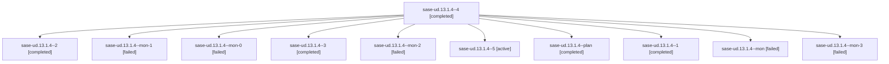

# Family: sase-ud.13.1.4

[Agent Hoods](../README.md) / [bbugyi200](../users/bbugyi200/README.md) / [athena](../users/bbugyi200/machines/athena/README.md) / [sase-ud](../users/bbugyi200/machines/athena/hoods/sase-ud/README.md) / sase-ud.13.1.4

Owner: `bbugyi200.athena` · Hood: `sase-ud` · Members: 11 · Bead: [sase-ud.13.1.4](https://github.com/sase-org/sase--beads/blob/main/pages/sase-ud/sase-ud.13.1.4.md)

## Lineage

The diagram is an optional enhancement; the ordered table below contains the same lineage in accessible text.

| Role | Agent | State | Model / provider | Timing | Commits | Prompt | Chat |
|---|---|---|---|---|---:|---|---|
| 4 | sase-ud.13.1.4--4 | completed | grok-4.6 / grok | 2026-08-28T15:58:20.613602+00:00 → 2026-08-28T16:04:36.677180+00:00 | 0 | [Prompt](../agents/bbugyi200.athena.sase-ud.13.1.4--4/prompt.md) | [Chat](../agents/bbugyi200.athena.sase-ud.13.1.4--4/chat.md) |
| 2 | sase-ud.13.1.4--2 | completed | grok-4.6 / grok | 2026-08-28T14:43:57.855660+00:00 → 2026-08-28T14:51:48.594352+00:00 | 0 | [Prompt](../agents/bbugyi200.athena.sase-ud.13.1.4--2/prompt.md) | [Chat](../agents/bbugyi200.athena.sase-ud.13.1.4--2/chat.md) |
| mon-1 | sase-ud.13.1.4--mon-1 | failed | grok-4.6 / grok | 2026-08-28T14:51:32.763990+00:00 | 0 | — | [Chat](../agents/bbugyi200.athena.sase-ud.13.1.4--mon-1/chat.md) |
| mon-0 | sase-ud.13.1.4--mon-0 | failed | grok-4.6 / grok | 2026-08-28T14:21:03.182276+00:00 | 0 | — | [Chat](../agents/bbugyi200.athena.sase-ud.13.1.4--mon-0/chat.md) |
| 3 | sase-ud.13.1.4--3 | completed | grok-4.6 / grok | 2026-08-28T15:30:17.494026+00:00 → 2026-08-28T15:39:37.252239+00:00 | 0 | [Prompt](../agents/bbugyi200.athena.sase-ud.13.1.4--3/prompt.md) | [Chat](../agents/bbugyi200.athena.sase-ud.13.1.4--3/chat.md) |
| mon-2 | sase-ud.13.1.4--mon-2 | failed | grok-4.6 / grok | 2026-08-28T15:39:15.264648+00:00 | 0 | — | [Chat](../agents/bbugyi200.athena.sase-ud.13.1.4--mon-2/chat.md) |
| 5 | sase-ud.13.1.4--5 | active | grok-4.6 / grok | 2026-08-28T16:19:56.715654+00:00 | [1](../agents/bbugyi200.athena.sase-ud.13.1.4--5/README.md#commits) | [Prompt](../agents/bbugyi200.athena.sase-ud.13.1.4--5/prompt.md) | — |
| plan | sase-ud.13.1.4--plan | completed | gpt-5.5 / codex | 2026-08-28T12:57:41.087731+00:00 → 2026-08-28T13:40:12.287904+00:00 | 0 | [Prompt](../agents/bbugyi200.athena.sase-ud.13.1.4--plan/prompt.md) | [Chat](../agents/bbugyi200.athena.sase-ud.13.1.4--plan/chat.md) |
| 1 | sase-ud.13.1.4--1 | completed | grok-4.6 / grok | 2026-08-28T14:02:51.956461+00:00 → 2026-08-28T14:21:16.107033+00:00 | 0 | [Prompt](../agents/bbugyi200.athena.sase-ud.13.1.4--1/prompt.md) | [Chat](../agents/bbugyi200.athena.sase-ud.13.1.4--1/chat.md) |
| mon | sase-ud.13.1.4--mon | failed | gpt-5.5 / codex | 2026-08-28T13:39:59.963685+00:00 | 0 | — | [Chat](../agents/bbugyi200.athena.sase-ud.13.1.4--mon/chat.md) |
| mon-3 | sase-ud.13.1.4--mon-3 | failed | grok-4.6 / grok | 2026-08-28T16:04:19.017304+00:00 | 0 | — | [Chat](../agents/bbugyi200.athena.sase-ud.13.1.4--mon-3/chat.md) |

## Commits

| Role | Repo | Commit | Subject | Committed |
|---|---|---|---|---|
| 5 | sase | [`f24aed1`](https://github.com/sase-org/sase/commit/f24aed1dfa6eaad588d456b7f41270a46646ff18) | feat(ace): collapse the agent-list status colour ladder | 2026-08-28 12:23:56 EDT |

## Neighbors

| Agent | Relation | State |
|---|---|---|
| [sase-ud.13](bbugyi200.athena.sase-ud.13.md) (family · 2) | ancestor | failed 2 |
| [sase-ud.13.1.1](../agents/bbugyi200.athena.sase-ud.13.1.1/README.md) | sase-ud.13.1 hood | completed |
| [sase-ud.13.1.2](bbugyi200.athena.sase-ud.13.1.2.md) (family · 8) | sase-ud.13.1 hood | completed 5, failed 3 |
| [sase-ud.13.1.3](bbugyi200.athena.sase-ud.13.1.3.md) (family · 2) | sase-ud.13.1 hood | failed 2 |
| [sase-ud.13.1.3.1.1](bbugyi200.athena.sase-ud.13.1.3.1.1.md) (family · 5) | sase-ud.13.1 hood | dismissed 5 |
| [sase-ud.13.1.3.1.2](../agents/bbugyi200.athena.sase-ud.13.1.3.1.2/README.md) | sase-ud.13.1 hood | dismissed |
| [sase-ud.13.1.3.1.3](../agents/bbugyi200.athena.sase-ud.13.1.3.1.3/README.md) | sase-ud.13.1 hood | dismissed |
| [sase-ud.13.1.3.1.4](bbugyi200.athena.sase-ud.13.1.3.1.4.md) (family · 21) | sase-ud.13.1 hood | active 2, completed 8, failed 11 |
| [sase-ud.13.1.3.1.4](../agents/bbugyi200.athena.sase-ud.13.1.3.1.4/README.md) | sase-ud.13.1 hood | active |
| [sase-ud.13.1.3.1.5.1](bbugyi200.athena.sase-ud.13.1.3.1.5.1.md) (family · 3) | sase-ud.13.1 hood | dismissed 3 |
| [sase-ud.13.1.3.1.5.land](../agents/bbugyi200.athena.sase-ud.13.1.3.1.5.land/README.md) | sase-ud.13.1 hood | dismissed |
| [sase-ud.13.1.3.1.land](bbugyi200.athena.sase-ud.13.1.3.1.land.md) (family · 4) | sase-ud.13.1 hood | dismissed 3, failed 1 |
| [sase-ud.13.1.5](../agents/bbugyi200.athena.sase-ud.13.1.5/README.md) | sase-ud.13.1 hood | completed |
| [sase-ud.13.1.land](../agents/bbugyi200.athena.sase-ud.13.1.land/README.md) | sase-ud.13.1 hood | waiting |
| [sase-ud.1](../agents/bbugyi200.athena.sase-ud.1/README.md) | sase-ud hood | completed |
| [sase-ud.10](bbugyi200.athena.sase-ud.10.md) (family · 2) | sase-ud hood | completed 2 |
| [sase-ud.11](bbugyi200.athena.sase-ud.11.md) (family · 2) | sase-ud hood | completed 2 |
| [sase-ud.12](bbugyi200.athena.sase-ud.12.md) (family · 2) | sase-ud hood | completed 2 |
| [sase-ud.14](../agents/bbugyi200.athena.sase-ud.14/README.md) | sase-ud hood | waiting |
| [sase-ud.2](bbugyi200.athena.sase-ud.2.md) (family · 6) | sase-ud hood | completed 4, failed 2 |
| [sase-ud.3](bbugyi200.athena.sase-ud.3.md) (family · 2) | sase-ud hood | completed 2 |
| [sase-ud.4](../agents/bbugyi200.athena.sase-ud.4/README.md) | sase-ud hood | completed |
| [sase-ud.5](../agents/bbugyi200.athena.sase-ud.5/README.md) | sase-ud hood | completed |
| [sase-ud.6](bbugyi200.athena.sase-ud.6.md) (family · 2) | sase-ud hood | completed 2 |
| [sase-ud.7](bbugyi200.athena.sase-ud.7.md) (family · 4) | sase-ud hood | completed 3, failed 1 |
| [sase-ud.8](../agents/bbugyi200.athena.sase-ud.8/README.md) | sase-ud hood | completed |
| [sase-ud.9](../agents/bbugyi200.athena.sase-ud.9/README.md) | sase-ud hood | completed |
| [sase-ud.land](../agents/bbugyi200.athena.sase-ud.land/README.md) | sase-ud hood | waiting |
