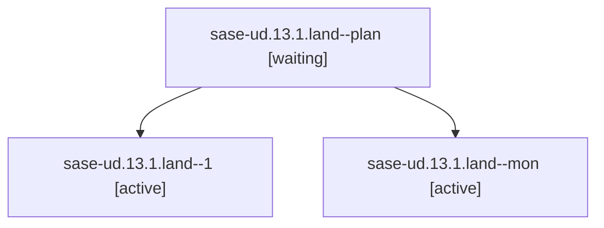

# Family: sase-ud.13.1.land

[Agent Hoods](../README.md) / [bbugyi200](../users/bbugyi200/README.md) / [athena](../users/bbugyi200/machines/athena/README.md) / [sase-ud](../users/bbugyi200/machines/athena/hoods/sase-ud/README.md) / sase-ud.13.1.land

Owner: `bbugyi200.athena` · Hood: `sase-ud` · Members: 3 · Bead: [sase-ud.13.1](https://github.com/sase-org/sase--beads/blob/main/pages/sase-ud/sase-ud.13.1.md)

## Lineage

The diagram is an optional enhancement; the ordered table below contains the same lineage in accessible text.

| Role | Agent | State | Model / provider | Timing | Commits | Prompt | Chat |
|---|---|---|---|---|---:|---|---|
| plan | sase-ud.13.1.land--plan | waiting | opus / claude | 2026-08-28T16:26:28.959364+00:00 | 0 | [Prompt](../agents/bbugyi200.athena.sase-ud.13.1.land--plan/prompt.md) | [Chat](../agents/bbugyi200.athena.sase-ud.13.1.land--plan/chat.md) |
| 1 | sase-ud.13.1.land--1 | active | opus / claude | 2026-08-28T17:07:15.092941+00:00 | 0 | [Prompt](../agents/bbugyi200.athena.sase-ud.13.1.land--1/prompt.md) | — |
| mon | sase-ud.13.1.land--mon | active | opus / claude | 2026-08-28T16:41:51.742099+00:00 | 0 | — | — |

## Neighbors

| Agent | Relation | State |
|---|---|---|
| [sase-ud.13](bbugyi200.athena.sase-ud.13.md) (family · 2) | ancestor | active 2 |
| [sase-ud.13.1.1](../agents/bbugyi200.athena.sase-ud.13.1.1/README.md) | sase-ud.13.1 hood | active |
| [sase-ud.13.1.2](bbugyi200.athena.sase-ud.13.1.2.md) (family · 8) | sase-ud.13.1 hood | active 6, completed 1, failed 1 |
| [sase-ud.13.1.3](bbugyi200.athena.sase-ud.13.1.3.md) (family · 2) | sase-ud.13.1 hood | active 2 |
| [sase-ud.13.1.3.1.1](bbugyi200.athena.sase-ud.13.1.3.1.1.md) (family · 5) | sase-ud.13.1 hood | active 5 |
| [sase-ud.13.1.3.1.2](../agents/bbugyi200.athena.sase-ud.13.1.3.1.2/README.md) | sase-ud.13.1 hood | active |
| [sase-ud.13.1.3.1.3](../agents/bbugyi200.athena.sase-ud.13.1.3.1.3/README.md) | sase-ud.13.1 hood | active |
| [sase-ud.13.1.3.1.4](bbugyi200.athena.sase-ud.13.1.3.1.4.md) (family · 21) | sase-ud.13.1 hood | active 2, completed 8, failed 11 |
| [sase-ud.13.1.3.1.4](../agents/bbugyi200.athena.sase-ud.13.1.3.1.4/README.md) | sase-ud.13.1 hood | active |
| [sase-ud.13.1.3.1.5.1](bbugyi200.athena.sase-ud.13.1.3.1.5.1.md) (family · 3) | sase-ud.13.1 hood | active 3 |
| [sase-ud.13.1.3.1.5.land](../agents/bbugyi200.athena.sase-ud.13.1.3.1.5.land/README.md) | sase-ud.13.1 hood | active |
| [sase-ud.13.1.3.1.land](bbugyi200.athena.sase-ud.13.1.3.1.land.md) (family · 4) | sase-ud.13.1 hood | active 3, failed 1 |
| [sase-ud.13.1.4](bbugyi200.athena.sase-ud.13.1.4.md) (family · 11) | sase-ud.13.1 hood | active 11 |
| [sase-ud.13.1.5](../agents/bbugyi200.athena.sase-ud.13.1.5/README.md) | sase-ud.13.1 hood | active |
| [sase-ud.1](../agents/bbugyi200.athena.sase-ud.1/README.md) | sase-ud hood | active |
| [sase-ud.10](bbugyi200.athena.sase-ud.10.md) (family · 2) | sase-ud hood | active 1, completed 1 |
| [sase-ud.11](bbugyi200.athena.sase-ud.11.md) (family · 2) | sase-ud hood | active 1, completed 1 |
| [sase-ud.12](bbugyi200.athena.sase-ud.12.md) (family · 2) | sase-ud hood | active 1, completed 1 |
| [sase-ud.14](../agents/bbugyi200.athena.sase-ud.14/README.md) | sase-ud hood | active |
| [sase-ud.2](bbugyi200.athena.sase-ud.2.md) (family · 6) | sase-ud hood | active 4, completed 1, failed 1 |
| [sase-ud.3](bbugyi200.athena.sase-ud.3.md) (family · 2) | sase-ud hood | active 1, completed 1 |
| [sase-ud.4](../agents/bbugyi200.athena.sase-ud.4/README.md) | sase-ud hood | active |
| [sase-ud.5](../agents/bbugyi200.athena.sase-ud.5/README.md) | sase-ud hood | active |
| [sase-ud.6](bbugyi200.athena.sase-ud.6.md) (family · 2) | sase-ud hood | active 1, completed 1 |
| [sase-ud.7](bbugyi200.athena.sase-ud.7.md) (family · 4) | sase-ud hood | active 2, completed 1, failed 1 |
| [sase-ud.8](../agents/bbugyi200.athena.sase-ud.8/README.md) | sase-ud hood | active |
| [sase-ud.9](../agents/bbugyi200.athena.sase-ud.9/README.md) | sase-ud hood | active |
| [sase-ud.land](bbugyi200.athena.sase-ud.land.md) (family · 3) | sase-ud hood | active 3 |
