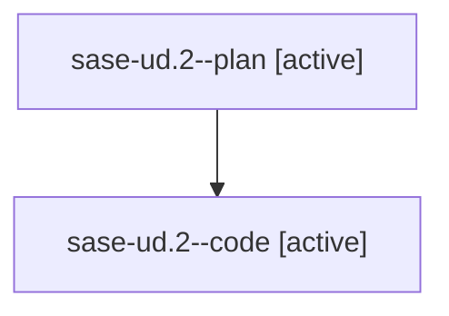

# Family: sase-ud.2

[Agent Hoods](../README.md) / [bbugyi200](../users/bbugyi200/README.md) / [athena](../users/bbugyi200/machines/athena/README.md) / [sase-ud](../users/bbugyi200/machines/athena/hoods/sase-ud/README.md) / sase-ud.2

Owner: `bbugyi200.athena` · Hood: `sase-ud` · Members: 2 · Bead: [sase-ud.2](https://github.com/sase-org/sase--beads/blob/main/pages/sase-ud/sase-ud.2.md)

## Lineage

The diagram is an optional enhancement; the ordered table below contains the same lineage in accessible text.

| Role | Agent | State | Model / provider | Timing | Commits | Prompt | Chat |
|---|---|---|---|---|---:|---|---|
| plan | sase-ud.2--plan | active | gpt-5.6-sol / codex | 2026-08-26T18:05:14.540945+00:00 | 0 | [Prompt](../agents/bbugyi200.athena.sase-ud.2--plan/prompt.md) | [Chat](../agents/bbugyi200.athena.sase-ud.2--plan/chat.md) |
| code | sase-ud.2--code | active | gpt-5.5 / codex | 2026-08-26T18:08:22.462308+00:00 | 0 | — | — |

## Neighbors

| Agent | Relation | State |
|---|---|---|
| [sase-ud.1](../agents/bbugyi200.athena.sase-ud.1/README.md) | sase-ud hood | active |
| [sase-ud.10](../agents/bbugyi200.athena.sase-ud.10/README.md) | sase-ud hood | waiting |
| [sase-ud.11](../agents/bbugyi200.athena.sase-ud.11/README.md) | sase-ud hood | waiting |
| [sase-ud.12](../agents/bbugyi200.athena.sase-ud.12/README.md) | sase-ud hood | waiting |
| [sase-ud.13](../agents/bbugyi200.athena.sase-ud.13/README.md) | sase-ud hood | waiting |
| [sase-ud.14](../agents/bbugyi200.athena.sase-ud.14/README.md) | sase-ud hood | waiting |
| [sase-ud.3](../agents/bbugyi200.athena.sase-ud.3/README.md) | sase-ud hood | waiting |
| [sase-ud.4](../agents/bbugyi200.athena.sase-ud.4/README.md) | sase-ud hood | waiting |
| [sase-ud.5](../agents/bbugyi200.athena.sase-ud.5/README.md) | sase-ud hood | waiting |
| [sase-ud.6](../agents/bbugyi200.athena.sase-ud.6/README.md) | sase-ud hood | waiting |
| [sase-ud.7](../agents/bbugyi200.athena.sase-ud.7/README.md) | sase-ud hood | waiting |
| [sase-ud.8](../agents/bbugyi200.athena.sase-ud.8/README.md) | sase-ud hood | waiting |
| [sase-ud.9](../agents/bbugyi200.athena.sase-ud.9/README.md) | sase-ud hood | waiting |
| [sase-ud.land](../agents/bbugyi200.athena.sase-ud.land/README.md) | sase-ud hood | waiting |
