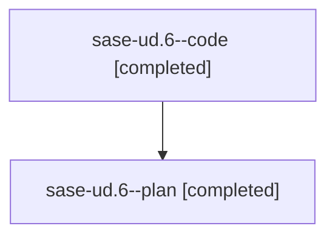

# Family: sase-ud.6

[Agent Hoods](../README.md) / [bbugyi200](../users/bbugyi200/README.md) / [athena](../users/bbugyi200/machines/athena/README.md) / [sase-ud](../users/bbugyi200/machines/athena/hoods/sase-ud/README.md) / sase-ud.6

Owner: `bbugyi200.athena` · Hood: `sase-ud` · Members: 2 · Bead: [sase-ud.6](https://github.com/sase-org/sase--beads/blob/main/pages/sase-ud/sase-ud.6.md)

## Lineage

The diagram is an optional enhancement; the ordered table below contains the same lineage in accessible text.

| Role | Agent | State | Model / provider | Timing | Commits | Prompt | Chat |
|---|---|---|---|---|---:|---|---|
| code | sase-ud.6--code | completed | gpt-5.5 / codex | 2026-08-26T22:12:21.815381+00:00 → 2026-08-27T01:21:34.024012+00:00 | 0 | — | [Chat](../agents/bbugyi200.athena.sase-ud.6--code/chat.md) |
| plan | sase-ud.6--plan | completed | gpt-5.6-sol / codex | 2026-08-26T22:08:19.860649+00:00 → 2026-08-27T01:21:34.024012+00:00 | 0 | [Prompt](../agents/bbugyi200.athena.sase-ud.6--plan/prompt.md) | [Chat](../agents/bbugyi200.athena.sase-ud.6--plan/chat.md) |

## Commits

| Role | Repo | Commit | Subject | Committed |
|---|---|---|---|---|
| — | sase | [`10d2c17`](https://github.com/sase-org/sase/commit/10d2c17a171ffff1fcf700edadc46be1e4405f2e) | feat(ace): render gate shell rows in agents tui | 2026-08-26 21:19:23 EDT |

## Neighbors

| Agent | Relation | State |
|---|---|---|
| [sase-ud.1](../agents/bbugyi200.athena.sase-ud.1/README.md) | sase-ud hood | completed |
| [sase-ud.10](bbugyi200.athena.sase-ud.10.md) (family · 2) | sase-ud hood | completed 2 |
| [sase-ud.11](bbugyi200.athena.sase-ud.11.md) (family · 2) | sase-ud hood | completed 2 |
| [sase-ud.12](bbugyi200.athena.sase-ud.12.md) (family · 2) | sase-ud hood | completed 2 |
| [sase-ud.13](bbugyi200.athena.sase-ud.13.md) (family · 2) | sase-ud hood | failed 2 |
| [sase-ud.13.1.1](../agents/bbugyi200.athena.sase-ud.13.1.1/README.md) | sase-ud hood | completed |
| [sase-ud.13.1.2](bbugyi200.athena.sase-ud.13.1.2.md) (family · 8) | sase-ud hood | completed 5, failed 3 |
| [sase-ud.13.1.3](bbugyi200.athena.sase-ud.13.1.3.md) (family · 2) | sase-ud hood | failed 2 |
| [sase-ud.13.1.3.1.1](bbugyi200.athena.sase-ud.13.1.3.1.1.md) (family · 5) | sase-ud hood | dismissed 5 |
| [sase-ud.13.1.3.1.2](../agents/bbugyi200.athena.sase-ud.13.1.3.1.2/README.md) | sase-ud hood | dismissed |
| [sase-ud.13.1.3.1.3](../agents/bbugyi200.athena.sase-ud.13.1.3.1.3/README.md) | sase-ud hood | dismissed |
| [sase-ud.13.1.3.1.4](bbugyi200.athena.sase-ud.13.1.3.1.4.md) (family · 21) | sase-ud hood | active 2, completed 8, failed 11 |
| [sase-ud.13.1.3.1.4](../agents/bbugyi200.athena.sase-ud.13.1.3.1.4/README.md) | sase-ud hood | active |
| [sase-ud.13.1.3.1.5.1](bbugyi200.athena.sase-ud.13.1.3.1.5.1.md) (family · 3) | sase-ud hood | dismissed 3 |
| [sase-ud.13.1.3.1.5.land](../agents/bbugyi200.athena.sase-ud.13.1.3.1.5.land/README.md) | sase-ud hood | dismissed |
| [sase-ud.13.1.3.1.land](bbugyi200.athena.sase-ud.13.1.3.1.land.md) (family · 4) | sase-ud hood | dismissed 3, failed 1 |
| [sase-ud.13.1.4](bbugyi200.athena.sase-ud.13.1.4.md) (family · 11) | sase-ud hood | completed 6, failed 5 |
| [sase-ud.13.1.5](../agents/bbugyi200.athena.sase-ud.13.1.5/README.md) | sase-ud hood | completed |
| [sase-ud.13.1.land](bbugyi200.athena.sase-ud.13.1.land.md) (family · 3) | sase-ud hood | completed 1, failed 1, waiting 1 |
| [sase-ud.14](../agents/bbugyi200.athena.sase-ud.14/README.md) | sase-ud hood | completed |
| [sase-ud.2](bbugyi200.athena.sase-ud.2.md) (family · 6) | sase-ud hood | completed 4, failed 2 |
| [sase-ud.3](bbugyi200.athena.sase-ud.3.md) (family · 2) | sase-ud hood | completed 2 |
| [sase-ud.4](../agents/bbugyi200.athena.sase-ud.4/README.md) | sase-ud hood | completed |
| [sase-ud.5](../agents/bbugyi200.athena.sase-ud.5/README.md) | sase-ud hood | completed |
| [sase-ud.7](bbugyi200.athena.sase-ud.7.md) (family · 4) | sase-ud hood | completed 3, failed 1 |
| [sase-ud.8](../agents/bbugyi200.athena.sase-ud.8/README.md) | sase-ud hood | completed |
| [sase-ud.9](../agents/bbugyi200.athena.sase-ud.9/README.md) | sase-ud hood | completed |
| [sase-ud.land](bbugyi200.athena.sase-ud.land.md) (family · 3) | sase-ud hood | active 1, completed 1, failed 1 |
