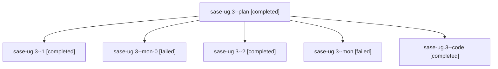

# Family: sase-ug.3

[Agent Hoods](../README.md) / [bbugyi200](../users/bbugyi200/README.md) / [athena](../users/bbugyi200/machines/athena/README.md) / [sase-ug](../users/bbugyi200/machines/athena/hoods/sase-ug/README.md) / sase-ug.3

Owner: `bbugyi200.athena` · Hood: `sase-ug` · Members: 6 · Bead: [sase-ug.3](https://github.com/sase-org/sase--beads/blob/main/pages/sase-ug/sase-ug.3.md)

## Lineage

The diagram is an optional enhancement; the ordered table below contains the same lineage in accessible text.

| Role | Agent | State | Model / provider | Timing | Commits | Prompt | Chat |
|---|---|---|---|---|---:|---|---|
| plan | sase-ug.3--plan | completed | opus / claude | 2026-08-26T19:18:09.500033+00:00 → 2026-08-26T21:09:58.980803+00:00 | 0 | [Prompt](../agents/bbugyi200.athena.sase-ug.3--plan/prompt.md) | [Chat](../agents/bbugyi200.athena.sase-ug.3--plan/chat.md) |
| 1 | sase-ug.3--1 | completed | sonnet / claude | 2026-08-26T21:28:36.146477+00:00 → 2026-08-26T21:55:02.231205+00:00 | 0 | [Prompt](../agents/bbugyi200.athena.sase-ug.3--1/prompt.md) | [Chat](../agents/bbugyi200.athena.sase-ug.3--1/chat.md) |
| mon-0 | sase-ug.3--mon-0 | failed | sonnet / claude | 2026-08-26T21:54:43.844652+00:00 | 0 | — | [Chat](../agents/bbugyi200.athena.sase-ug.3--mon-0/chat.md) |
| 2 | sase-ug.3--2 | completed | gpt-5.5 / codex | 2026-08-26T22:00:29.055393+00:00 → 2026-08-26T22:51:39.755744+00:00 | 0 | [Prompt](../agents/bbugyi200.athena.sase-ug.3--2/prompt.md) | [Chat](../agents/bbugyi200.athena.sase-ug.3--2/chat.md) |
| mon | sase-ug.3--mon | failed | sonnet / claude | 2026-08-26T21:09:48.912584+00:00 | 0 | — | [Chat](../agents/bbugyi200.athena.sase-ug.3--mon/chat.md) |
| code | sase-ug.3--code | completed | sonnet / claude | 2026-08-26T19:39:13.641369+00:00 → 2026-08-26T21:09:58.980803+00:00 | 0 | — | [Chat](../agents/bbugyi200.athena.sase-ug.3--code/chat.md) |

## Commits

| Role | Repo | Commit | Subject | Committed |
|---|---|---|---|---|
| — | sase | [`4bce1a4`](https://github.com/sase-org/sase/commit/4bce1a4f68d985c623611416ea8187da7052609f) | feat(artifact-links): project recomputed edges into the read model (sase-ug.3) | 2026-08-26 18:45:13 EDT |

## Neighbors

| Agent | Relation | State |
|---|---|---|
| [sase-ug.1](../agents/bbugyi200.athena.sase-ug.1/README.md) | sase-ug hood | completed |
| [sase-ug.10](../agents/bbugyi200.athena.sase-ug.10/README.md) | sase-ug hood | waiting |
| [sase-ug.2](../agents/bbugyi200.athena.sase-ug.2/README.md) | sase-ug hood | completed |
| [sase-ug.4](../agents/bbugyi200.athena.sase-ug.4/README.md) | sase-ug hood | completed |
| [sase-ug.5](../agents/bbugyi200.athena.sase-ug.5/README.md) | sase-ug hood | completed |
| [sase-ug.6](../agents/bbugyi200.athena.sase-ug.6/README.md) | sase-ug hood | completed |
| [sase-ug.7](bbugyi200.athena.sase-ug.7.md) (family · 2) | sase-ug hood | active 2 |
| [sase-ug.8](../agents/bbugyi200.athena.sase-ug.8/README.md) | sase-ug hood | waiting |
| [sase-ug.9](../agents/bbugyi200.athena.sase-ug.9/README.md) | sase-ug hood | waiting |
| [sase-ug.land](../agents/bbugyi200.athena.sase-ug.land/README.md) | sase-ug hood | waiting |
