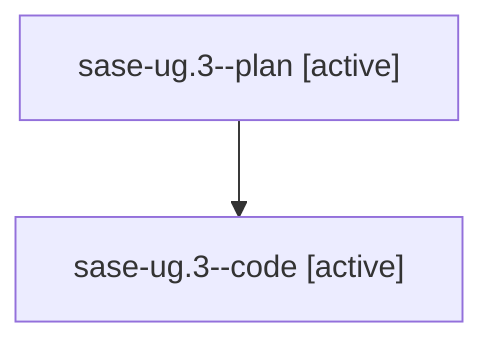

# Family: sase-ug.3

[Agent Hoods](../README.md) / [bbugyi200](../users/bbugyi200/README.md) / [athena](../users/bbugyi200/machines/athena/README.md) / [sase-ug](../users/bbugyi200/machines/athena/hoods/sase-ug/README.md) / sase-ug.3

Owner: `bbugyi200.athena` · Hood: `sase-ug` · Members: 2 · Bead: [sase-ug.3](https://github.com/sase-org/sase--beads/blob/main/pages/sase-ug/sase-ug.3.md)

## Lineage

The diagram is an optional enhancement; the ordered table below contains the same lineage in accessible text.

| Role | Agent | State | Model / provider | Timing | Commits | Prompt | Chat |
|---|---|---|---|---|---:|---|---|
| plan | sase-ug.3--plan | active | opus / claude | 2026-08-26T19:18:09.500033+00:00 | 0 | [Prompt](../agents/bbugyi200.athena.sase-ug.3--plan/prompt.md) | [Chat](../agents/bbugyi200.athena.sase-ug.3--plan/chat.md) |
| code | sase-ug.3--code | active | sonnet / claude | 2026-08-26T19:39:13.641369+00:00 | 0 | — | — |

## Neighbors

| Agent | Relation | State |
|---|---|---|
| [sase-ug.1](../agents/bbugyi200.athena.sase-ug.1/README.md) | sase-ug hood | completed |
| [sase-ug.10](../agents/bbugyi200.athena.sase-ug.10/README.md) | sase-ug hood | waiting |
| [sase-ug.2](../agents/bbugyi200.athena.sase-ug.2/README.md) | sase-ug hood | active |
| [sase-ug.4](../agents/bbugyi200.athena.sase-ug.4/README.md) | sase-ug hood | waiting |
| [sase-ug.5](../agents/bbugyi200.athena.sase-ug.5/README.md) | sase-ug hood | waiting |
| [sase-ug.6](../agents/bbugyi200.athena.sase-ug.6/README.md) | sase-ug hood | waiting |
| [sase-ug.7](../agents/bbugyi200.athena.sase-ug.7/README.md) | sase-ug hood | waiting |
| [sase-ug.8](../agents/bbugyi200.athena.sase-ug.8/README.md) | sase-ug hood | waiting |
| [sase-ug.9](../agents/bbugyi200.athena.sase-ug.9/README.md) | sase-ug hood | waiting |
| [sase-ug.land](../agents/bbugyi200.athena.sase-ug.land/README.md) | sase-ug hood | waiting |
