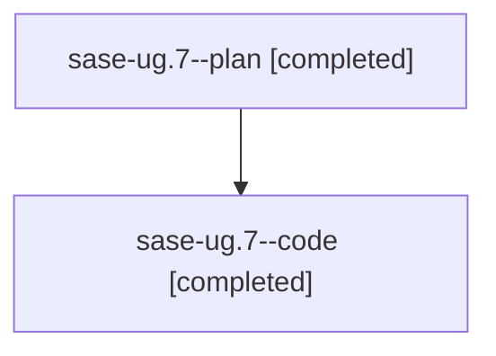

# Family: sase-ug.7

[Agent Hoods](../README.md) / [bbugyi200](../users/bbugyi200/README.md) / [athena](../users/bbugyi200/machines/athena/README.md) / [sase-ug](../users/bbugyi200/machines/athena/hoods/sase-ug/README.md) / sase-ug.7

Owner: `bbugyi200.athena` · Hood: `sase-ug` · Members: 2 · Bead: [sase-ug.7](https://github.com/sase-org/sase--beads/blob/main/pages/sase-ug/sase-ug.7.md)

## Lineage

The diagram is an optional enhancement; the ordered table below contains the same lineage in accessible text.

| Role | Agent | State | Model / provider | Timing | Commits | Prompt | Chat |
|---|---|---|---|---|---:|---|---|
| plan | sase-ug.7--plan | completed | opus / claude | 2026-08-27T02:27:13.894206+00:00 → 2026-08-27T03:47:51.953220+00:00 | 0 | [Prompt](../agents/bbugyi200.athena.sase-ug.7--plan/prompt.md) | [Chat](../agents/bbugyi200.athena.sase-ug.7--plan/chat.md) |
| code | sase-ug.7--code | completed | gpt-5.5 / codex | 2026-08-27T02:39:55.096565+00:00 → 2026-08-27T03:47:51.953220+00:00 | [1](../agents/bbugyi200.athena.sase-ug.7--code/README.md#commits) | — | [Chat](../agents/bbugyi200.athena.sase-ug.7--code/chat.md) |

## Commits

| Role | Repo | Commit | Subject | Committed |
|---|---|---|---|---|
| code | sase | [`d070280`](https://github.com/sase-org/sase/commit/d07028050cb831849d1e666ab267a39223779f9b) | feat(tui): add link-follow key grammar | 2026-08-26 23:45:35 EDT |

## Neighbors

| Agent | Relation | State |
|---|---|---|
| [sase-ug.1](../agents/bbugyi200.athena.sase-ug.1/README.md) | sase-ug hood | completed |
| [sase-ug.10](../agents/bbugyi200.athena.sase-ug.10/README.md) | sase-ug hood | waiting |
| [sase-ug.2](../agents/bbugyi200.athena.sase-ug.2/README.md) | sase-ug hood | completed |
| [sase-ug.3](bbugyi200.athena.sase-ug.3.md) (family · 6) | sase-ug hood | completed 4, failed 2 |
| [sase-ug.4](../agents/bbugyi200.athena.sase-ug.4/README.md) | sase-ug hood | completed |
| [sase-ug.5](../agents/bbugyi200.athena.sase-ug.5/README.md) | sase-ug hood | completed |
| [sase-ug.6](../agents/bbugyi200.athena.sase-ug.6/README.md) | sase-ug hood | completed |
| [sase-ug.8](bbugyi200.athena.sase-ug.8.md) (family · 3) | sase-ug hood | active 1, completed 1, failed 1 |
| [sase-ug.9](../agents/bbugyi200.athena.sase-ug.9/README.md) | sase-ug hood | completed |
| [sase-ug.land](../agents/bbugyi200.athena.sase-ug.land/README.md) | sase-ug hood | waiting |
