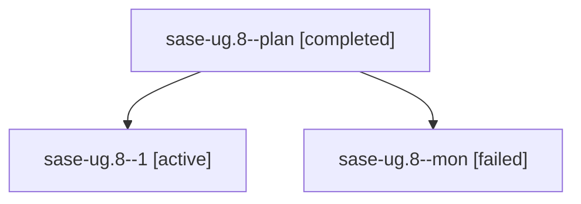

# Family: sase-ug.8

[Agent Hoods](../README.md) / [bbugyi200](../users/bbugyi200/README.md) / [athena](../users/bbugyi200/machines/athena/README.md) / [sase-ug](../users/bbugyi200/machines/athena/hoods/sase-ug/README.md) / sase-ug.8

Owner: `bbugyi200.athena` · Hood: `sase-ug` · Members: 3 · Bead: [sase-ug.8](https://github.com/sase-org/sase--beads/blob/main/pages/sase-ug/sase-ug.8.md)

## Lineage

The diagram is an optional enhancement; the ordered table below contains the same lineage in accessible text.

| Role | Agent | State | Model / provider | Timing | Commits | Prompt | Chat |
|---|---|---|---|---|---:|---|---|
| plan | sase-ug.8--plan | completed | sonnet / claude | 2026-08-27T03:48:16.819586+00:00 → 2026-08-27T04:47:25.683212+00:00 | 0 | [Prompt](../agents/bbugyi200.athena.sase-ug.8--plan/prompt.md) | [Chat](../agents/bbugyi200.athena.sase-ug.8--plan/chat.md) |
| 1 | sase-ug.8--1 | active | sonnet / claude | 2026-08-27T05:02:12.770943+00:00 | [1](../agents/bbugyi200.athena.sase-ug.8--1/README.md#commits) | [Prompt](../agents/bbugyi200.athena.sase-ug.8--1/prompt.md) | — |
| mon | sase-ug.8--mon | failed | sonnet / claude | 2026-08-27T04:47:15.634220+00:00 | 0 | — | [Chat](../agents/bbugyi200.athena.sase-ug.8--mon/chat.md) |

## Commits

| Role | Repo | Commit | Subject | Committed |
|---|---|---|---|---|
| 1 | sase | [`d8e8b5a`](https://github.com/sase-org/sase/commit/d8e8b5ab8ed264a983fd892b29d8e6f752428a93) | feat(tui): add app-level link trail for Ctrl+O/Ctrl+Shift+O across tabs | 2026-08-27 01:04:08 EDT |

## Neighbors

| Agent | Relation | State |
|---|---|---|
| [sase-ug.1](../agents/bbugyi200.athena.sase-ug.1/README.md) | sase-ug hood | completed |
| [sase-ug.10](../agents/bbugyi200.athena.sase-ug.10/README.md) | sase-ug hood | waiting |
| [sase-ug.2](../agents/bbugyi200.athena.sase-ug.2/README.md) | sase-ug hood | completed |
| [sase-ug.3](bbugyi200.athena.sase-ug.3.md) (family · 6) | sase-ug hood | completed 4, failed 2 |
| [sase-ug.4](../agents/bbugyi200.athena.sase-ug.4/README.md) | sase-ug hood | completed |
| [sase-ug.5](../agents/bbugyi200.athena.sase-ug.5/README.md) | sase-ug hood | completed |
| [sase-ug.6](../agents/bbugyi200.athena.sase-ug.6/README.md) | sase-ug hood | completed |
| [sase-ug.7](bbugyi200.athena.sase-ug.7.md) (family · 2) | sase-ug hood | completed 2 |
| [sase-ug.9](../agents/bbugyi200.athena.sase-ug.9/README.md) | sase-ug hood | completed |
| [sase-ug.land](../agents/bbugyi200.athena.sase-ug.land/README.md) | sase-ug hood | waiting |
