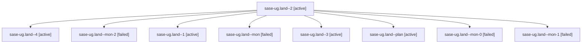

# Family: sase-ug.land

[Agent Hoods](../README.md) / [bbugyi200](../users/bbugyi200/README.md) / [athena](../users/bbugyi200/machines/athena/README.md) / [sase-ug](../users/bbugyi200/machines/athena/hoods/sase-ug/README.md) / sase-ug.land

Owner: `bbugyi200.athena` · Hood: `sase-ug` · Members: 9 · Bead: [sase-ug](https://github.com/sase-org/sase--beads/blob/main/pages/sase-ug/README.md)

## Lineage

The diagram is an optional enhancement; the ordered table below contains the same lineage in accessible text.

| Role | Agent | State | Model / provider | Timing | Commits | Prompt | Chat |
|---|---|---|---|---|---:|---|---|
| 2 | sase-ug.land--2 | active | opus / claude | 2026-08-27T13:14:59.579512+00:00 | 0 | [Prompt](../agents/bbugyi200.athena.sase-ug.land--2/prompt.md) | [Chat](../agents/bbugyi200.athena.sase-ug.land--2/chat.md) |
| 4 | sase-ug.land--4 | active | opus / claude | 2026-08-27T14:19:09.363849+00:00 | [1](../agents/bbugyi200.athena.sase-ug.land--4/README.md#commits) | [Prompt](../agents/bbugyi200.athena.sase-ug.land--4/prompt.md) | — |
| mon-2 | sase-ug.land--mon-2 | failed | opus / claude | 2026-08-27T13:54:50.436252+00:00 | 0 | — | [Chat](../agents/bbugyi200.athena.sase-ug.land--mon-2/chat.md) |
| 1 | sase-ug.land--1 | active | opus / claude | 2026-08-27T12:21:19.508206+00:00 | 0 | [Prompt](../agents/bbugyi200.athena.sase-ug.land--1/prompt.md) | [Chat](../agents/bbugyi200.athena.sase-ug.land--1/chat.md) |
| mon | sase-ug.land--mon | failed | opus / claude | 2026-08-27T12:02:25.493728+00:00 | 0 | — | [Chat](../agents/bbugyi200.athena.sase-ug.land--mon/chat.md) |
| 3 | sase-ug.land--3 | active | opus / claude | 2026-08-27T13:26:12.765146+00:00 | 0 | [Prompt](../agents/bbugyi200.athena.sase-ug.land--3/prompt.md) | [Chat](../agents/bbugyi200.athena.sase-ug.land--3/chat.md) |
| plan | sase-ug.land--plan | active | opus / claude | 2026-08-27T11:07:49.364878+00:00 | 0 | [Prompt](../agents/bbugyi200.athena.sase-ug.land--plan/prompt.md) | [Chat](../agents/bbugyi200.athena.sase-ug.land--plan/chat.md) |
| mon-0 | sase-ug.land--mon-0 | failed | opus / claude | 2026-08-27T12:52:44.321438+00:00 | 0 | — | [Chat](../agents/bbugyi200.athena.sase-ug.land--mon-0/chat.md) |
| mon-1 | sase-ug.land--mon-1 | failed | opus / claude | 2026-08-27T13:24:47.842528+00:00 | 0 | — | [Chat](../agents/bbugyi200.athena.sase-ug.land--mon-1/chat.md) |

## Commits

| Role | Repo | Commit | Subject | Committed |
|---|---|---|---|---|
| 4 | sase | [`00ff34a`](https://github.com/sase-org/sase/commit/00ff34acdbb7daffc2863251aac4e1803009c030) | fix(ace-tui): render the Link Rail chips and restore AXE folds on back-walk | 2026-08-27 10:32:12 EDT |

## Neighbors

| Agent | Relation | State |
|---|---|---|
| [sase-ug.1](../agents/bbugyi200.athena.sase-ug.1/README.md) | sase-ug hood | active |
| [sase-ug.10](../agents/bbugyi200.athena.sase-ug.10/README.md) | sase-ug hood | active |
| [sase-ug.2](../agents/bbugyi200.athena.sase-ug.2/README.md) | sase-ug hood | active |
| [sase-ug.3](bbugyi200.athena.sase-ug.3.md) (family · 6) | sase-ug hood | active 4, completed 1, failed 1 |
| [sase-ug.4](../agents/bbugyi200.athena.sase-ug.4/README.md) | sase-ug hood | active |
| [sase-ug.5](../agents/bbugyi200.athena.sase-ug.5/README.md) | sase-ug hood | active |
| [sase-ug.6](../agents/bbugyi200.athena.sase-ug.6/README.md) | sase-ug hood | active |
| [sase-ug.7](bbugyi200.athena.sase-ug.7.md) (family · 2) | sase-ug hood | active 1, completed 1 |
| [sase-ug.8](bbugyi200.athena.sase-ug.8.md) (family · 3) | sase-ug hood | active 2, failed 1 |
| [sase-ug.9](../agents/bbugyi200.athena.sase-ug.9/README.md) | sase-ug hood | active |
