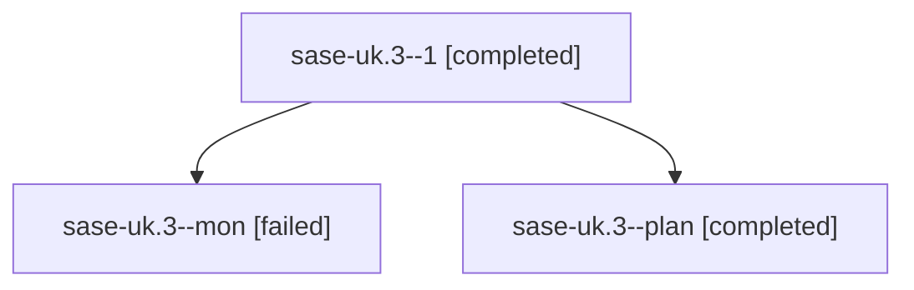

# Family: sase-uk.3

[Agent Hoods](../README.md) / [bbugyi200](../users/bbugyi200/README.md) / [athena](../users/bbugyi200/machines/athena/README.md) / [sase-uk](../users/bbugyi200/machines/athena/hoods/sase-uk/README.md) / sase-uk.3

Owner: `bbugyi200.athena` · Hood: `sase-uk` · Members: 3 · Bead: [sase-uk.3](https://github.com/sase-org/sase--beads/blob/main/pages/sase-uk/sase-uk.3.md)

## Lineage

The diagram is an optional enhancement; the ordered table below contains the same lineage in accessible text.

| Role | Agent | State | Model / provider | Timing | Commits | Prompt | Chat |
|---|---|---|---|---|---:|---|---|
| 1 | sase-uk.3--1 | completed | gpt-5.5 / codex | 2026-08-26T23:49:50.315090+00:00 → 2026-08-26T23:52:41.917837+00:00 | [1](../agents/bbugyi200.athena.sase-uk.3--1/README.md#commits) | [Prompt](../agents/bbugyi200.athena.sase-uk.3--1/prompt.md) | [Chat](../agents/bbugyi200.athena.sase-uk.3--1/chat.md) |
| mon | sase-uk.3--mon | failed | sonnet / claude | 2026-08-26T23:44:43.141484+00:00 | 0 | — | [Chat](../agents/bbugyi200.athena.sase-uk.3--mon/chat.md) |
| plan | sase-uk.3--plan | completed | sonnet / claude | 2026-08-26T23:00:19.163061+00:00 → 2026-08-26T23:45:26.131219+00:00 | 0 | [Prompt](../agents/bbugyi200.athena.sase-uk.3--plan/prompt.md) | [Chat](../agents/bbugyi200.athena.sase-uk.3--plan/chat.md) |

## Commits

| Role | Repo | Commit | Subject | Committed |
|---|---|---|---|---|
| 1 | sase | [`54f0c2a`](https://github.com/sase-org/sase/commit/54f0c2aaa5ebde3bdd2117b82af2a4442c53cf9e) | feat(pager): add SasePager reading surface | 2026-08-26 19:51:44 EDT |

## Neighbors

| Agent | Relation | State |
|---|---|---|
| [sase-uk.1](../agents/bbugyi200.athena.sase-uk.1/README.md) | sase-uk hood | completed |
| [sase-uk.10](../agents/bbugyi200.athena.sase-uk.10/README.md) | sase-uk hood | waiting |
| [sase-uk.2](../agents/bbugyi200.athena.sase-uk.2/README.md) | sase-uk hood | completed |
| [sase-uk.4](../agents/bbugyi200.athena.sase-uk.4/README.md) | sase-uk hood | completed |
| [sase-uk.5](../agents/bbugyi200.athena.sase-uk.5/README.md) | sase-uk hood | completed |
| [sase-uk.6](../agents/bbugyi200.athena.sase-uk.6/README.md) | sase-uk hood | dismissed |
| [sase-uk.7](../agents/bbugyi200.athena.sase-uk.7/README.md) | sase-uk hood | completed |
| [sase-uk.8](../agents/bbugyi200.athena.sase-uk.8/README.md) | sase-uk hood | completed |
| [sase-uk.9](../agents/bbugyi200.athena.sase-uk.9/README.md) | sase-uk hood | active |
| [sase-uk.land](../agents/bbugyi200.athena.sase-uk.land/README.md) | sase-uk hood | waiting |
