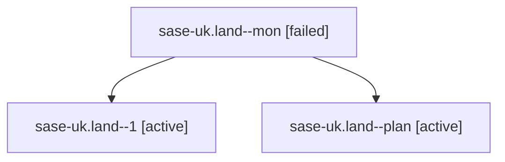

# Family: sase-uk.land

[Agent Hoods](../README.md) / [bbugyi200](../users/bbugyi200/README.md) / [athena](../users/bbugyi200/machines/athena/README.md) / [sase-uk](../users/bbugyi200/machines/athena/hoods/sase-uk/README.md) / sase-uk.land

Owner: `bbugyi200.athena` · Hood: `sase-uk` · Members: 3 · Bead: [sase-uk](https://github.com/sase-org/sase--beads/blob/main/pages/sase-uk/README.md)

## Lineage

The diagram is an optional enhancement; the ordered table below contains the same lineage in accessible text.

| Role | Agent | State | Model / provider | Timing | Commits | Prompt | Chat |
|---|---|---|---|---|---:|---|---|
| mon | sase-uk.land--mon | failed | opus / claude | 2026-08-27T14:20:09.492899+00:00 | 0 | — | [Chat](../agents/bbugyi200.athena.sase-uk.land--mon/chat.md) |
| 1 | sase-uk.land--1 | active | opus / claude | 2026-08-27T14:44:53.946967+00:00 | [1](../agents/bbugyi200.athena.sase-uk.land--1/README.md#commits) | [Prompt](../agents/bbugyi200.athena.sase-uk.land--1/prompt.md) | — |
| plan | sase-uk.land--plan | active | opus / claude | 2026-08-27T13:25:20.310895+00:00 | 0 | [Prompt](../agents/bbugyi200.athena.sase-uk.land--plan/prompt.md) | [Chat](../agents/bbugyi200.athena.sase-uk.land--plan/chat.md) |

## Commits

| Role | Repo | Commit | Subject | Committed |
|---|---|---|---|---|
| 1 | sase | [`5cc5da0`](https://github.com/sase-org/sase/commit/5cc5da03a44c56ac25bf3b2971b902aca25a7de2) | fix(pager): render link neighborhoods for pager-followed beads | 2026-08-27 10:51:39 EDT |

## Neighbors

| Agent | Relation | State |
|---|---|---|
| [sase-uk.1](../agents/bbugyi200.athena.sase-uk.1/README.md) | sase-uk hood | active |
| [sase-uk.10](../agents/bbugyi200.athena.sase-uk.10/README.md) | sase-uk hood | active |
| [sase-uk.2](../agents/bbugyi200.athena.sase-uk.2/README.md) | sase-uk hood | active |
| [sase-uk.3](bbugyi200.athena.sase-uk.3.md) (family · 3) | sase-uk hood | active 3 |
| [sase-uk.4](../agents/bbugyi200.athena.sase-uk.4/README.md) | sase-uk hood | active |
| [sase-uk.5](../agents/bbugyi200.athena.sase-uk.5/README.md) | sase-uk hood | active |
| [sase-uk.6](../agents/bbugyi200.athena.sase-uk.6/README.md) | sase-uk hood | active |
| [sase-uk.7](../agents/bbugyi200.athena.sase-uk.7/README.md) | sase-uk hood | active |
| [sase-uk.8](../agents/bbugyi200.athena.sase-uk.8/README.md) | sase-uk hood | active |
| [sase-uk.9](../agents/bbugyi200.athena.sase-uk.9/README.md) | sase-uk hood | active |
