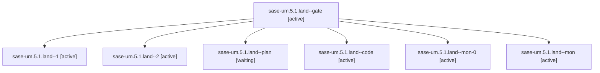

# Family: sase-um.5.1.land

[Agent Hoods](../README.md) / [bbugyi200](../users/bbugyi200/README.md) / [athena](../users/bbugyi200/machines/athena/README.md) / [sase-um](../users/bbugyi200/machines/athena/hoods/sase-um/README.md) / sase-um.5.1.land

Owner: `bbugyi200.athena` · Hood: `sase-um` · Members: 7 · Bead: [sase-um.5.1](https://github.com/sase-org/sase--beads/blob/main/pages/sase-um/sase-um.5.1.md)

## Lineage

The diagram is an optional enhancement; the ordered table below contains the same lineage in accessible text.

| Role | Agent | State | Model / provider | Timing | Commits | Prompt | Chat |
|---|---|---|---|---|---:|---|---|
| gate | sase-um.5.1.land--gate | active | gpt-5.6-sol / codex | 2026-08-28T18:42:23.658809+00:00 | 0 | — | [Chat](../agents/bbugyi200.athena.sase-um.5.1.land--gate/chat.md) |
| 1 | sase-um.5.1.land--1 | active | gpt-5.6-sol / codex | 2026-08-28T18:28:29.448221+00:00 | 0 | [Prompt](../agents/bbugyi200.athena.sase-um.5.1.land--1/prompt.md) | [Chat](../agents/bbugyi200.athena.sase-um.5.1.land--1/chat.md) |
| 2 | sase-um.5.1.land--2 | active | gpt-5.6-sol / codex | 2026-08-28T18:38:37.123266+00:00 | 0 | [Prompt](../agents/bbugyi200.athena.sase-um.5.1.land--2/prompt.md) | [Chat](../agents/bbugyi200.athena.sase-um.5.1.land--2/chat.md) |
| plan | sase-um.5.1.land--plan | waiting | gpt-5.6-sol / codex | 2026-08-28T07:18:18.730435+00:00 | 0 | [Prompt](../agents/bbugyi200.athena.sase-um.5.1.land--plan/prompt.md) | [Chat](../agents/bbugyi200.athena.sase-um.5.1.land--plan/chat.md) |
| code | sase-um.5.1.land--code | active | grok-4.6 / grok | 2026-08-28T18:46:19.273973+00:00 | [1](../agents/bbugyi200.athena.sase-um.5.1.land--code/README.md#commits) | [Prompt](../agents/bbugyi200.athena.sase-um.5.1.land--code/prompt.md) | — |
| mon-0 | sase-um.5.1.land--mon-0 | active | gpt-5.6-sol / codex | 2026-08-28T18:33:50.562895+00:00 | 0 | — | — |
| mon | sase-um.5.1.land--mon | active | gpt-5.6-sol / codex | 2026-08-28T07:30:50.143684+00:00 | 0 | — | — |

## Commits

| Role | Repo | Commit | Subject | Committed |
|---|---|---|---|---|
| code | sase | [`bcd6813`](https://github.com/sase-org/sase/commit/bcd6813d270aa0da6e48df79410fe7017f5441c9) | fix(history): restore helper-git-cwd chat name fallback | 2026-08-28 15:00:49 EDT |

## Neighbors

| Agent | Relation | State |
|---|---|---|
| [sase-um.5](bbugyi200.athena.sase-um.5.md) (family · 2) | ancestor | active 2 |
| [sase-um.5.1.1](../agents/bbugyi200.athena.sase-um.5.1.1/README.md) | sase-um.5.1 hood | active |
| [sase-um.5.1.2](../agents/bbugyi200.athena.sase-um.5.1.2/README.md) | sase-um.5.1 hood | active |
| [sase-um.5.1.3](bbugyi200.athena.sase-um.5.1.3.md) (family · 67) | sase-um.5.1 hood | active 67 |
| [sase-um.5.1.3](../agents/bbugyi200.athena.sase-um.5.1.3/README.md) | sase-um.5.1 hood | completed |
| [sase-um.1](bbugyi200.athena.sase-um.1.md) (family · 2) | sase-um hood | active 1, completed 1 |
| [sase-um.2](bbugyi200.athena.sase-um.2.md) (family · 2) | sase-um hood | active 1, completed 1 |
| [sase-um.3](../agents/bbugyi200.athena.sase-um.3/README.md) | sase-um hood | active |
| [sase-um.4](../agents/bbugyi200.athena.sase-um.4/README.md) | sase-um hood | active |
| [sase-um.6](../agents/bbugyi200.athena.sase-um.6/README.md) | sase-um hood | active |
| [sase-um.7](../agents/bbugyi200.athena.sase-um.7/README.md) | sase-um hood | active |
| [sase-um.8](../agents/bbugyi200.athena.sase-um.8/README.md) | sase-um hood | active |
| [sase-um.9.1](bbugyi200.athena.sase-um.9.1.md) (family · 3) | sase-um hood | active 2, completed 1 |
| [sase-um.9.2](../agents/bbugyi200.athena.sase-um.9.2/README.md) | sase-um hood | active |
| [sase-um.9.3](../agents/bbugyi200.athena.sase-um.9.3/README.md) | sase-um hood | active |
| [sase-um.9.4](bbugyi200.athena.sase-um.9.4.md) (family · 5) | sase-um hood | active 5 |
| [sase-um.9.5.1](../agents/bbugyi200.athena.sase-um.9.5.1/README.md) | sase-um hood | active |
| [sase-um.9.5.2](../agents/bbugyi200.athena.sase-um.9.5.2/README.md) | sase-um hood | active |
| [sase-um.9.5.3](bbugyi200.athena.sase-um.9.5.3.md) (family · 3) | sase-um hood | active 3 |
| [sase-um.9.5.4](bbugyi200.athena.sase-um.9.5.4.md) (family · 17) | sase-um hood | active 17 |
| [sase-um.9.5.5](bbugyi200.athena.sase-um.9.5.5.md) (family · 3) | sase-um hood | active 3 |
| [sase-um.9.5.land](../agents/bbugyi200.athena.sase-um.9.5.land/README.md) | sase-um hood | active |
| [sase-um.9.land](bbugyi200.athena.sase-um.9.land.md) (family · 3) | sase-um hood | active 3 |
| [sase-um.land](bbugyi200.athena.sase-um.land.md) (family · 3) | sase-um hood | dismissed 3 |
