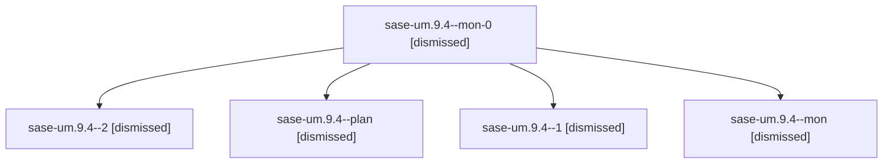

# Family: sase-um.9.4

[Agent Hoods](../README.md) / [bbugyi200](../users/bbugyi200/README.md) / [athena](../users/bbugyi200/machines/athena/README.md) / [sase-um](../users/bbugyi200/machines/athena/hoods/sase-um/README.md) / sase-um.9.4

Owner: `bbugyi200.athena` · Hood: `sase-um` · Members: 5 · Bead: [sase-um.9.4](https://github.com/sase-org/sase--beads/blob/main/pages/sase-um/sase-um.9.4.md)

## Lineage

The diagram is an optional enhancement; the ordered table below contains the same lineage in accessible text.

| Role | Agent | State | Model / provider | Timing | Commits | Prompt | Chat |
|---|---|---|---|---|---:|---|---|
| mon-0 | sase-um.9.4--mon-0 | dismissed | — | 2026-08-28T19:39:58 | 0 | — | — |
| 2 | sase-um.9.4--2 | dismissed | — | 2026-08-28T19:44:42 | 0 | — | — |
| plan | sase-um.9.4--plan | dismissed | — | 2026-08-28T15:50:09 | 0 | — | — |
| 1 | sase-um.9.4--1 | dismissed | — | 2026-08-28T19:09:13 | 0 | — | — |
| mon | sase-um.9.4--mon | dismissed | — | 2026-08-28T17:45:53 | 0 | — | — |

## Commits

| Role | Repo | Commit | Subject | Committed |
|---|---|---|---|---|
| — | sase | [`fa74163`](https://github.com/sase-org/sase/commit/fa74163b5a742fa1cd7e8bfcf98fdd5c0b579da3) | fix(ci): ratchet core pin and wait for models-panel snapshot refresh | 2026-08-28 19:52:06 EDT |

## Neighbors

| Agent | Relation | State |
|---|---|---|
| [sase-um.9.1](bbugyi200.athena.sase-um.9.1.md) (family · 3) | sase-um.9 hood | completed 1, dismissed 2 |
| [sase-um.9.2](../agents/bbugyi200.athena.sase-um.9.2/README.md) | sase-um.9 hood | dismissed |
| [sase-um.9.3](../agents/bbugyi200.athena.sase-um.9.3/README.md) | sase-um.9 hood | dismissed |
| [sase-um.9.5.1](../agents/bbugyi200.athena.sase-um.9.5.1/README.md) | sase-um.9 hood | completed |
| [sase-um.9.5.2](../agents/bbugyi200.athena.sase-um.9.5.2/README.md) | sase-um.9 hood | completed |
| [sase-um.9.5.3](bbugyi200.athena.sase-um.9.5.3.md) (family · 3) | sase-um.9 hood | completed 2, failed 1 |
| [sase-um.9.5.4](bbugyi200.athena.sase-um.9.5.4.md) (family · 15) | sase-um.9 hood | active 1, completed 7, failed 7 |
| [sase-um.9.5.5](../agents/bbugyi200.athena.sase-um.9.5.5/README.md) | sase-um.9 hood | waiting |
| [sase-um.9.5.land](../agents/bbugyi200.athena.sase-um.9.5.land/README.md) | sase-um.9 hood | waiting |
| [sase-um.9.land](bbugyi200.athena.sase-um.9.land.md) (family · 3) | sase-um.9 hood | dismissed 3 |
| [sase-um.1](bbugyi200.athena.sase-um.1.md) (family · 2) | sase-um hood | completed 2 |
| [sase-um.2](bbugyi200.athena.sase-um.2.md) (family · 2) | sase-um hood | completed 2 |
| [sase-um.3](../agents/bbugyi200.athena.sase-um.3/README.md) | sase-um hood | completed |
| [sase-um.4](../agents/bbugyi200.athena.sase-um.4/README.md) | sase-um hood | completed |
| [sase-um.5](bbugyi200.athena.sase-um.5.md) (family · 2) | sase-um hood | failed 2 |
| [sase-um.5.1.1](../agents/bbugyi200.athena.sase-um.5.1.1/README.md) | sase-um hood | completed |
| [sase-um.5.1.2](../agents/bbugyi200.athena.sase-um.5.1.2/README.md) | sase-um hood | completed |
| [sase-um.5.1.3](bbugyi200.athena.sase-um.5.1.3.md) (family · 67) | sase-um hood | dismissed 67 |
| [sase-um.5.1.3](../agents/bbugyi200.athena.sase-um.5.1.3/README.md) | sase-um hood | completed |
| [sase-um.5.1.land](bbugyi200.athena.sase-um.5.1.land.md) (family · 7) | sase-um hood | dismissed 7 |
| [sase-um.6](../agents/bbugyi200.athena.sase-um.6/README.md) | sase-um hood | completed |
| [sase-um.7](../agents/bbugyi200.athena.sase-um.7/README.md) | sase-um hood | completed |
| [sase-um.8](../agents/bbugyi200.athena.sase-um.8/README.md) | sase-um hood | dismissed |
| [sase-um.land](bbugyi200.athena.sase-um.land.md) (family · 3) | sase-um hood | dismissed 3 |
