# Family: sase-um.9.5.4

[Agent Hoods](../README.md) / [bbugyi200](../users/bbugyi200/README.md) / [athena](../users/bbugyi200/machines/athena/README.md) / [sase-um](../users/bbugyi200/machines/athena/hoods/sase-um/README.md) / sase-um.9.5.4

Owner: `bbugyi200.athena` · Hood: `sase-um` · Members: 13 · Bead: [sase-um.9.5.4](https://github.com/sase-org/sase--beads/blob/main/pages/sase-um/sase-um.9.5.4.md)

## Lineage

```mermaid
flowchart TD
  n0["sase-um.9.5.4--6 [active]"]
  n1["sase-um.9.5.4--mon-3 [failed]"]
  n0 --> n1
  n2["sase-um.9.5.4--2 [completed]"]
  n0 --> n2
  n3["sase-um.9.5.4--mon [failed]"]
  n0 --> n3
  n4["sase-um.9.5.4--1 [completed]"]
  n0 --> n4
  n5["sase-um.9.5.4--4 [completed]"]
  n0 --> n5
  n6["sase-um.9.5.4--5 [completed]"]
  n0 --> n6
  n7["sase-um.9.5.4--3 [completed]"]
  n0 --> n7
  n8["sase-um.9.5.4--mon-0 [failed]"]
  n0 --> n8
  n9["sase-um.9.5.4--mon-1 [failed]"]
  n0 --> n9
  n10["sase-um.9.5.4--mon-4 [failed]"]
  n0 --> n10
  n11["sase-um.9.5.4--mon-2 [failed]"]
  n0 --> n11
  n12["sase-um.9.5.4--plan [completed]"]
  n0 --> n12
```

The diagram is an optional enhancement; the ordered table below contains the same lineage in accessible text.

| Role | Agent | State | Model / provider | Timing | Commits | Prompt | Chat |
|---|---|---|---|---|---:|---|---|
| 6 | sase-um.9.5.4--6 | active | grok-4.6 / grok | 2026-08-29T12:56:30.196751+00:00 | [1](../agents/bbugyi200.athena.sase-um.9.5.4--6/README.md#commits) | [Prompt](../agents/bbugyi200.athena.sase-um.9.5.4--6/prompt.md) | — |
| mon-3 | sase-um.9.5.4--mon-3 | failed | grok-4.6 / grok | 2026-08-29T09:03:15.414304+00:00 → 2026-08-29T10:38:50.979428+00:00 | 0 | — | [Chat](../agents/bbugyi200.athena.sase-um.9.5.4--mon-3/chat.md) |
| 2 | sase-um.9.5.4--2 | completed | grok-4.6 / grok | 2026-08-29T04:10:32.535026+00:00 → 2026-08-29T04:15:45.275986+00:00 | 0 | [Prompt](../agents/bbugyi200.athena.sase-um.9.5.4--2/prompt.md) | [Chat](../agents/bbugyi200.athena.sase-um.9.5.4--2/chat.md) |
| mon | sase-um.9.5.4--mon | failed | grok-4.6 / grok | 2026-08-29T03:47:38.218336+00:00 → 2026-08-29T03:50:40.027523+00:00 | 0 | — | [Chat](../agents/bbugyi200.athena.sase-um.9.5.4--mon/chat.md) |
| 1 | sase-um.9.5.4--1 | completed | grok-4.6 / grok | 2026-08-29T03:51:11.615504+00:00 → 2026-08-29T04:07:16.487055+00:00 | [1](../agents/bbugyi200.athena.sase-um.9.5.4--1/README.md#commits) | [Prompt](../agents/bbugyi200.athena.sase-um.9.5.4--1/prompt.md) | [Chat](../agents/bbugyi200.athena.sase-um.9.5.4--1/chat.md) |
| 4 | sase-um.9.5.4--4 | completed | grok-4.6 / grok | 2026-08-29T08:45:23.062447+00:00 → 2026-08-29T09:03:27.029957+00:00 | [1](../agents/bbugyi200.athena.sase-um.9.5.4--4/README.md#commits) | [Prompt](../agents/bbugyi200.athena.sase-um.9.5.4--4/prompt.md) | [Chat](../agents/bbugyi200.athena.sase-um.9.5.4--4/chat.md) |
| 5 | sase-um.9.5.4--5 | completed | grok-4.6 / grok | 2026-08-29T10:39:25.715923+00:00 → 2026-08-29T11:19:46.249022+00:00 | [1](../agents/bbugyi200.athena.sase-um.9.5.4--5/README.md#commits) | [Prompt](../agents/bbugyi200.athena.sase-um.9.5.4--5/prompt.md) | [Chat](../agents/bbugyi200.athena.sase-um.9.5.4--5/chat.md) |
| 3 | sase-um.9.5.4--3 | completed | grok-4.6 / grok | 2026-08-29T06:17:42.799314+00:00 → 2026-08-29T07:11:04.382009+00:00 | [1](../agents/bbugyi200.athena.sase-um.9.5.4--3/README.md#commits) | [Prompt](../agents/bbugyi200.athena.sase-um.9.5.4--3/prompt.md) | [Chat](../agents/bbugyi200.athena.sase-um.9.5.4--3/chat.md) |
| mon-0 | sase-um.9.5.4--mon-0 | failed | grok-4.6 / grok | 2026-08-29T04:07:06.252983+00:00 → 2026-08-29T04:10:00.753829+00:00 | 0 | — | [Chat](../agents/bbugyi200.athena.sase-um.9.5.4--mon-0/chat.md) |
| mon-1 | sase-um.9.5.4--mon-1 | failed | grok-4.6 / grok | 2026-08-29T04:15:36.682531+00:00 → 2026-08-29T06:17:07.589323+00:00 | 0 | — | [Chat](../agents/bbugyi200.athena.sase-um.9.5.4--mon-1/chat.md) |
| mon-4 | sase-um.9.5.4--mon-4 | failed | grok-4.6 / grok | 2026-08-29T11:19:17.496861+00:00 → 2026-08-29T12:55:57.914998+00:00 | 0 | — | [Chat](../agents/bbugyi200.athena.sase-um.9.5.4--mon-4/chat.md) |
| mon-2 | sase-um.9.5.4--mon-2 | failed | grok-4.6 / grok | 2026-08-29T07:10:54.447696+00:00 → 2026-08-29T08:44:51.211139+00:00 | 0 | — | [Chat](../agents/bbugyi200.athena.sase-um.9.5.4--mon-2/chat.md) |
| plan | sase-um.9.5.4--plan | completed | grok-4.6 / grok | 2026-08-29T03:07:43.812837+00:00 → 2026-08-29T03:47:47.986084+00:00 | [1](../agents/bbugyi200.athena.sase-um.9.5.4--plan/README.md#commits) | [Prompt](../agents/bbugyi200.athena.sase-um.9.5.4--plan/prompt.md) | [Chat](../agents/bbugyi200.athena.sase-um.9.5.4--plan/chat.md) |

## Commits

| Role | Repo | Commit | Subject | Committed |
|---|---|---|---|---|
| plan | sase | [`e856c68`](https://github.com/sase-org/sase/commit/e856c68041ecee74e0a33836a86417a6d95d0a88) | fix(ace): reflow panel tabs after layout settles | 2026-08-28 23:43:28 EDT |
| 1 | sase | [`49d6c41`](https://github.com/sase-org/sase/commit/49d6c4188d1a282a73f600d334aca67718a7a81c) | test(agents-sync): harden cross-machine clone against auto-gc races | 2026-08-29 00:02:49 EDT |
| 3 | sase | [`c1a5b36`](https://github.com/sase-org/sase/commit/c1a5b36f5faf6f014d9d0bddea435a4e9fc4b0ee) | fix(pipe): inherit the parent model when a successor has no %model | 2026-08-29 03:04:20 EDT |
| 4 | sase | [`ca7692e`](https://github.com/sase-org/sase/commit/ca7692ee3329b17ef1e176e5deb95dadbc3cfc3a) | test(agent): stub pid\_is\_thread so fixture PIDs survive host TID collisions | 2026-08-29 04:57:19 EDT |
| 5 | sase | [`4a8b835`](https://github.com/sase-org/sase/commit/4a8b8358fdb55ef9f19c397959ed364dd50ea1c9) | test(ace): wait for TUI settle in CI-flaky flags and plugin tests | 2026-08-29 07:14:17 EDT |
| 6 | sase | [`60043de`](https://github.com/sase-org/sase/commit/60043deb95c5a2c730e278bd744462218de94d2b) | test(ace): capture only the sase-update restart poll timer | 2026-08-29 09:14:16 EDT |

## Neighbors

| Agent | Relation | State |
|---|---|---|
| [sase-um.9.5.1](../agents/bbugyi200.athena.sase-um.9.5.1/README.md) | sase-um.9.5 hood | completed |
| [sase-um.9.5.2](../agents/bbugyi200.athena.sase-um.9.5.2/README.md) | sase-um.9.5 hood | completed |
| [sase-um.9.5.3](bbugyi200.athena.sase-um.9.5.3.md) (family · 3) | sase-um.9.5 hood | completed 2, failed 1 |
| [sase-um.9.5.5](../agents/bbugyi200.athena.sase-um.9.5.5/README.md) | sase-um.9.5 hood | waiting |
| [sase-um.9.5.land](../agents/bbugyi200.athena.sase-um.9.5.land/README.md) | sase-um.9.5 hood | waiting |
| [sase-um.9.1](bbugyi200.athena.sase-um.9.1.md) (family · 3) | sase-um.9 hood | completed 1, dismissed 2 |
| [sase-um.9.2](../agents/bbugyi200.athena.sase-um.9.2/README.md) | sase-um.9 hood | dismissed |
| [sase-um.9.3](../agents/bbugyi200.athena.sase-um.9.3/README.md) | sase-um.9 hood | dismissed |
| [sase-um.9.4](bbugyi200.athena.sase-um.9.4.md) (family · 5) | sase-um.9 hood | dismissed 5 |
| [sase-um.9.land](bbugyi200.athena.sase-um.9.land.md) (family · 3) | sase-um.9 hood | dismissed 3 |
| [sase-um.1](bbugyi200.athena.sase-um.1.md) (family · 2) | sase-um hood | completed 2 |
| [sase-um.2](bbugyi200.athena.sase-um.2.md) (family · 2) | sase-um hood | completed 2 |
| [sase-um.3](../agents/bbugyi200.athena.sase-um.3/README.md) | sase-um hood | completed |
| [sase-um.4](../agents/bbugyi200.athena.sase-um.4/README.md) | sase-um hood | completed |
| [sase-um.5](bbugyi200.athena.sase-um.5.md) (family · 2) | sase-um hood | failed 2 |
| [sase-um.5.1.1](../agents/bbugyi200.athena.sase-um.5.1.1/README.md) | sase-um hood | completed |
| [sase-um.5.1.2](../agents/bbugyi200.athena.sase-um.5.1.2/README.md) | sase-um hood | completed |
| [sase-um.5.1.3](bbugyi200.athena.sase-um.5.1.3.md) (family · 67) | sase-um hood | dismissed 67 |
| [sase-um.5.1.3](../agents/bbugyi200.athena.sase-um.5.1.3/README.md) | sase-um hood | completed |
| [sase-um.5.1.land](bbugyi200.athena.sase-um.5.1.land.md) (family · 7) | sase-um hood | dismissed 7 |
| [sase-um.6](../agents/bbugyi200.athena.sase-um.6/README.md) | sase-um hood | completed |
| [sase-um.7](../agents/bbugyi200.athena.sase-um.7/README.md) | sase-um hood | completed |
| [sase-um.8](../agents/bbugyi200.athena.sase-um.8/README.md) | sase-um hood | dismissed |
| [sase-um.land](bbugyi200.athena.sase-um.land.md) (family · 3) | sase-um hood | dismissed 3 |
