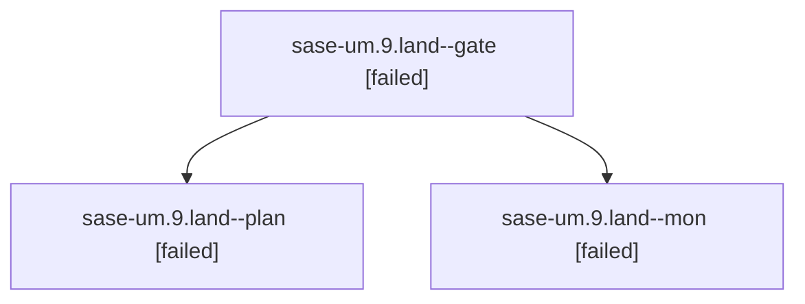

# Family: sase-um.9.land

[Agent Hoods](../README.md) / [bbugyi200](../users/bbugyi200/README.md) / [athena](../users/bbugyi200/machines/athena/README.md) / [sase-um](../users/bbugyi200/machines/athena/hoods/sase-um/README.md) / sase-um.9.land

Owner: `bbugyi200.athena` · Hood: `sase-um` · Members: 3 · Bead: [sase-um.9](https://github.com/sase-org/sase--beads/blob/main/pages/sase-um/sase-um.9.md)

## Lineage

The diagram is an optional enhancement; the ordered table below contains the same lineage in accessible text.

| Role | Agent | State | Model / provider | Timing | Commits | Prompt | Chat |
|---|---|---|---|---|---:|---|---|
| gate | sase-um.9.land--gate | failed | gpt-5.6-sol / codex | 2026-08-29T00:17:30.991687+00:00 → 2026-08-29T00:17:42.502170+00:00 | 0 | — | [Chat](../agents/bbugyi200.athena.sase-um.9.land--gate/chat.md) |
| plan | sase-um.9.land--plan | failed | gpt-5.6-sol / codex | 2026-08-28T23:56:37.103811+00:00 → 2026-08-29T00:17:48.390735+00:00 | 0 | [Prompt](../agents/bbugyi200.athena.sase-um.9.land--plan/prompt.md) | [Chat](../agents/bbugyi200.athena.sase-um.9.land--plan/chat.md) |
| mon | sase-um.9.land--mon | failed | gpt-5.6-sol / codex | 2026-08-29T00:17:41.580218+00:00 → 2026-08-29T00:19:50.090307+00:00 | 0 | — | [Chat](../agents/bbugyi200.athena.sase-um.9.land--mon/chat.md) |

## Neighbors

| Agent | Relation | State |
|---|---|---|
| [sase-um.9.1](bbugyi200.athena.sase-um.9.1.md) (family · 3) | sase-um.9 hood | completed 2, failed 1 |
| [sase-um.9.2](../agents/bbugyi200.athena.sase-um.9.2/README.md) | sase-um.9 hood | completed |
| [sase-um.9.3](../agents/bbugyi200.athena.sase-um.9.3/README.md) | sase-um.9 hood | completed |
| [sase-um.9.4](bbugyi200.athena.sase-um.9.4.md) (family · 5) | sase-um.9 hood | completed 3, failed 2 |
| [sase-um.9.5.1](../agents/bbugyi200.athena.sase-um.9.5.1/README.md) | sase-um.9 hood | completed |
| [sase-um.9.5.2](../agents/bbugyi200.athena.sase-um.9.5.2/README.md) | sase-um.9 hood | completed |
| [sase-um.9.5.3](bbugyi200.athena.sase-um.9.5.3.md) (family · 3) | sase-um.9 hood | completed 2, failed 1 |
| [sase-um.9.5.4](bbugyi200.athena.sase-um.9.5.4.md) (family · 9) | sase-um.9 hood | active 1, completed 4, failed 4 |
| [sase-um.9.5.5](../agents/bbugyi200.athena.sase-um.9.5.5/README.md) | sase-um.9 hood | waiting |
| [sase-um.9.5.land](../agents/bbugyi200.athena.sase-um.9.5.land/README.md) | sase-um.9 hood | waiting |
| [sase-um.1](bbugyi200.athena.sase-um.1.md) (family · 2) | sase-um hood | completed 2 |
| [sase-um.2](bbugyi200.athena.sase-um.2.md) (family · 2) | sase-um hood | completed 2 |
| [sase-um.3](../agents/bbugyi200.athena.sase-um.3/README.md) | sase-um hood | completed |
| [sase-um.4](../agents/bbugyi200.athena.sase-um.4/README.md) | sase-um hood | completed |
| [sase-um.5](bbugyi200.athena.sase-um.5.md) (family · 2) | sase-um hood | failed 2 |
| [sase-um.5.1.1](../agents/bbugyi200.athena.sase-um.5.1.1/README.md) | sase-um hood | completed |
| [sase-um.5.1.2](../agents/bbugyi200.athena.sase-um.5.1.2/README.md) | sase-um hood | completed |
| [sase-um.5.1.3](bbugyi200.athena.sase-um.5.1.3.md) (family · 67) | sase-um hood | completed 34, failed 33 |
| [sase-um.5.1.3](../agents/bbugyi200.athena.sase-um.5.1.3/README.md) | sase-um hood | completed |
| [sase-um.5.1.land](bbugyi200.athena.sase-um.5.1.land.md) (family · 7) | sase-um hood | completed 3, failed 3, waiting 1 |
| [sase-um.6](../agents/bbugyi200.athena.sase-um.6/README.md) | sase-um hood | completed |
| [sase-um.7](../agents/bbugyi200.athena.sase-um.7/README.md) | sase-um hood | completed |
| [sase-um.8](../agents/bbugyi200.athena.sase-um.8/README.md) | sase-um hood | completed |
| [sase-um.land](bbugyi200.athena.sase-um.land.md) (family · 3) | sase-um hood | failed 3 |
