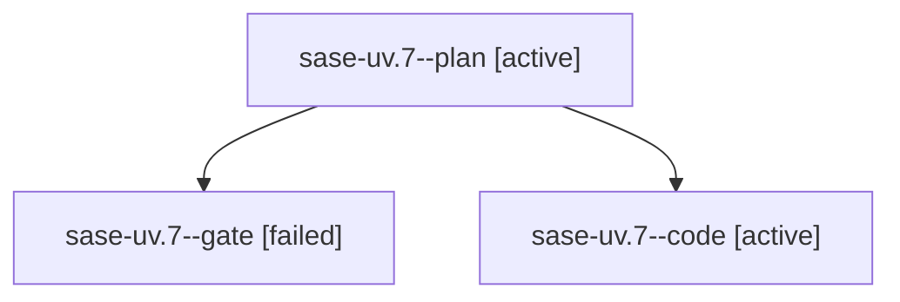

# Family: sase-uv.7

[Agent Hoods](../README.md) / [bbugyi200](../users/bbugyi200/README.md) / [athena](../users/bbugyi200/machines/athena/README.md) / [sase-uv](../users/bbugyi200/machines/athena/hoods/sase-uv/README.md) / sase-uv.7

Owner: `bbugyi200.athena` · Hood: `sase-uv` · Members: 3 · Bead: [sase-uv.7](https://github.com/sase-org/sase--beads/blob/main/pages/sase-uv/sase-uv.7.md)

## Lineage

The diagram is an optional enhancement; the ordered table below contains the same lineage in accessible text.

| Role | Agent | State | Model / provider | Timing | Commits | Prompt | Chat |
|---|---|---|---|---|---:|---|---|
| plan | sase-uv.7--plan | active | opus / claude | 2026-08-27T18:37:06.625811+00:00 | 0 | [Prompt](../agents/bbugyi200.athena.sase-uv.7--plan/prompt.md) | [Chat](../agents/bbugyi200.athena.sase-uv.7--plan/chat.md) |
| gate | sase-uv.7--gate | failed | opus / claude | 2026-08-27T18:49:52.293726+00:00 → 2026-08-27T18:50:04.002144+00:00 | 0 | — | [Chat](../agents/bbugyi200.athena.sase-uv.7--gate/chat.md) |
| code | sase-uv.7--code | active | gpt-5.5 / codex | 2026-08-27T18:51:37.511311+00:00 | 0 | — | — |

## Neighbors

| Agent | Relation | State |
|---|---|---|
| [sase-uv.1](../agents/bbugyi200.athena.sase-uv.1/README.md) | sase-uv hood | completed |
| [sase-uv.2](../agents/bbugyi200.athena.sase-uv.2/README.md) | sase-uv hood | completed |
| [sase-uv.3](../agents/bbugyi200.athena.sase-uv.3/README.md) | sase-uv hood | completed |
| [sase-uv.4](../agents/bbugyi200.athena.sase-uv.4/README.md) | sase-uv hood | failed |
| [sase-uv.5](../agents/bbugyi200.athena.sase-uv.5/README.md) | sase-uv hood | completed |
| [sase-uv.6](../agents/bbugyi200.athena.sase-uv.6/README.md) | sase-uv hood | completed |
| [sase-uv.8](../agents/bbugyi200.athena.sase-uv.8/README.md) | sase-uv hood | waiting |
| [sase-uv.9](../agents/bbugyi200.athena.sase-uv.9/README.md) | sase-uv hood | completed |
| [sase-uv.land](../agents/bbugyi200.athena.sase-uv.land/README.md) | sase-uv hood | waiting |
