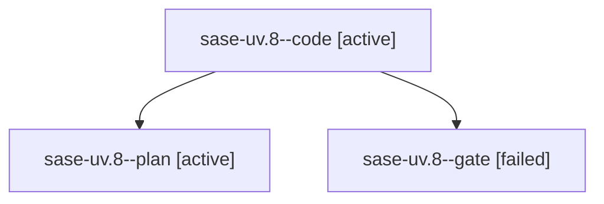

# Family: sase-uv.8

[Agent Hoods](../README.md) / [bbugyi200](../users/bbugyi200/README.md) / [athena](../users/bbugyi200/machines/athena/README.md) / [sase-uv](../users/bbugyi200/machines/athena/hoods/sase-uv/README.md) / sase-uv.8

Owner: `bbugyi200.athena` · Hood: `sase-uv` · Members: 3 · Bead: [sase-uv.8](https://github.com/sase-org/sase--beads/blob/main/pages/sase-uv/sase-uv.8.md)

## Lineage

The diagram is an optional enhancement; the ordered table below contains the same lineage in accessible text.

| Role | Agent | State | Model / provider | Timing | Commits | Prompt | Chat |
|---|---|---|---|---|---:|---|---|
| code | sase-uv.8--code | active | gpt-5.5 / codex | 2026-08-27T21:20:25.785240+00:00 | [1](../agents/bbugyi200.athena.sase-uv.8--code/README.md#commits) | — | — |
| plan | sase-uv.8--plan | active | gpt-5.6-sol / codex | 2026-08-27T21:09:27.453711+00:00 | 0 | [Prompt](../agents/bbugyi200.athena.sase-uv.8--plan/prompt.md) | [Chat](../agents/bbugyi200.athena.sase-uv.8--plan/chat.md) |
| gate | sase-uv.8--gate | failed | gpt-5.6-sol / codex | 2026-08-27T21:20:01.706921+00:00 → 2026-08-27T21:20:08.935136+00:00 | 0 | — | [Chat](../agents/bbugyi200.athena.sase-uv.8--gate/chat.md) |

## Commits

| Role | Repo | Commit | Subject | Committed |
|---|---|---|---|---|
| code | sase | [`a805b0d`](https://github.com/sase-org/sase/commit/a805b0da2f23de59d628c9c16ff4855fb68d8a02) | feat(agents): add bounded viewport loading | 2026-08-27 18:49:33 EDT |

## Neighbors

| Agent | Relation | State |
|---|---|---|
| [sase-uv.1](../agents/bbugyi200.athena.sase-uv.1/README.md) | sase-uv hood | completed |
| [sase-uv.2](../agents/bbugyi200.athena.sase-uv.2/README.md) | sase-uv hood | completed |
| [sase-uv.3](../agents/bbugyi200.athena.sase-uv.3/README.md) | sase-uv hood | completed |
| [sase-uv.4](../agents/bbugyi200.athena.sase-uv.4/README.md) | sase-uv hood | dismissed |
| [sase-uv.5](../agents/bbugyi200.athena.sase-uv.5/README.md) | sase-uv hood | completed |
| [sase-uv.6](../agents/bbugyi200.athena.sase-uv.6/README.md) | sase-uv hood | completed |
| [sase-uv.7](bbugyi200.athena.sase-uv.7.md) (family · 3) | sase-uv hood | completed 2, failed 1 |
| [sase-uv.9](../agents/bbugyi200.athena.sase-uv.9/README.md) | sase-uv hood | completed |
| [sase-uv.land](../agents/bbugyi200.athena.sase-uv.land/README.md) | sase-uv hood | waiting |
