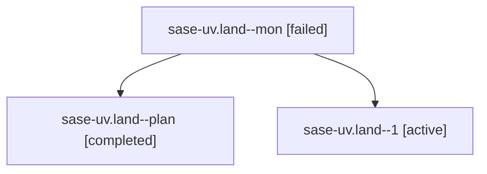

# Family: sase-uv.land

[Agent Hoods](../README.md) / [bbugyi200](../users/bbugyi200/README.md) / [athena](../users/bbugyi200/machines/athena/README.md) / [sase-uv](../users/bbugyi200/machines/athena/hoods/sase-uv/README.md) / sase-uv.land

Owner: `bbugyi200.athena` · Hood: `sase-uv` · Members: 3 · Bead: [sase-uv](https://github.com/sase-org/sase--beads/blob/main/pages/sase-uv/README.md)

## Lineage

The diagram is an optional enhancement; the ordered table below contains the same lineage in accessible text.

| Role | Agent | State | Model / provider | Timing | Commits | Prompt | Chat |
|---|---|---|---|---|---:|---|---|
| mon | sase-uv.land--mon | failed | opus / claude | 2026-08-27T23:49:13.745154+00:00 | 0 | — | [Chat](../agents/bbugyi200.athena.sase-uv.land--mon/chat.md) |
| plan | sase-uv.land--plan | completed | opus / claude | 2026-08-27T22:54:47.423454+00:00 → 2026-08-27T23:49:24.177500+00:00 | 0 | [Prompt](../agents/bbugyi200.athena.sase-uv.land--plan/prompt.md) | [Chat](../agents/bbugyi200.athena.sase-uv.land--plan/chat.md) |
| 1 | sase-uv.land--1 | active | opus / claude | 2026-08-28T00:01:27.432175+00:00 | [1](../agents/bbugyi200.athena.sase-uv.land--1/README.md#commits) | [Prompt](../agents/bbugyi200.athena.sase-uv.land--1/prompt.md) | — |

## Commits

| Role | Repo | Commit | Subject | Committed |
|---|---|---|---|---|
| 1 | sase | [`a5d59a4`](https://github.com/sase-org/sase/commit/a5d59a4cb34107399eebcd5bb0bb5d8343b2e8dd) | fix(agents): ratchet core pin and scope the keypath bench gate | 2026-08-27 20:09:26 EDT |

## Neighbors

| Agent | Relation | State |
|---|---|---|
| [sase-uv.1](../agents/bbugyi200.athena.sase-uv.1/README.md) | sase-uv hood | completed |
| [sase-uv.2](../agents/bbugyi200.athena.sase-uv.2/README.md) | sase-uv hood | completed |
| [sase-uv.3](../agents/bbugyi200.athena.sase-uv.3/README.md) | sase-uv hood | completed |
| [sase-uv.4](../agents/bbugyi200.athena.sase-uv.4/README.md) | sase-uv hood | dismissed |
| [sase-uv.5](../agents/bbugyi200.athena.sase-uv.5/README.md) | sase-uv hood | completed |
| [sase-uv.6](../agents/bbugyi200.athena.sase-uv.6/README.md) | sase-uv hood | completed |
| [sase-uv.7](bbugyi200.athena.sase-uv.7.md) (family · 3) | sase-uv hood | completed 2, failed 1 |
| [sase-uv.8](bbugyi200.athena.sase-uv.8.md) (family · 3) | sase-uv hood | completed 2, failed 1 |
| [sase-uv.8](../agents/bbugyi200.athena.sase-uv.8/README.md) | sase-uv hood | waiting |
| [sase-uv.9](../agents/bbugyi200.athena.sase-uv.9/README.md) | sase-uv hood | completed |
