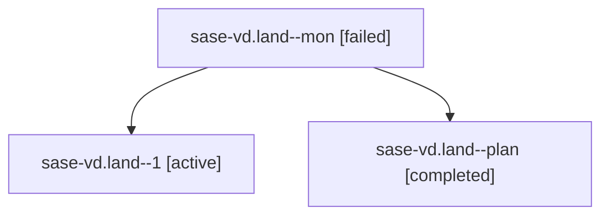

# Family: sase-vd.land

[Agent Hoods](../README.md) / [bbugyi200](../users/bbugyi200/README.md) / [athena](../users/bbugyi200/machines/athena/README.md) / [sase-vd](../users/bbugyi200/machines/athena/hoods/sase-vd/README.md) / sase-vd.land

Owner: `bbugyi200.athena` · Hood: `sase-vd` · Members: 3 · Bead: [sase-vd](https://github.com/sase-org/sase--beads/blob/main/pages/sase-vd/README.md)

## Lineage

The diagram is an optional enhancement; the ordered table below contains the same lineage in accessible text.

| Role | Agent | State | Model / provider | Timing | Commits | Prompt | Chat |
|---|---|---|---|---|---:|---|---|
| mon | sase-vd.land--mon | failed | opus / claude | 2026-08-29T01:56:37.498297+00:00 → 2026-08-29T02:14:42.569966+00:00 | 0 | — | [Chat](../agents/bbugyi200.athena.sase-vd.land--mon/chat.md) |
| 1 | sase-vd.land--1 | active | opus / claude | 2026-08-29T02:14:58.444654+00:00 | [1](../agents/bbugyi200.athena.sase-vd.land--1/README.md#commits) | [Prompt](../agents/bbugyi200.athena.sase-vd.land--1/prompt.md) | — |
| plan | sase-vd.land--plan | completed | opus / claude | 2026-08-29T01:31:10.000417+00:00 → 2026-08-29T01:56:45.836273+00:00 | 0 | [Prompt](../agents/bbugyi200.athena.sase-vd.land--plan/prompt.md) | [Chat](../agents/bbugyi200.athena.sase-vd.land--plan/chat.md) |

## Commits

| Role | Repo | Commit | Subject | Committed |
|---|---|---|---|---|
| 1 | sase | [`651619d`](https://github.com/sase-org/sase/commit/651619dcb366b8a0ae68e24fbfc8455dd2567f14) | fix(workspace): claim git setup workspace under the runner pid | 2026-08-28 22:17:48 EDT |

## Neighbors

| Agent | Relation | State |
|---|---|---|
| [sase-vd.1](../agents/bbugyi200.athena.sase-vd.1/README.md) | sase-vd hood | completed |
| [sase-vd.2](../agents/bbugyi200.athena.sase-vd.2/README.md) | sase-vd hood | completed |
| [sase-vd.3](../agents/bbugyi200.athena.sase-vd.3/README.md) | sase-vd hood | completed |
| [sase-vd.4](../agents/bbugyi200.athena.sase-vd.4/README.md) | sase-vd hood | completed |
| [sase-vd.5](../agents/bbugyi200.athena.sase-vd.5/README.md) | sase-vd hood | completed |
