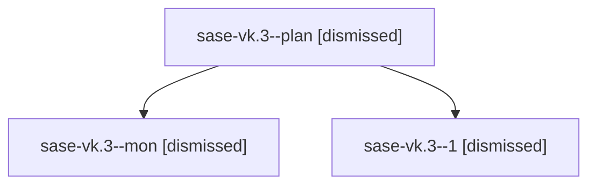

# Family: sase-vk.3

[Agent Hoods](../README.md) / [bbugyi200](../users/bbugyi200/README.md) / [athena](../users/bbugyi200/machines/athena/README.md) / [sase-vk](../users/bbugyi200/machines/athena/hoods/sase-vk/README.md) / sase-vk.3

Owner: `bbugyi200.athena` · Hood: `sase-vk` · Members: 3 · Bead: [sase-vk.3](https://github.com/sase-org/sase--beads/blob/main/pages/sase-vk/sase-vk.3.md)

## Lineage

The diagram is an optional enhancement; the ordered table below contains the same lineage in accessible text.

| Role | Agent | State | Model / provider | Timing | Commits | Prompt | Chat |
|---|---|---|---|---|---:|---|---|
| plan | sase-vk.3--plan | dismissed | — | 2026-08-30T05:55:03 | 0 | — | — |
| mon | sase-vk.3--mon | dismissed | — | 2026-08-30T06:32:22 | 0 | — | — |
| 1 | sase-vk.3--1 | dismissed | — | 2026-08-30T06:50:19 | 0 | — | — |

## Commits

| Role | Repo | Commit | Subject | Committed |
|---|---|---|---|---|
| — | sase | [`0860fcb`](https://github.com/sase-org/sase/commit/0860fcb200f35e3ec99cdd50cc9f54ad82ea857b) | docs(memory): rewrite Tier-1/Tier-2 memory vocabulary across docs and templates | 2026-08-30 06:52:22 EDT |

## Neighbors

| Agent | Relation | State |
|---|---|---|
| [sase-vk.1](../agents/bbugyi200.athena.sase-vk.1/README.md) | sase-vk hood | dismissed |
| [sase-vk.2](../agents/bbugyi200.athena.sase-vk.2/README.md) | sase-vk hood | active |
| [sase-vk.land](../agents/bbugyi200.athena.sase-vk.land/README.md) | sase-vk hood | active |
| [sase-vk.land.w0](../agents/bbugyi200.athena.sase-vk.land.w0/README.md) | sase-vk hood | dismissed |
| [sase-vk.land.w1.w0](../agents/bbugyi200.athena.sase-vk.land.w1.w0/README.md) | sase-vk hood | waiting |
| [sase-vk.land.w2](bbugyi200.athena.sase-vk.land.w2.md) (family · 3) | sase-vk hood | active 1, completed 1, failed 1 |
