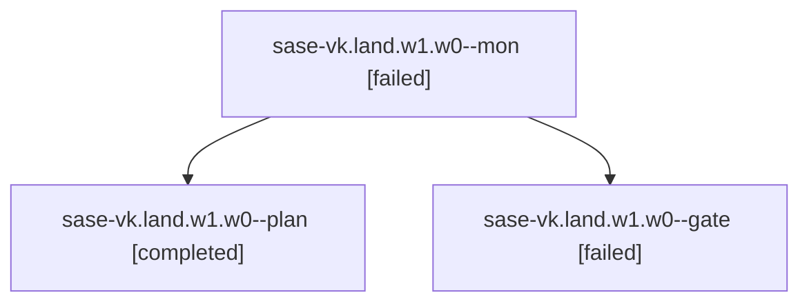

# Family: sase-vk.land.w1.w0

[Agent Hoods](../README.md) / [bbugyi200](../users/bbugyi200/README.md) / [athena](../users/bbugyi200/machines/athena/README.md) / [sase-vk](../users/bbugyi200/machines/athena/hoods/sase-vk/README.md) / sase-vk.land.w1.w0

Owner: `bbugyi200.athena` · Hood: `sase-vk` · Members: 3

## Lineage

The diagram is an optional enhancement; the ordered table below contains the same lineage in accessible text.

| Role | Agent | State | Model / provider | Timing | Commits | Prompt | Chat |
|---|---|---|---|---|---:|---|---|
| mon | sase-vk.land.w1.w0--mon | failed | opus / claude | 2026-08-30T14:02:10.676657+00:00 → 2026-08-30T14:05:03.365651+00:00 | 0 | — | [Chat](../agents/bbugyi200.athena.sase-vk.land.w1.w0--mon/chat.md) |
| plan | sase-vk.land.w1.w0--plan | completed | opus / claude | 2026-08-30T13:26:09.891338+00:00 → 2026-08-30T13:36:29.496712+00:00 | 0 | [Prompt](../agents/bbugyi200.athena.sase-vk.land.w1.w0--plan/prompt.md) | [Chat](../agents/bbugyi200.athena.sase-vk.land.w1.w0--plan/chat.md) |
| gate | sase-vk.land.w1.w0--gate | failed | opus / claude | 2026-08-30T13:36:22.510603+00:00 → 2026-08-30T14:02:11.571950+00:00 | 0 | — | [Chat](../agents/bbugyi200.athena.sase-vk.land.w1.w0--gate/chat.md) |

## Neighbors

| Agent | Relation | State |
|---|---|---|
| [sase-vk.land](../agents/bbugyi200.athena.sase-vk.land/README.md) | ancestor | active |
| [sase-vk.land.w0](../agents/bbugyi200.athena.sase-vk.land.w0/README.md) | sase-vk.land hood | dismissed |
| [sase-vk.land.w2](bbugyi200.athena.sase-vk.land.w2.md) (family · 3) | sase-vk.land hood | completed 2, failed 1 |
| [sase-vk.land.w2.f0](bbugyi200.athena.sase-vk.land.w2.f0.md) (family · 3) | sase-vk.land hood | active 1, completed 1, failed 1 |
| [sase-vk.1](../agents/bbugyi200.athena.sase-vk.1/README.md) | sase-vk hood | dismissed |
| [sase-vk.2](../agents/bbugyi200.athena.sase-vk.2/README.md) | sase-vk hood | active |
| [sase-vk.3](bbugyi200.athena.sase-vk.3.md) (family · 3) | sase-vk hood | dismissed 3 |
| [sase-vk.3](../agents/bbugyi200.athena.sase-vk.3/README.md) | sase-vk hood | waiting |
