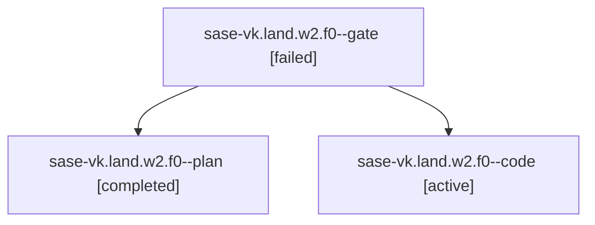

# Family: sase-vk.land.w2.f0

[Agent Hoods](../README.md) / [bbugyi200](../users/bbugyi200/README.md) / [athena](../users/bbugyi200/machines/athena/README.md) / [sase-vk](../users/bbugyi200/machines/athena/hoods/sase-vk/README.md) / sase-vk.land.w2.f0

Owner: `bbugyi200.athena` · Hood: `sase-vk` · Members: 3

## Lineage

The diagram is an optional enhancement; the ordered table below contains the same lineage in accessible text.

| Role | Agent | State | Model / provider | Timing | Commits | Prompt | Chat |
|---|---|---|---|---|---:|---|---|
| gate | sase-vk.land.w2.f0--gate | failed | opus / claude | 2026-08-30T15:04:20.117218+00:00 → 2026-08-30T15:05:14.787848+00:00 | 0 | — | [Chat](../agents/bbugyi200.athena.sase-vk.land.w2.f0--gate/chat.md) |
| plan | sase-vk.land.w2.f0--plan | completed | opus / claude | 2026-08-30T14:59:12.380190+00:00 → 2026-08-30T15:04:27.311583+00:00 | 0 | [Prompt](../agents/bbugyi200.athena.sase-vk.land.w2.f0--plan/prompt.md) | [Chat](../agents/bbugyi200.athena.sase-vk.land.w2.f0--plan/chat.md) |
| code | sase-vk.land.w2.f0--code | active | gpt-5.5 / codex | 2026-08-30T15:05:21.193984+00:00 | [1](../agents/bbugyi200.athena.sase-vk.land.w2.f0--code/README.md#commits) | [Prompt](../agents/bbugyi200.athena.sase-vk.land.w2.f0--code/prompt.md) | — |

## Commits

| Role | Repo | Commit | Subject | Committed |
|---|---|---|---|---|
| code | sase | [`cccacb9`](https://github.com/sase-org/sase/commit/cccacb98b605766c96178506b14bd29d43b06e2f) | docs(memory): reorder SASE memory bullets | 2026-08-30 11:19:47 EDT |

## Neighbors

| Agent | Relation | State |
|---|---|---|
| [sase-vk.land.w2](bbugyi200.athena.sase-vk.land.w2.md) (family · 3) | ancestor | completed 2, failed 1 |
| [sase-vk.land](../agents/bbugyi200.athena.sase-vk.land/README.md) | ancestor | active |
| [sase-vk.land.w0](../agents/bbugyi200.athena.sase-vk.land.w0/README.md) | sase-vk.land hood | dismissed |
| [sase-vk.land.w1.w0](bbugyi200.athena.sase-vk.land.w1.w0.md) (family · 3) | sase-vk.land hood | completed 1, failed 2 |
| [sase-vk.1](../agents/bbugyi200.athena.sase-vk.1/README.md) | sase-vk hood | dismissed |
| [sase-vk.2](../agents/bbugyi200.athena.sase-vk.2/README.md) | sase-vk hood | active |
| [sase-vk.3](bbugyi200.athena.sase-vk.3.md) (family · 3) | sase-vk hood | dismissed 3 |
| [sase-vk.3](../agents/bbugyi200.athena.sase-vk.3/README.md) | sase-vk hood | waiting |
