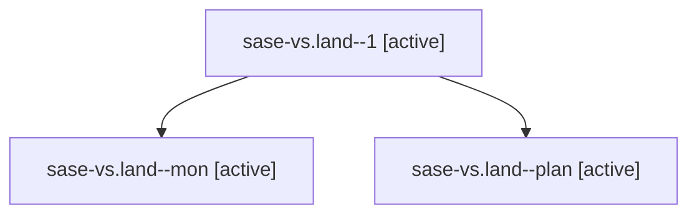

# Family: sase-vs.land

[Agent Hoods](../README.md) / [bbugyi200](../users/bbugyi200/README.md) / [athena](../users/bbugyi200/machines/athena/README.md) / [sase-vs](../users/bbugyi200/machines/athena/hoods/sase-vs/README.md) / sase-vs.land

Owner: `bbugyi200.athena` · Hood: `sase-vs` · Members: 3 · Bead: [sase-vs](https://github.com/sase-org/sase--beads/blob/main/pages/sase-vs/README.md)

## Lineage

The diagram is an optional enhancement; the ordered table below contains the same lineage in accessible text.

| Role | Agent | State | Model / provider | Timing | Commits | Prompt | Chat |
|---|---|---|---|---|---:|---|---|
| 1 | sase-vs.land--1 | active | opus / claude | 2026-08-30T14:24:42.955754+00:00 | [1](../agents/bbugyi200.athena.sase-vs.land--1/README.md#commits) | [Prompt](../agents/bbugyi200.athena.sase-vs.land--1/prompt.md) | [Chat](../agents/bbugyi200.athena.sase-vs.land--1/chat.md) |
| mon | sase-vs.land--mon | active | opus / claude | 2026-08-30T14:05:35.419696+00:00 | 0 | — | [Chat](../agents/bbugyi200.athena.sase-vs.land--mon/chat.md) |
| plan | sase-vs.land--plan | active | opus / claude | 2026-08-30T13:49:29.340333+00:00 | 0 | [Prompt](../agents/bbugyi200.athena.sase-vs.land--plan/prompt.md) | [Chat](../agents/bbugyi200.athena.sase-vs.land--plan/chat.md) |

## Commits

| Role | Repo | Commit | Subject | Committed |
|---|---|---|---|---|
| 1 | sase | [`c087df8`](https://github.com/sase-org/sase/commit/c087df878c0bf6e2eb17ab3a899e6d4a1f6d7117) | fix(completion): resync the CLI spec snapshot for plan approve --wait | 2026-08-30 10:35:31 EDT |

## Neighbors

| Agent | Relation | State |
|---|---|---|
| [sase-vs.1](../agents/bbugyi200.athena.sase-vs.1/README.md) | sase-vs hood | active |
| [sase-vs.2](../agents/bbugyi200.athena.sase-vs.2/README.md) | sase-vs hood | active |
| [sase-vs.3](../agents/bbugyi200.athena.sase-vs.3/README.md) | sase-vs hood | active |
| [sase-vs.4](../agents/bbugyi200.athena.sase-vs.4/README.md) | sase-vs hood | active |
| [sase-vs.5](../agents/bbugyi200.athena.sase-vs.5/README.md) | sase-vs hood | active |
| [sase-vs.6](../agents/bbugyi200.athena.sase-vs.6/README.md) | sase-vs hood | active |
