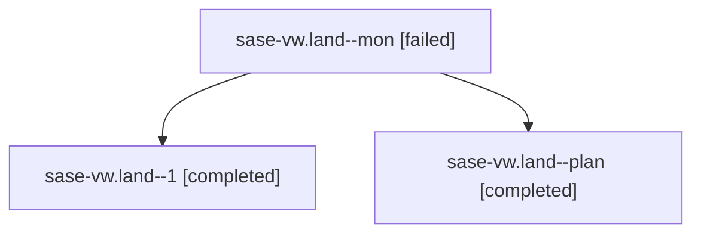

# Family: sase-vw.land

[Agent Hoods](../README.md) / [bbugyi200](../users/bbugyi200/README.md) / [athena](../users/bbugyi200/machines/athena/README.md) / [sase-vw](../users/bbugyi200/machines/athena/hoods/sase-vw/README.md) / sase-vw.land

Owner: `bbugyi200.athena` · Hood: `sase-vw` · Members: 3 · Bead: [sase-vw](https://github.com/sase-org/sase--beads/blob/main/pages/sase-vw/README.md)

## Lineage

The diagram is an optional enhancement; the ordered table below contains the same lineage in accessible text.

| Role | Agent | State | Model / provider | Timing | Commits | Prompt | Chat |
|---|---|---|---|---|---:|---|---|
| mon | sase-vw.land--mon | failed | opus / claude | 2026-08-30T17:45:22.081728+00:00 → 2026-08-30T18:03:34.643144+00:00 | 0 | — | [Chat](../agents/bbugyi200.athena.sase-vw.land--mon/chat.md) |
| 1 | sase-vw.land--1 | completed | opus / claude | 2026-08-30T18:03:50.606438+00:00 → 2026-08-30T18:07:50.803183+00:00 | [1](../agents/bbugyi200.athena.sase-vw.land--1/README.md#commits) | [Prompt](../agents/bbugyi200.athena.sase-vw.land--1/prompt.md) | [Chat](../agents/bbugyi200.athena.sase-vw.land--1/chat.md) |
| plan | sase-vw.land--plan | completed | opus / claude | 2026-08-30T17:13:26.247739+00:00 → 2026-08-30T17:45:35.443037+00:00 | 0 | [Prompt](../agents/bbugyi200.athena.sase-vw.land--plan/prompt.md) | [Chat](../agents/bbugyi200.athena.sase-vw.land--plan/chat.md) |

## Commits

| Role | Repo | Commit | Subject | Committed |
|---|---|---|---|---|
| 1 | sase | [`467d3de`](https://github.com/sase-org/sase/commit/467d3dee47f8a12dadfc6600fc2274ca170787c6) | fix(memory): resolve sase-vw landing gaps in authored memory links | 2026-08-30 14:06:46 EDT |

## Neighbors

| Agent | Relation | State |
|---|---|---|
| [sase-vw.1](../agents/bbugyi200.athena.sase-vw.1/README.md) | sase-vw hood | completed |
| [sase-vw.2](../agents/bbugyi200.athena.sase-vw.2/README.md) | sase-vw hood | completed |
| [sase-vw.3](../agents/bbugyi200.athena.sase-vw.3/README.md) | sase-vw hood | completed |
| [sase-vw.4](../agents/bbugyi200.athena.sase-vw.4/README.md) | sase-vw hood | completed |
| [sase-vw.5](../agents/bbugyi200.athena.sase-vw.5/README.md) | sase-vw hood | completed |
| [sase-vw.6](../agents/bbugyi200.athena.sase-vw.6/README.md) | sase-vw hood | completed |
| [sase-vw.7](../agents/bbugyi200.athena.sase-vw.7/README.md) | sase-vw hood | completed |
| [sase-vw.8](../agents/bbugyi200.athena.sase-vw.8/README.md) | sase-vw hood | completed |
