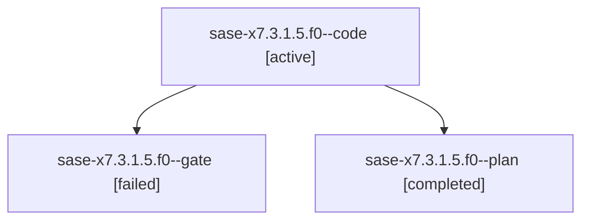

# Family: sase-x7.3.1.5.f0

[Agent Hoods](../README.md) / [bbugyi200](../users/bbugyi200/README.md) / [athena](../users/bbugyi200/machines/athena/README.md) / [sase-x7](../users/bbugyi200/machines/athena/hoods/sase-x7/README.md) / sase-x7.3.1.5.f0

Owner: `bbugyi200.athena` · Hood: `sase-x7` · Members: 3

## Lineage

The diagram is an optional enhancement; the ordered table below contains the same lineage in accessible text.

| Role | Agent | State | Model / provider | Timing | Commits | Prompt | Chat |
|---|---|---|---|---|---:|---|---|
| code | sase-x7.3.1.5.f0--code | active | gpt-5.5 / codex | 2026-09-06T17:42:03.888661+00:00 | [1](../agents/bbugyi200.athena.sase-x7.3.1.5.f0--code/README.md#commits) | [Prompt](../agents/bbugyi200.athena.sase-x7.3.1.5.f0--code/prompt.md) | — |
| gate | sase-x7.3.1.5.f0--gate | failed | gpt-6-astra / codex | 2026-09-06T17:22:49.869211+00:00 → 2026-09-06T17:41:56.489648+00:00 | 0 | — | [Chat](../agents/bbugyi200.athena.sase-x7.3.1.5.f0--gate/chat.md) |
| plan | sase-x7.3.1.5.f0--plan | completed | gpt-6-astra / codex | 2026-09-06T17:11:50.124818+00:00 → 2026-09-06T17:22:56.933251+00:00 | 0 | [Prompt](../agents/bbugyi200.athena.sase-x7.3.1.5.f0--plan/prompt.md) | [Chat](../agents/bbugyi200.athena.sase-x7.3.1.5.f0--plan/chat.md) |

## Commits

| Role | Repo | Commit | Subject | Committed |
|---|---|---|---|---|
| code | sase | [`a45669b`](https://github.com/sase-org/sase/commit/a45669b26fd3f6f313398e09f82160e2253fe168) | fix(agent): preserve monitor fork context | 2026-09-06 14:33:38 EDT |

## Neighbors

| Agent | Relation | State |
|---|---|---|
| [sase-x7.3.1.5](../agents/bbugyi200.athena.sase-x7.3.1.5/README.md) | ancestor | waiting |
| [sase-x7.3](bbugyi200.athena.sase-x7.3.md) (family · 3) | ancestor | failed 3 |
| [sase-x7.3.1.1](../agents/bbugyi200.athena.sase-x7.3.1.1/README.md) | sase-x7.3.1 hood | completed |
| [sase-x7.3.1.2](../agents/bbugyi200.athena.sase-x7.3.1.2/README.md) | sase-x7.3.1 hood | completed |
| [sase-x7.3.1.3](../agents/bbugyi200.athena.sase-x7.3.1.3/README.md) | sase-x7.3.1 hood | completed |
| [sase-x7.3.1.4](../agents/bbugyi200.athena.sase-x7.3.1.4/README.md) | sase-x7.3.1 hood | completed |
| [sase-x7.3.1.land](../agents/bbugyi200.athena.sase-x7.3.1.land/README.md) | sase-x7.3.1 hood | active |
| [sase-x7.1](../agents/bbugyi200.athena.sase-x7.1/README.md) | sase-x7 hood | completed |
| [sase-x7.10](../agents/bbugyi200.athena.sase-x7.10/README.md) | sase-x7 hood | waiting |
| [sase-x7.11](../agents/bbugyi200.athena.sase-x7.11/README.md) | sase-x7 hood | waiting |
| [sase-x7.12](../agents/bbugyi200.athena.sase-x7.12/README.md) | sase-x7 hood | waiting |
| [sase-x7.13](../agents/bbugyi200.athena.sase-x7.13/README.md) | sase-x7 hood | waiting |
| [sase-x7.14](../agents/bbugyi200.athena.sase-x7.14/README.md) | sase-x7 hood | waiting |
| [sase-x7.15](../agents/bbugyi200.athena.sase-x7.15/README.md) | sase-x7 hood | waiting |
| [sase-x7.2](bbugyi200.athena.sase-x7.2.md) (family · 3) | sase-x7 hood | failed 3 |
| [sase-x7.2.1.1](../agents/bbugyi200.athena.sase-x7.2.1.1/README.md) | sase-x7 hood | completed |
| [sase-x7.2.1.2](../agents/bbugyi200.athena.sase-x7.2.1.2/README.md) | sase-x7 hood | completed |
| [sase-x7.2.1.3](bbugyi200.athena.sase-x7.2.1.3.md) (family · 3) | sase-x7 hood | completed 2, failed 1 |
| [sase-x7.2.1.4](../agents/bbugyi200.athena.sase-x7.2.1.4/README.md) | sase-x7 hood | completed |
| [sase-x7.2.1.5.1](bbugyi200.athena.sase-x7.2.1.5.1.md) (family · 3) | sase-x7 hood | completed 2, failed 1 |
| [sase-x7.2.1.5.2](../agents/bbugyi200.athena.sase-x7.2.1.5.2/README.md) | sase-x7 hood | completed |
| [sase-x7.2.1.5.land](bbugyi200.athena.sase-x7.2.1.5.land.md) (family · 3) | sase-x7 hood | completed 2, failed 1 |
| [sase-x7.2.1.land](bbugyi200.athena.sase-x7.2.1.land.md) (family · 3) | sase-x7 hood | failed 3 |
| [sase-x7.4](../agents/bbugyi200.athena.sase-x7.4/README.md) | sase-x7 hood | waiting |
| [sase-x7.5](../agents/bbugyi200.athena.sase-x7.5/README.md) | sase-x7 hood | waiting |
| [sase-x7.6](../agents/bbugyi200.athena.sase-x7.6/README.md) | sase-x7 hood | waiting |
| [sase-x7.7](../agents/bbugyi200.athena.sase-x7.7/README.md) | sase-x7 hood | waiting |
| [sase-x7.8](../agents/bbugyi200.athena.sase-x7.8/README.md) | sase-x7 hood | waiting |
| [sase-x7.9](../agents/bbugyi200.athena.sase-x7.9/README.md) | sase-x7 hood | waiting |
| [sase-x7.land](../agents/bbugyi200.athena.sase-x7.land/README.md) | sase-x7 hood | waiting |
