# Family: sase-x7.4.r0

[Agent Hoods](../README.md) / [bbugyi200](../users/bbugyi200/README.md) / [athena](../users/bbugyi200/machines/athena/README.md) / [sase-x7](../users/bbugyi200/machines/athena/hoods/sase-x7/README.md) / sase-x7.4.r0

Owner: `bbugyi200.athena` · Hood: `sase-x7` · Members: 13 · Bead: [sase-x7.4](https://github.com/sase-org/sase--beads/blob/main/pages/sase-x7/sase-x7.4.md)

## Lineage

```mermaid
flowchart TD
  n0["sase-x7.4.r0--5 [completed]"]
  n1["sase-x7.4.r0--mon-2 [failed]"]
  n0 --> n1
  n2["sase-x7.4.r0--3 [completed]"]
  n0 --> n2
  n3["sase-x7.4.r0--1 [completed]"]
  n0 --> n3
  n4["sase-x7.4.r0--4 [completed]"]
  n0 --> n4
  n5["sase-x7.4.r0--mon-1 [failed]"]
  n0 --> n5
  n6["sase-x7.4.r0--mon-0 [failed]"]
  n0 --> n6
  n7["sase-x7.4.r0--2 [completed]"]
  n0 --> n7
  n8["sase-x7.4.r0--mon-4 [failed]"]
  n0 --> n8
  n9["sase-x7.4.r0--mon-3 [failed]"]
  n0 --> n9
  n10["sase-x7.4.r0--plan [dismissed]"]
  n0 --> n10
  n11["sase-x7.4.r0--6 [failed]"]
  n0 --> n11
  n12["sase-x7.4.r0--mon [failed]"]
  n0 --> n12
```

The diagram is an optional enhancement; the ordered table below contains the same lineage in accessible text.

| Role | Agent | State | Model / provider | Timing | Commits | Prompt | Chat |
|---|---|---|---|---|---:|---|---|
| 5 | sase-x7.4.r0--5 | completed | gpt-6-astra / codex | 2026-09-07T04:03:17.273839+00:00 → 2026-09-07T04:12:15.884203+00:00 | 0 | [Prompt](../agents/bbugyi200.athena.sase-x7.4.r0--5/prompt.md) | [Chat](../agents/bbugyi200.athena.sase-x7.4.r0--5/chat.md) |
| mon-2 | sase-x7.4.r0--mon-2 | failed | gpt-6-astra / codex | 2026-09-07T03:27:50.872236+00:00 → 2026-09-07T03:42:25.822672+00:00 | 0 | — | [Chat](../agents/bbugyi200.athena.sase-x7.4.r0--mon-2/chat.md) |
| 3 | sase-x7.4.r0--3 | completed | gpt-6-astra / codex | 2026-09-07T03:22:15.257821+00:00 → 2026-09-07T03:28:50.201974+00:00 | 0 | [Prompt](../agents/bbugyi200.athena.sase-x7.4.r0--3/prompt.md) | [Chat](../agents/bbugyi200.athena.sase-x7.4.r0--3/chat.md) |
| 1 | sase-x7.4.r0--1 | completed | gpt-6-astra / codex | 2026-09-07T02:59:40.193400+00:00 → 2026-09-07T03:05:52.697816+00:00 | 0 | [Prompt](../agents/bbugyi200.athena.sase-x7.4.r0--1/prompt.md) | [Chat](../agents/bbugyi200.athena.sase-x7.4.r0--1/chat.md) |
| 4 | sase-x7.4.r0--4 | completed | gpt-6-astra / codex | 2026-09-07T03:43:02.566256+00:00 → 2026-09-07T03:50:34.405472+00:00 | 0 | [Prompt](../agents/bbugyi200.athena.sase-x7.4.r0--4/prompt.md) | [Chat](../agents/bbugyi200.athena.sase-x7.4.r0--4/chat.md) |
| mon-1 | sase-x7.4.r0--mon-1 | failed | gpt-6-astra / codex | 2026-09-07T03:15:41.068245+00:00 → 2026-09-07T03:21:47.206720+00:00 | 0 | — | [Chat](../agents/bbugyi200.athena.sase-x7.4.r0--mon-1/chat.md) |
| mon-0 | sase-x7.4.r0--mon-0 | failed | gpt-6-astra / codex | 2026-09-07T03:05:17.912392+00:00 → 2026-09-07T03:07:37.464257+00:00 | 0 | — | [Chat](../agents/bbugyi200.athena.sase-x7.4.r0--mon-0/chat.md) |
| 2 | sase-x7.4.r0--2 | completed | gpt-6-astra / codex | 2026-09-07T03:08:04.584783+00:00 → 2026-09-07T03:16:17.834807+00:00 | 0 | [Prompt](../agents/bbugyi200.athena.sase-x7.4.r0--2/prompt.md) | [Chat](../agents/bbugyi200.athena.sase-x7.4.r0--2/chat.md) |
| mon-4 | sase-x7.4.r0--mon-4 | failed | gpt-6-astra / codex | 2026-09-07T04:11:15.136502+00:00 → 2026-09-07T05:17:04.327515+00:00 | 0 | — | [Chat](../agents/bbugyi200.athena.sase-x7.4.r0--mon-4/chat.md) |
| mon-3 | sase-x7.4.r0--mon-3 | failed | gpt-6-astra / codex | 2026-09-07T03:49:52.782916+00:00 → 2026-09-07T04:02:53.015910+00:00 | 0 | — | [Chat](../agents/bbugyi200.athena.sase-x7.4.r0--mon-3/chat.md) |
| plan | sase-x7.4.r0--plan | dismissed | gpt-6-astra / codex | 2026-09-06T22:37:38.299371 → 2026-09-06T22:54:54.053482 | 0 | [Prompt](../agents/bbugyi200.athena.sase-x7.4.r0--plan/prompt.md) | [Chat](../agents/bbugyi200.athena.sase-x7.4.r0--plan/chat.md) |
| 6 | sase-x7.4.r0--6 | failed | gpt-6-astra / codex | 2026-09-07T05:17:29.238837+00:00 → 2026-09-07T05:19:09.333324+00:00 | 0 | [Prompt](../agents/bbugyi200.athena.sase-x7.4.r0--6/prompt.md) | — |
| mon | sase-x7.4.r0--mon | failed | gpt-6-astra / codex | 2026-09-07T02:53:52.413498+00:00 → 2026-09-07T02:59:14.646230+00:00 | 0 | — | [Chat](../agents/bbugyi200.athena.sase-x7.4.r0--mon/chat.md) |

## Neighbors

| Agent | Relation | State |
|---|---|---|
| [sase-x7.4](../agents/bbugyi200.athena.sase-x7.4/README.md) | ancestor | waiting |
| [sase-x7.4.r0.r0](bbugyi200.athena.sase-x7.4.r0.r0.md) (family · 3) | descendant | dismissed 2, failed 1 |
| [sase-x7.1](../agents/bbugyi200.athena.sase-x7.1/README.md) | sase-x7 hood | completed |
| [sase-x7.10](../agents/bbugyi200.athena.sase-x7.10/README.md) | sase-x7 hood | waiting |
| [sase-x7.11](../agents/bbugyi200.athena.sase-x7.11/README.md) | sase-x7 hood | waiting |
| [sase-x7.12](../agents/bbugyi200.athena.sase-x7.12/README.md) | sase-x7 hood | waiting |
| [sase-x7.13](../agents/bbugyi200.athena.sase-x7.13/README.md) | sase-x7 hood | waiting |
| [sase-x7.14](../agents/bbugyi200.athena.sase-x7.14/README.md) | sase-x7 hood | waiting |
| [sase-x7.15](../agents/bbugyi200.athena.sase-x7.15/README.md) | sase-x7 hood | waiting |
| [sase-x7.2](bbugyi200.athena.sase-x7.2.md) (family · 3) | sase-x7 hood | failed 3 |
| [sase-x7.2.1.1](../agents/bbugyi200.athena.sase-x7.2.1.1/README.md) | sase-x7 hood | completed |
| [sase-x7.2.1.2](../agents/bbugyi200.athena.sase-x7.2.1.2/README.md) | sase-x7 hood | completed |
| [sase-x7.2.1.3](bbugyi200.athena.sase-x7.2.1.3.md) (family · 3) | sase-x7 hood | completed 2, failed 1 |
| [sase-x7.2.1.4](../agents/bbugyi200.athena.sase-x7.2.1.4/README.md) | sase-x7 hood | completed |
| [sase-x7.2.1.5.1](bbugyi200.athena.sase-x7.2.1.5.1.md) (family · 3) | sase-x7 hood | completed 2, failed 1 |
| [sase-x7.2.1.5.2](../agents/bbugyi200.athena.sase-x7.2.1.5.2/README.md) | sase-x7 hood | completed |
| [sase-x7.2.1.5.land](bbugyi200.athena.sase-x7.2.1.5.land.md) (family · 3) | sase-x7 hood | completed 2, failed 1 |
| [sase-x7.2.1.land](bbugyi200.athena.sase-x7.2.1.land.md) (family · 3) | sase-x7 hood | failed 3 |
| [sase-x7.3](bbugyi200.athena.sase-x7.3.md) (family · 3) | sase-x7 hood | failed 3 |
| [sase-x7.3.1.1](../agents/bbugyi200.athena.sase-x7.3.1.1/README.md) | sase-x7 hood | completed |
| [sase-x7.3.1.2](../agents/bbugyi200.athena.sase-x7.3.1.2/README.md) | sase-x7 hood | completed |
| [sase-x7.3.1.3](../agents/bbugyi200.athena.sase-x7.3.1.3/README.md) | sase-x7 hood | completed |
| [sase-x7.3.1.4](../agents/bbugyi200.athena.sase-x7.3.1.4/README.md) | sase-x7 hood | completed |
| [sase-x7.3.1.5](bbugyi200.athena.sase-x7.3.1.5.md) (family · 3) | sase-x7 hood | completed 2, failed 1 |
| [sase-x7.3.1.5](../agents/bbugyi200.athena.sase-x7.3.1.5/README.md) | sase-x7 hood | waiting |
| [sase-x7.3.1.5.f0](bbugyi200.athena.sase-x7.3.1.5.f0.md) (family · 3) | sase-x7 hood | completed 1, dismissed 1, failed 1 |
| [sase-x7.3.1.land](bbugyi200.athena.sase-x7.3.1.land.md) (family · 5) | sase-x7 hood | completed 3, failed 2 |
| [sase-x7.5](bbugyi200.athena.sase-x7.5.md) (family · 3) | sase-x7 hood | failed 3 |
| [sase-x7.5](../agents/bbugyi200.athena.sase-x7.5/README.md) | sase-x7 hood | waiting |
| [sase-x7.5.1.1](../agents/bbugyi200.athena.sase-x7.5.1.1/README.md) | sase-x7 hood | active |
| [sase-x7.5.1.2](../agents/bbugyi200.athena.sase-x7.5.1.2/README.md) | sase-x7 hood | waiting |
| [sase-x7.5.1.3](../agents/bbugyi200.athena.sase-x7.5.1.3/README.md) | sase-x7 hood | waiting |
| [sase-x7.5.1.4](../agents/bbugyi200.athena.sase-x7.5.1.4/README.md) | sase-x7 hood | waiting |
| [sase-x7.5.1.5](../agents/bbugyi200.athena.sase-x7.5.1.5/README.md) | sase-x7 hood | waiting |
| [sase-x7.5.1.6](../agents/bbugyi200.athena.sase-x7.5.1.6/README.md) | sase-x7 hood | waiting |
| [sase-x7.5.1.7](../agents/bbugyi200.athena.sase-x7.5.1.7/README.md) | sase-x7 hood | waiting |
| [sase-x7.5.1.land](../agents/bbugyi200.athena.sase-x7.5.1.land/README.md) | sase-x7 hood | waiting |
| [sase-x7.6](../agents/bbugyi200.athena.sase-x7.6/README.md) | sase-x7 hood | completed |
| [sase-x7.7](../agents/bbugyi200.athena.sase-x7.7/README.md) | sase-x7 hood | completed |
| [sase-x7.8](../agents/bbugyi200.athena.sase-x7.8/README.md) | sase-x7 hood | waiting |
| [sase-x7.9](../agents/bbugyi200.athena.sase-x7.9/README.md) | sase-x7 hood | waiting |
| [sase-x7.land](../agents/bbugyi200.athena.sase-x7.land/README.md) | sase-x7 hood | waiting |
