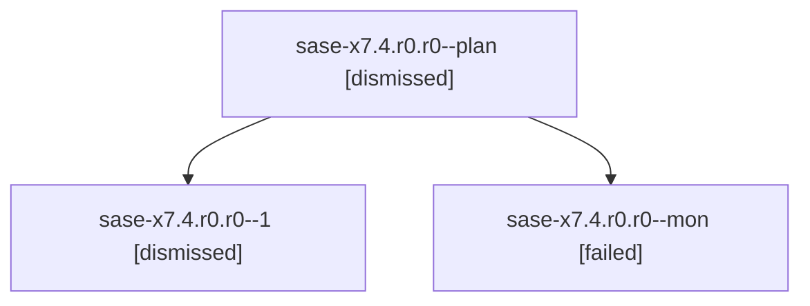

# Family: sase-x7.4.r0.r0

[Agent Hoods](../README.md) / [bbugyi200](../users/bbugyi200/README.md) / [athena](../users/bbugyi200/machines/athena/README.md) / [sase-x7](../users/bbugyi200/machines/athena/hoods/sase-x7/README.md) / sase-x7.4.r0.r0

Owner: `bbugyi200.athena` · Hood: `sase-x7` · Members: 3 · Bead: [sase-x7.4](https://github.com/sase-org/sase--beads/blob/main/pages/sase-x7/sase-x7.4.md)

## Lineage

The diagram is an optional enhancement; the ordered table below contains the same lineage in accessible text.

| Role | Agent | State | Model / provider | Timing | Commits | Prompt | Chat |
|---|---|---|---|---|---:|---|---|
| plan | sase-x7.4.r0.r0--plan | dismissed | gpt-6-astra / codex | 2026-09-07T02:31:46.732970 → 2026-09-07T02:41:21.302312 | 0 | [Prompt](../agents/bbugyi200.athena.sase-x7.4.r0.r0--plan/prompt.md) | [Chat](../agents/bbugyi200.athena.sase-x7.4.r0.r0--plan/chat.md) |
| 1 | sase-x7.4.r0.r0--1 | dismissed | gpt-6-astra / codex | 2026-09-07T03:32:52.244937 → 2026-09-07T03:33:03.377745 | 0 | [Prompt](../agents/bbugyi200.athena.sase-x7.4.r0.r0--1/prompt.md) | — |
| mon | sase-x7.4.r0.r0--mon | failed | gpt-6-astra / codex | 2026-09-07T06:41:12.707015+00:00 → 2026-09-07T07:32:30.764148+00:00 | 0 | — | [Chat](../agents/bbugyi200.athena.sase-x7.4.r0.r0--mon/chat.md) |

## Neighbors

| Agent | Relation | State |
|---|---|---|
| [sase-x7.4.r0](bbugyi200.athena.sase-x7.4.r0.md) (family · 13) | ancestor | completed 5, dismissed 1, failed 7 |
| [sase-x7.4](../agents/bbugyi200.athena.sase-x7.4/README.md) | ancestor | waiting |
| [sase-x7.1](../agents/bbugyi200.athena.sase-x7.1/README.md) | sase-x7 hood | completed |
| [sase-x7.10](../agents/bbugyi200.athena.sase-x7.10/README.md) | sase-x7 hood | waiting |
| [sase-x7.11](../agents/bbugyi200.athena.sase-x7.11/README.md) | sase-x7 hood | waiting |
| [sase-x7.12](../agents/bbugyi200.athena.sase-x7.12/README.md) | sase-x7 hood | waiting |
| [sase-x7.13](../agents/bbugyi200.athena.sase-x7.13/README.md) | sase-x7 hood | waiting |
| [sase-x7.14](../agents/bbugyi200.athena.sase-x7.14/README.md) | sase-x7 hood | waiting |
| [sase-x7.15](../agents/bbugyi200.athena.sase-x7.15/README.md) | sase-x7 hood | waiting |
| [sase-x7.2](bbugyi200.athena.sase-x7.2.md) (family · 3) | sase-x7 hood | failed 3 |
| [sase-x7.2.1.1](../agents/bbugyi200.athena.sase-x7.2.1.1/README.md) | sase-x7 hood | completed |
| [sase-x7.2.1.2](../agents/bbugyi200.athena.sase-x7.2.1.2/README.md) | sase-x7 hood | completed |
| [sase-x7.2.1.3](bbugyi200.athena.sase-x7.2.1.3.md) (family · 3) | sase-x7 hood | completed 2, failed 1 |
| [sase-x7.2.1.4](../agents/bbugyi200.athena.sase-x7.2.1.4/README.md) | sase-x7 hood | completed |
| [sase-x7.2.1.5.1](bbugyi200.athena.sase-x7.2.1.5.1.md) (family · 3) | sase-x7 hood | completed 2, failed 1 |
| [sase-x7.2.1.5.2](../agents/bbugyi200.athena.sase-x7.2.1.5.2/README.md) | sase-x7 hood | completed |
| [sase-x7.2.1.5.land](bbugyi200.athena.sase-x7.2.1.5.land.md) (family · 3) | sase-x7 hood | completed 2, failed 1 |
| [sase-x7.2.1.land](bbugyi200.athena.sase-x7.2.1.land.md) (family · 3) | sase-x7 hood | failed 3 |
| [sase-x7.3](bbugyi200.athena.sase-x7.3.md) (family · 3) | sase-x7 hood | failed 3 |
| [sase-x7.3.1.1](../agents/bbugyi200.athena.sase-x7.3.1.1/README.md) | sase-x7 hood | completed |
| [sase-x7.3.1.2](../agents/bbugyi200.athena.sase-x7.3.1.2/README.md) | sase-x7 hood | completed |
| [sase-x7.3.1.3](../agents/bbugyi200.athena.sase-x7.3.1.3/README.md) | sase-x7 hood | completed |
| [sase-x7.3.1.4](../agents/bbugyi200.athena.sase-x7.3.1.4/README.md) | sase-x7 hood | completed |
| [sase-x7.3.1.5](bbugyi200.athena.sase-x7.3.1.5.md) (family · 3) | sase-x7 hood | completed 2, failed 1 |
| [sase-x7.3.1.5](../agents/bbugyi200.athena.sase-x7.3.1.5/README.md) | sase-x7 hood | waiting |
| [sase-x7.3.1.5.f0](bbugyi200.athena.sase-x7.3.1.5.f0.md) (family · 3) | sase-x7 hood | completed 1, dismissed 1, failed 1 |
| [sase-x7.3.1.land](bbugyi200.athena.sase-x7.3.1.land.md) (family · 5) | sase-x7 hood | completed 3, failed 2 |
| [sase-x7.5](bbugyi200.athena.sase-x7.5.md) (family · 3) | sase-x7 hood | failed 3 |
| [sase-x7.5](../agents/bbugyi200.athena.sase-x7.5/README.md) | sase-x7 hood | waiting |
| [sase-x7.5.1.1](../agents/bbugyi200.athena.sase-x7.5.1.1/README.md) | sase-x7 hood | active |
| [sase-x7.5.1.2](../agents/bbugyi200.athena.sase-x7.5.1.2/README.md) | sase-x7 hood | waiting |
| [sase-x7.5.1.3](../agents/bbugyi200.athena.sase-x7.5.1.3/README.md) | sase-x7 hood | waiting |
| [sase-x7.5.1.4](../agents/bbugyi200.athena.sase-x7.5.1.4/README.md) | sase-x7 hood | waiting |
| [sase-x7.5.1.5](../agents/bbugyi200.athena.sase-x7.5.1.5/README.md) | sase-x7 hood | waiting |
| [sase-x7.5.1.6](../agents/bbugyi200.athena.sase-x7.5.1.6/README.md) | sase-x7 hood | waiting |
| [sase-x7.5.1.7](../agents/bbugyi200.athena.sase-x7.5.1.7/README.md) | sase-x7 hood | waiting |
| [sase-x7.5.1.land](../agents/bbugyi200.athena.sase-x7.5.1.land/README.md) | sase-x7 hood | waiting |
| [sase-x7.6](../agents/bbugyi200.athena.sase-x7.6/README.md) | sase-x7 hood | completed |
| [sase-x7.7](../agents/bbugyi200.athena.sase-x7.7/README.md) | sase-x7 hood | completed |
| [sase-x7.8](../agents/bbugyi200.athena.sase-x7.8/README.md) | sase-x7 hood | waiting |
| [sase-x7.9](../agents/bbugyi200.athena.sase-x7.9/README.md) | sase-x7 hood | waiting |
| [sase-x7.land](../agents/bbugyi200.athena.sase-x7.land/README.md) | sase-x7 hood | waiting |
