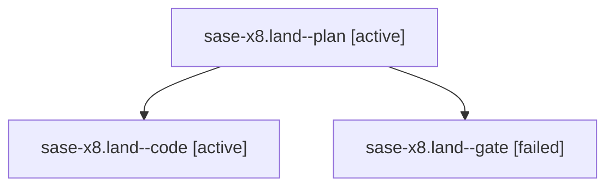

# Family: sase-x8.land

[Agent Hoods](../README.md) / [bbugyi200](../users/bbugyi200/README.md) / [athena](../users/bbugyi200/machines/athena/README.md) / [sase-x8](../users/bbugyi200/machines/athena/hoods/sase-x8/README.md) / sase-x8.land

Owner: `bbugyi200.athena` · Hood: `sase-x8` · Members: 3 · Bead: [sase-x8](https://github.com/sase-org/sase--beads/blob/main/pages/sase-x8/README.md)

## Lineage

The diagram is an optional enhancement; the ordered table below contains the same lineage in accessible text.

| Role | Agent | State | Model / provider | Timing | Commits | Prompt | Chat |
|---|---|---|---|---|---:|---|---|
| plan | sase-x8.land--plan | active | gpt-5.6-sol / codex | 2026-09-06T02:22:47.787001+00:00 | 0 | [Prompt](../agents/bbugyi200.athena.sase-x8.land--plan/prompt.md) | [Chat](../agents/bbugyi200.athena.sase-x8.land--plan/chat.md) |
| code | sase-x8.land--code | active | grok-4.6 / grok | 2026-09-06T02:34:40.153635+00:00 | [1](../agents/bbugyi200.athena.sase-x8.land--code/README.md#commits) | — | — |
| gate | sase-x8.land--gate | failed | gpt-5.6-sol / codex | 2026-09-06T02:34:08.621434+00:00 → 2026-09-06T02:34:21.441123+00:00 | 0 | — | [Chat](../agents/bbugyi200.athena.sase-x8.land--gate/chat.md) |

## Commits

| Role | Repo | Commit | Subject | Committed |
|---|---|---|---|---|
| code | sase | [`18b3cf0`](https://github.com/sase-org/sase/commit/18b3cf0fae9238517aefc963fac6387cca660c67) | fix(deps): raise sase-core-rs floor to 0.32.25 for wait.artifacts | 2026-09-05 22:52:57 EDT |

## Neighbors

| Agent | Relation | State |
|---|---|---|
| [sase-x8.1](../agents/bbugyi200.athena.sase-x8.1/README.md) | sase-x8 hood | completed |
| [sase-x8.2](../agents/bbugyi200.athena.sase-x8.2/README.md) | sase-x8 hood | completed |
| [sase-x8.3](../agents/bbugyi200.athena.sase-x8.3/README.md) | sase-x8 hood | completed |
