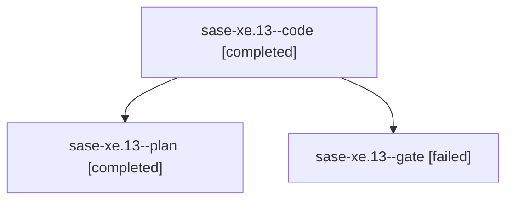

# Family: sase-xe.13

[Agent Hoods](../README.md) / [bbugyi200](../users/bbugyi200/README.md) / [athena](../users/bbugyi200/machines/athena/README.md) / [sase-xe](../users/bbugyi200/machines/athena/hoods/sase-xe/README.md) / sase-xe.13

Owner: `bbugyi200.athena` · Hood: `sase-xe` · Members: 3 · Bead: [sase-xe.13](https://github.com/sase-org/sase--beads/blob/main/pages/sase-xe/sase-xe.13.md)

## Lineage

The diagram is an optional enhancement; the ordered table below contains the same lineage in accessible text.

| Role | Agent | State | Model / provider | Timing | Commits | Prompt | Chat |
|---|---|---|---|---|---:|---|---|
| code | sase-xe.13--code | completed | grok-4.6 / grok | 2026-09-07T11:40:25.439640+00:00 → 2026-09-07T13:32:20.240295+00:00 | [1](../agents/bbugyi200.athena.sase-xe.13--code/README.md#commits) | — | [Chat](../agents/bbugyi200.athena.sase-xe.13--code/chat.md) |
| plan | sase-xe.13--plan | completed | opus / claude | 2026-09-07T11:24:03.566214+00:00 → 2026-09-07T13:32:20.240295+00:00 | 0 | [Prompt](../agents/bbugyi200.athena.sase-xe.13--plan/prompt.md) | [Chat](../agents/bbugyi200.athena.sase-xe.13--plan/chat.md) |
| gate | sase-xe.13--gate | failed | opus / claude | 2026-09-07T11:40:00.507896+00:00 → 2026-09-07T11:40:07.910800+00:00 | 0 | — | [Chat](../agents/bbugyi200.athena.sase-xe.13--gate/chat.md) |

## Commits

| Role | Repo | Commit | Subject | Committed |
|---|---|---|---|---|
| code | sase | [`1a3a12a`](https://github.com/sase-org/sase/commit/1a3a12a7eff807fa93da4d788242a3adbfba5b6d) | feat(dispatch): add remote fleet stop, retry, fork, and bounded content | 2026-09-07 09:27:01 EDT |

## Neighbors

| Agent | Relation | State |
|---|---|---|
| [sase-xe.1](../agents/bbugyi200.athena.sase-xe.1/README.md) | sase-xe hood | active |
| [sase-xe.10](bbugyi200.athena.sase-xe.10.md) (family · 3) | sase-xe hood | completed 2, failed 1 |
| [sase-xe.10](../agents/bbugyi200.athena.sase-xe.10/README.md) | sase-xe hood | waiting |
| [sase-xe.11](bbugyi200.athena.sase-xe.11.md) (family · 3) | sase-xe hood | completed 2, failed 1 |
| [sase-xe.12](bbugyi200.athena.sase-xe.12.md) (family · 3) | sase-xe hood | completed 2, failed 1 |
| [sase-xe.14](bbugyi200.athena.sase-xe.14.md) (family · 3) | sase-xe hood | completed 2, failed 1 |
| [sase-xe.14.f0](bbugyi200.athena.sase-xe.14.f0.md) (family · 5) | sase-xe hood | active 1, completed 1, failed 3 |
| [sase-xe.15](bbugyi200.athena.sase-xe.15.md) (family · 6) | sase-xe hood | active 2, completed 2, failed 2 |
| [sase-xe.15](../agents/bbugyi200.athena.sase-xe.15/README.md) | sase-xe hood | waiting |
| [sase-xe.16.1](bbugyi200.athena.sase-xe.16.1.md) (family · 3) | sase-xe hood | completed 2, failed 1 |
| [sase-xe.16.10](bbugyi200.athena.sase-xe.16.10.md) (family · 5) | sase-xe hood | active 1, completed 2, failed 2 |
| [sase-xe.16.11.1](../agents/bbugyi200.athena.sase-xe.16.11.1/README.md) | sase-xe hood | completed |
| [sase-xe.16.11.2](../agents/bbugyi200.athena.sase-xe.16.11.2/README.md) | sase-xe hood | completed |
| [sase-xe.16.11.3](bbugyi200.athena.sase-xe.16.11.3.md) (family · 7) | sase-xe hood | completed 4, failed 3 |
| [sase-xe.16.11.4](../agents/bbugyi200.athena.sase-xe.16.11.4/README.md) | sase-xe hood | completed |
| [sase-xe.16.11.5](../agents/bbugyi200.athena.sase-xe.16.11.5/README.md) | sase-xe hood | completed |
| [sase-xe.16.11.6.1](../agents/bbugyi200.athena.sase-xe.16.11.6.1/README.md) | sase-xe hood | active |
| [sase-xe.16.11.6.2](../agents/bbugyi200.athena.sase-xe.16.11.6.2/README.md) | sase-xe hood | waiting |
| [sase-xe.16.11.6.3](../agents/bbugyi200.athena.sase-xe.16.11.6.3/README.md) | sase-xe hood | waiting |
| [sase-xe.16.11.6.4](../agents/bbugyi200.athena.sase-xe.16.11.6.4/README.md) | sase-xe hood | waiting |
| [sase-xe.16.11.6.5](../agents/bbugyi200.athena.sase-xe.16.11.6.5/README.md) | sase-xe hood | waiting |
| [sase-xe.16.11.6.6](../agents/bbugyi200.athena.sase-xe.16.11.6.6/README.md) | sase-xe hood | waiting |
| [sase-xe.16.11.6.land](../agents/bbugyi200.athena.sase-xe.16.11.6.land/README.md) | sase-xe hood | active |
| [sase-xe.16.11.7.1](../agents/bbugyi200.athena.sase-xe.16.11.7.1/README.md) | sase-xe hood | completed |
| [sase-xe.16.11.7.10](../agents/bbugyi200.athena.sase-xe.16.11.7.10/README.md) | sase-xe hood | active |
| [sase-xe.16.11.7.11](../agents/bbugyi200.athena.sase-xe.16.11.7.11/README.md) | sase-xe hood | completed |
| [sase-xe.16.11.7.12](../agents/bbugyi200.athena.sase-xe.16.11.7.12/README.md) | sase-xe hood | completed |
| [sase-xe.16.11.7.13](../agents/bbugyi200.athena.sase-xe.16.11.7.13/README.md) | sase-xe hood | completed |
| [sase-xe.16.11.7.14.1](bbugyi200.athena.sase-xe.16.11.7.14.1.md) (family · 3) | sase-xe hood | completed 2, failed 1 |
| [sase-xe.16.11.7.14.2](../agents/bbugyi200.athena.sase-xe.16.11.7.14.2/README.md) | sase-xe hood | completed |
| [sase-xe.16.11.7.14.3](../agents/bbugyi200.athena.sase-xe.16.11.7.14.3/README.md) | sase-xe hood | completed |
| [sase-xe.16.11.7.14.4](../agents/bbugyi200.athena.sase-xe.16.11.7.14.4/README.md) | sase-xe hood | completed |
| [sase-xe.16.11.7.14.5](bbugyi200.athena.sase-xe.16.11.7.14.5.md) (family · 3) | sase-xe hood | completed 2, failed 1 |
| [sase-xe.16.11.7.14.6.1](bbugyi200.athena.sase-xe.16.11.7.14.6.1.md) (family · 7) | sase-xe hood | completed 4, failed 3 |
| [sase-xe.16.11.7.14.6.2](../agents/bbugyi200.athena.sase-xe.16.11.7.14.6.2/README.md) | sase-xe hood | completed |
| [sase-xe.16.11.7.14.6.3](bbugyi200.athena.sase-xe.16.11.7.14.6.3.md) (family · 3) | sase-xe hood | completed 2, failed 1 |
| [sase-xe.16.11.7.14.6.4](../agents/bbugyi200.athena.sase-xe.16.11.7.14.6.4/README.md) | sase-xe hood | completed |
| [sase-xe.16.11.7.14.6.4.f0](../agents/bbugyi200.athena.sase-xe.16.11.7.14.6.4.f0/README.md) | sase-xe hood | active |
| [sase-xe.16.11.7.14.6.5](../agents/bbugyi200.athena.sase-xe.16.11.7.14.6.5/README.md) | sase-xe hood | waiting |
| [sase-xe.16.11.7.14.6.6](../agents/bbugyi200.athena.sase-xe.16.11.7.14.6.6/README.md) | sase-xe hood | waiting |
| [sase-xe.16.11.7.14.6.land](../agents/bbugyi200.athena.sase-xe.16.11.7.14.6.land/README.md) | sase-xe hood | waiting |
| [sase-xe.16.11.7.14.land](bbugyi200.athena.sase-xe.16.11.7.14.land.md) (family · 3) | sase-xe hood | failed 3 |
| [sase-xe.16.11.7.2](../agents/bbugyi200.athena.sase-xe.16.11.7.2/README.md) | sase-xe hood | completed |
| [sase-xe.16.11.7.3](../agents/bbugyi200.athena.sase-xe.16.11.7.3/README.md) | sase-xe hood | completed |
| [sase-xe.16.11.7.4](../agents/bbugyi200.athena.sase-xe.16.11.7.4/README.md) | sase-xe hood | completed |
| [sase-xe.16.11.7.5](../agents/bbugyi200.athena.sase-xe.16.11.7.5/README.md) | sase-xe hood | completed |
| [sase-xe.16.11.7.6](../agents/bbugyi200.athena.sase-xe.16.11.7.6/README.md) | sase-xe hood | completed |
| [sase-xe.16.11.7.7](../agents/bbugyi200.athena.sase-xe.16.11.7.7/README.md) | sase-xe hood | completed |
| [sase-xe.16.11.7.8](../agents/bbugyi200.athena.sase-xe.16.11.7.8/README.md) | sase-xe hood | completed |
| [sase-xe.16.11.7.9](../agents/bbugyi200.athena.sase-xe.16.11.7.9/README.md) | sase-xe hood | completed |
| … and 27 more in the [hood roster](../users/bbugyi200/machines/athena/hoods/sase-xe/README.md) | sase-xe hood | — |
