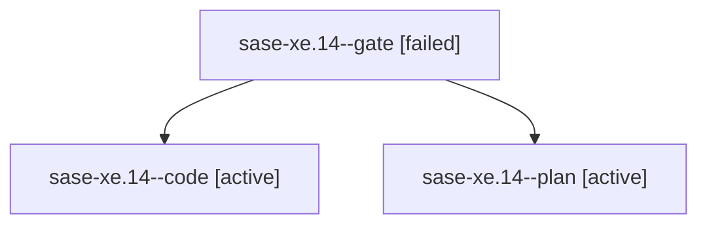

# Family: sase-xe.14

[Agent Hoods](../README.md) / [bbugyi200](../users/bbugyi200/README.md) / [athena](../users/bbugyi200/machines/athena/README.md) / [sase-xe](../users/bbugyi200/machines/athena/hoods/sase-xe/README.md) / sase-xe.14

Owner: `bbugyi200.athena` · Hood: `sase-xe` · Members: 3 · Bead: [sase-xe.14](https://github.com/sase-org/sase--beads/blob/main/pages/sase-xe/sase-xe.14.md)

## Lineage

The diagram is an optional enhancement; the ordered table below contains the same lineage in accessible text.

| Role | Agent | State | Model / provider | Timing | Commits | Prompt | Chat |
|---|---|---|---|---|---:|---|---|
| gate | sase-xe.14--gate | failed | opus / claude | 2026-09-07T13:44:05.172772+00:00 → 2026-09-07T13:44:11.979499+00:00 | 0 | — | [Chat](../agents/bbugyi200.athena.sase-xe.14--gate/chat.md) |
| code | sase-xe.14--code | active | sonnet / claude | 2026-09-07T13:44:23.205105+00:00 | [1](../agents/bbugyi200.athena.sase-xe.14--code/README.md#commits) | — | — |
| plan | sase-xe.14--plan | active | opus / claude | 2026-09-07T13:32:59.143798+00:00 | 0 | [Prompt](../agents/bbugyi200.athena.sase-xe.14--plan/prompt.md) | [Chat](../agents/bbugyi200.athena.sase-xe.14--plan/chat.md) |

## Commits

| Role | Repo | Commit | Subject | Committed |
|---|---|---|---|---|
| code | sase | [`287048d`](https://github.com/sase-org/sase/commit/287048d601b6a2003aa01e12743c2ed053c7c982) | feat(dispatch): surface and answer remote question/gate attention in Focus | 2026-09-07 11:24:08 EDT |

## Neighbors

| Agent | Relation | State |
|---|---|---|
| [sase-xe.1](../agents/bbugyi200.athena.sase-xe.1/README.md) | sase-xe hood | active |
| [sase-xe.10](bbugyi200.athena.sase-xe.10.md) (family · 3) | sase-xe hood | completed 2, failed 1 |
| [sase-xe.10](../agents/bbugyi200.athena.sase-xe.10/README.md) | sase-xe hood | waiting |
| [sase-xe.11](bbugyi200.athena.sase-xe.11.md) (family · 3) | sase-xe hood | completed 2, failed 1 |
| [sase-xe.12](bbugyi200.athena.sase-xe.12.md) (family · 3) | sase-xe hood | completed 2, failed 1 |
| [sase-xe.13](bbugyi200.athena.sase-xe.13.md) (family · 3) | sase-xe hood | completed 2, failed 1 |
| [sase-xe.13](../agents/bbugyi200.athena.sase-xe.13/README.md) | sase-xe hood | waiting |
| [sase-xe.15](../agents/bbugyi200.athena.sase-xe.15/README.md) | sase-xe hood | waiting |
| [sase-xe.2](bbugyi200.athena.sase-xe.2.md) (family · 3) | sase-xe hood | active 1, dismissed 1, failed 1 |
| [sase-xe.3](../agents/bbugyi200.athena.sase-xe.3/README.md) | sase-xe hood | completed |
| [sase-xe.4](bbugyi200.athena.sase-xe.4.md) (family · 3) | sase-xe hood | completed 2, failed 1 |
| [sase-xe.5](bbugyi200.athena.sase-xe.5.md) (family · 3) | sase-xe hood | completed 2, failed 1 |
| [sase-xe.5](../agents/bbugyi200.athena.sase-xe.5/README.md) | sase-xe hood | waiting |
| [sase-xe.6](../agents/bbugyi200.athena.sase-xe.6/README.md) | sase-xe hood | dismissed |
| [sase-xe.7](bbugyi200.athena.sase-xe.7.md) (family · 3) | sase-xe hood | failed 3 |
| [sase-xe.8](bbugyi200.athena.sase-xe.8.md) (family · 3) | sase-xe hood | completed 2, failed 1 |
| [sase-xe.8](../agents/bbugyi200.athena.sase-xe.8/README.md) | sase-xe hood | waiting |
| [sase-xe.9](../agents/bbugyi200.athena.sase-xe.9/README.md) | sase-xe hood | completed |
| [sase-xe.land](../agents/bbugyi200.athena.sase-xe.land/README.md) | sase-xe hood | waiting |
